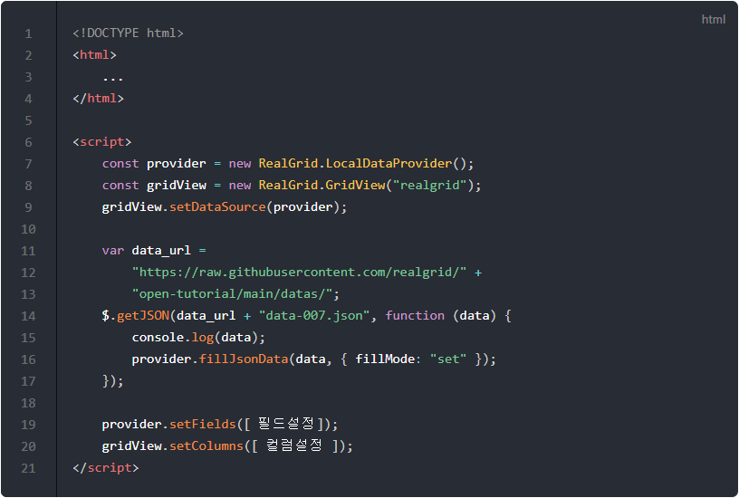
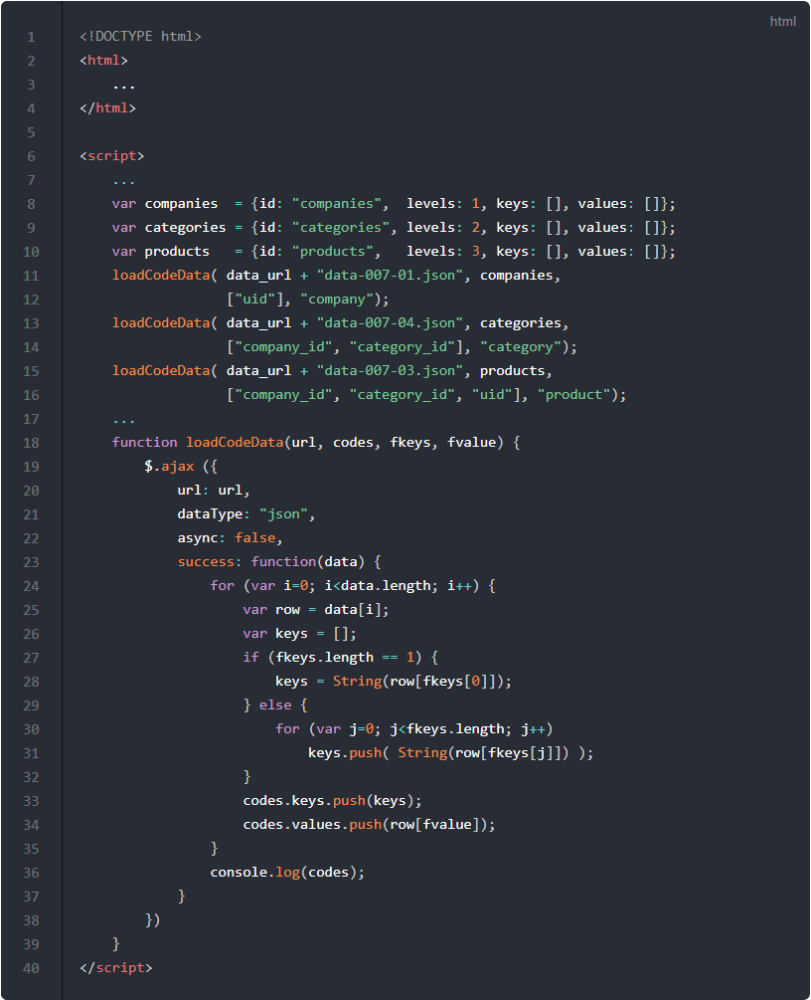
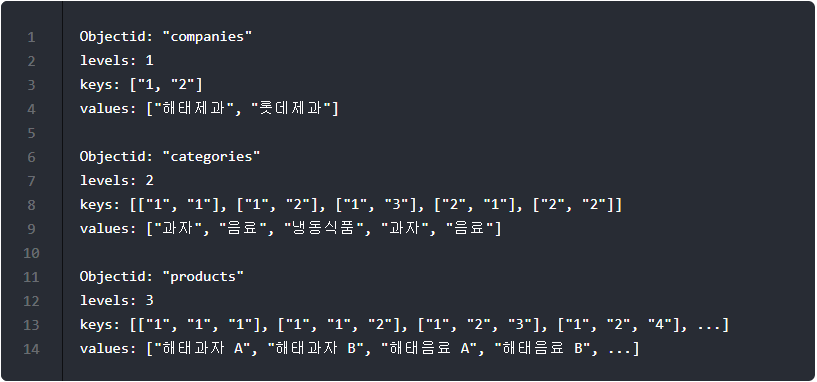
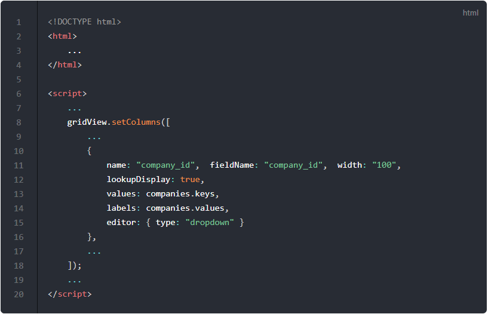
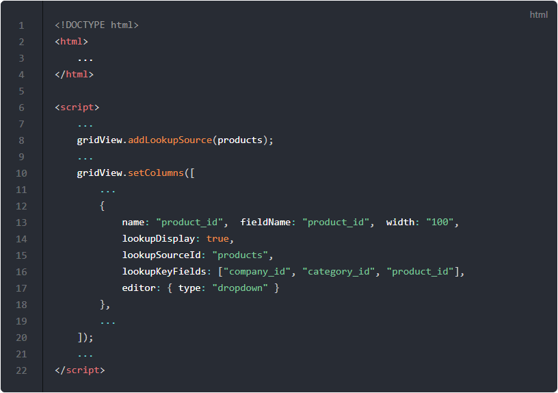
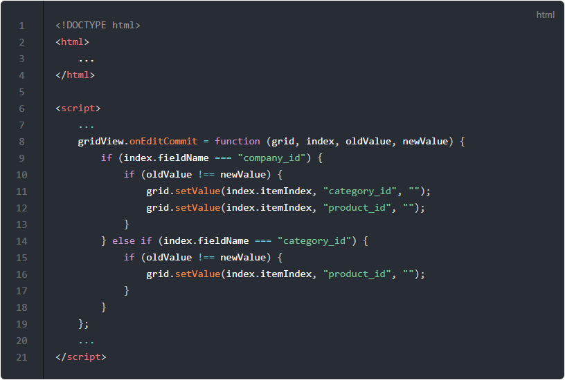

# Lookup Tree

## 기본 코드

예제들의 기본이 되는 코드부터 살펴보겠습니다.
서버로부터 예제 데이터를 가져와서 표시해주기까지만 적용된 상태입니다.

기본 코드의 실행결과는 아래 링크에서 확인할 수 있습니다.
* [기본 코드의 실행 결과](http://10bun.tv/samples/realgrid2/part-1/11/step-00.html)

## 동기식으로 코드 데이터 가져오기

지금까지는 서버에서 데이터를 가져올 때 비동기식을 사용했습니다.
하지만 이번 예제에서는 코드 테이블에 해당하는 데이터를 동기식으로 가져와야 하는데요.
컬럼 설정 전에 코드 데이터를 가져와야 하기 때문입니다.
비동기식을 사용하면 데이터를 받지 못한 상태에서 컬럼 설정이 먼저 진행될 수 있기 때문입니다.

loadCodeData() 함수는 동기식으로 데이터가 다운받을 때까지 코드가 다음으로 진행되지 않도록 블록킹하게 됩니다.

예제 코드의 실행결과는 아래 링크에서 확인할 수 있습니다.
* [동기식으로 코드 데이터 가져오기 예제 실행결과](http://10bun.tv/samples/realgrid2/part-1/11/step-01.html)

* 8-10: Lookup Tree를 사용하기 위해서 필요한 LookupSource 데이터 구조입니다. 이것은 정해진 약속이기 때문에 반드시 같은 형태로 작업해주셔야 합니다.
* 11-13: 서버로부터 데이터를 가져와서 LookupSource에 저장해줍니다.
* 15-25: loadCodeData() 함수의 구현 부분입니다.
* 19: async 속성을 false로 설정해서 동기식으로 데이터를 다운받도록 합니다.
* 20-33: 서버로부터 데이터가 정상적으로 다운받아지면 LookupSource에 데이터를 저장합니다.

예제 코드가 실행되면 LookSource 객체에는 각각 아래와 같은 데이터가 적재됩니다.

* "companies"의 경우에는 value 값을 찾기 위한 키가 하나만 필요하기 때문에 keys 배열은 단일 값 요소만 가지고 있습니다.
* "categories"의 경우에는 회사와 분류코드 값 두 개를 알아야 value를 찾고 걸러낼 수 있기 때문에 keys 배열은 두 개의 요소를 가지고 있는 배열을 요소로 가지고 있습니다.
	* keys의 ["1", "2"] 요소 중 앞에 있는 "1"은 companies 코드로 보면 해태제과에 해당합니다.
		* companies가 해태제과로 선택이 되면 ["1", "?"] 앞의 요소가 "1"인 데이터만 걸러지게 됩니다. 결과적으로 ["1", "1"], ["1", "2"], ["1", "3"] 세 개의 요소만이 걸러집니다.
		* 그리고 categories는 ["1", "1"], ["1", "2"], ["1", "3"]에 해당하는 ["과자", "음료", "냉동식품"]만 표시하게 되는 것입니다.
	* keys의 ["1", "2"] 요소 중 뒤에 있는 "2"는 상품분류코드에 해당합니다.
		* 뒤의 값이 "1", "2", "3" 일 때 각각 value는 "과자", "음료", "냉동식품"로 매칭이 됩니다.
		* 롯데제과는 냉동식품 정보가 없는 것으로 표현하고 있기 때문에 keys에 ["2", "3"] 요소가 없는 것입니다.
* "products"의 경우에는 세 개의 정보를 알아야 value를 찾고 걸러낼 수 있기 때문에 keys 배열은 세 개의 요소를 가지고 있는 배열을 요소로 가지고 있습니다.

## Company 컬럼을 Lookup 컬럼으로 구성하기

Company 컬럼의 경우에는 Lookup 컬럼의 구조입니다.
따라서 이전 포스트에서 다룬 것처럼 컬럼 설정 중에 values와 labels를 아래 코드처럼 다운받은 코드 데이터로 지정해주시면 됩니다.

예제 코드의 실행결과는 아래 링크에서 확인할 수 있습니다.
* [Company 컬럼을 Lookup 컬럼으로 구성하기 예제 실행결과](http://10bun.tv/samples/realgrid2/part-1/11/step-02.html)

## Category 컬럼에 LookupSource 적용하기

Category는 Company 컬럼의 값에 영향을 받습니다.
LookupSource에서 Company 컬럼의 값에 해당하는 데이터만 걸러내서 드롭다운으로 표시하도록 해야 합니다.

예제 코드의 실행결과는 아래 링크에서 확인할 수 있습니다.
* [Category 컬럼에 LookupSource 적용하기 예제 실행결과](http://10bun.tv/samples/realgrid2/part-1/11/step-03.html)

* 14: Lookup 컬럼과 마찬가지로 lookupDisplay 속성이 true가 되어야 합니다.
* 15: Category 컬럼에 해당하는 lookupSourceId를 지정합니다.
	* 동기식으로 코드 데이터 가져오기 예제 소스에서 "var categories = {...}"로 선언된 코드를 참고하세요.
* 16: 코드 데이터를 걸러내고 표시할 값을 가져오기 위한 키가 되는 필드의 이름을 지정합니다.
	* 회사가 선택이되면 해당 회사와 관련된 데이터만 걸러내야 하기 때문에 "company_id" 필드가 필요합니다.
	* "category_id" 필드는 표시할 내용을 구별하기 위한 키 값입니다. 여기서는 상품분류(Category)의 표시 값을 구별하기 위한 코드입니다.

## Product 컬럼에 LookupSource 적용하기

예제 코드의 실행결과는 아래 링크에서 확인할 수 있습니다.
* [Product 컬럼에 LookupSource 적용하기 예제 실행결과](http://10bun.tv/samples/realgrid2/part-1/11/step-04.html)

* 15: Product 컬럼에 해당하는 lookupSourceId를 지정합니다.
* 16: 코드 데이터를 걸러내고 표시할 값을 가져오기 위한 키가 되는 필드의 이름을 지정합니다.
	* 회사와 상품분류가 선택이되면 해당 데이터만 걸러내야 하기 때문에 "company_id", "category_id" 두 개의 필드가 필요합니다.
	* "product_id" 필드는 표시할 내용을 구별하기 위한 키 값입니다. 여기서는 상품명(Product)의 표시 값을 구별하기 위한 코드입니다.

## 변경이 발생하면 뒤에 오는 컬럼 초기화하기

그리드의 onEditCommit 이벤트를 이용해서 앞의 컬럼의 값이 변경되면 뒤의 Lookup Tree로 연결된 컬럼의 값을 공백으로 초기화 하는 예제입니다.
앞의 컬럼이 변동되면 뒤의 컬럼의 값이 규칙에서 벗어날 수 있기 때문에 다시 입력받아야 하기 때문입니다.

예제 코드의 실행결과는 아래 링크에서 확인할 수 있습니다.
* [변경이 발생하면 뒤에 오는 컬럼 초기화하기 예제 실행결과](http://10bun.tv/samples/realgrid2/part-1/11/step-05.html)

* 10-13: 변경된 컬럼의 "company_id"인 경우에는 뒤에 Lookup Tree로 묶인 "category_id", "product_id" 컬럼을 초기화 합니다.
* 15-17: 변경된 컬럼의 "category_id"인 경우에는 뒤에 Lookup Tree로 묶인 "product_id" 컬럼만 초기화 합니다.
