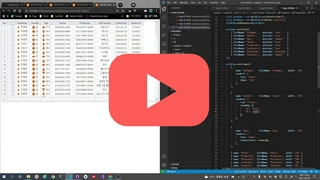
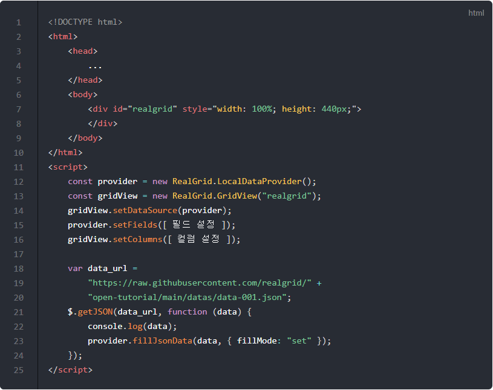
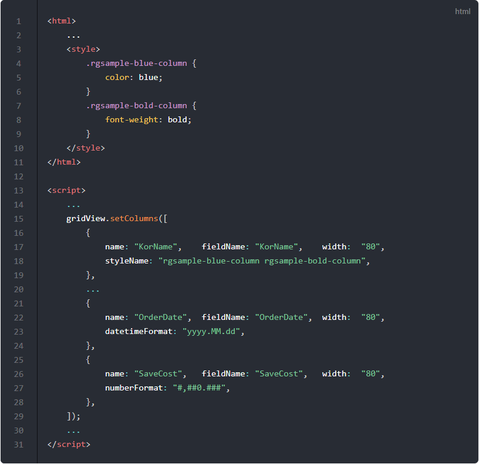
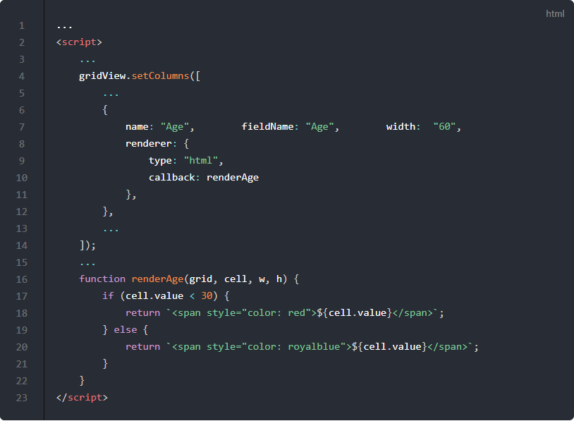
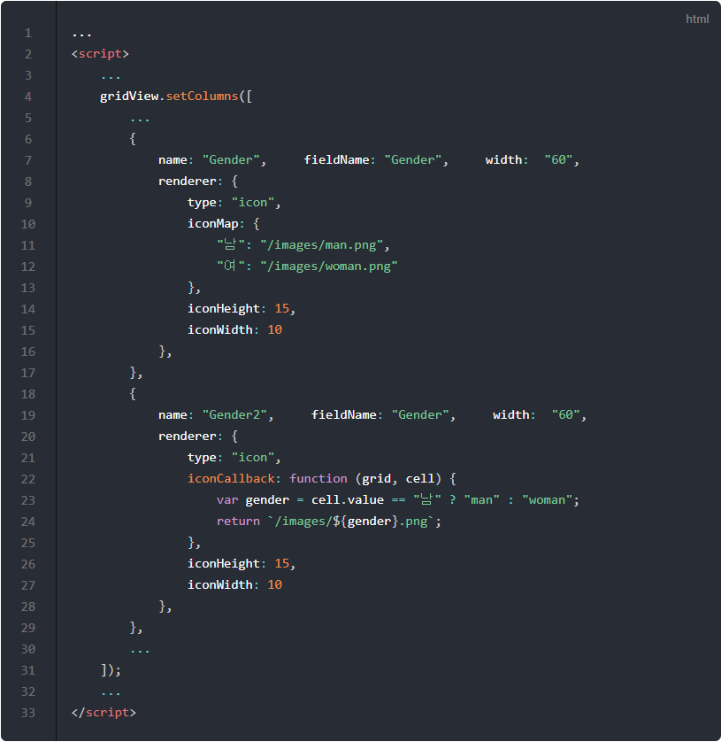
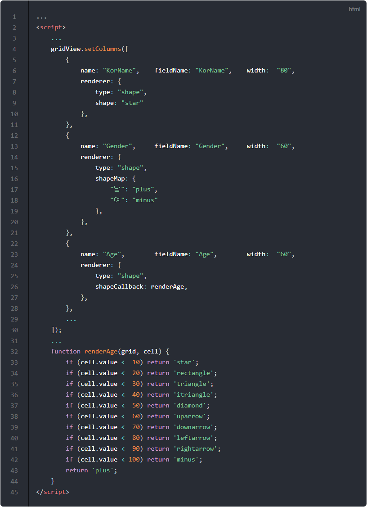
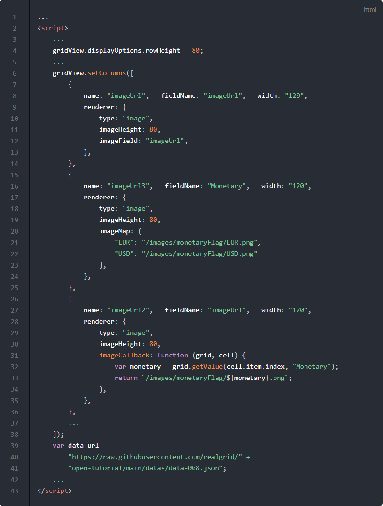
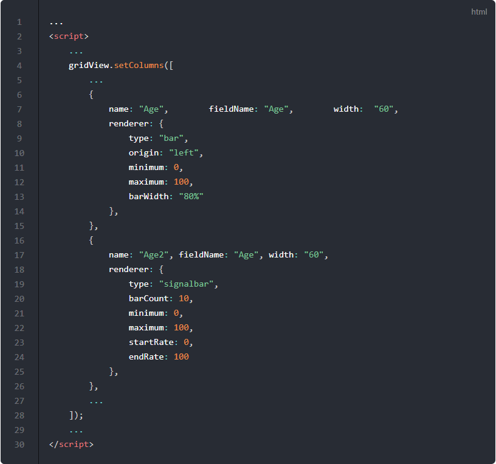

# 랜더러

## 기본 코드

예제들의 기본이 되는 코드부터 살펴보겠습니다.
서버로부터 예제 데이터를 가져와서 표시해주기까지만 적용된 상태입니다.

기본 코드의 실행결과는 아래 링크에서 확인할 수 있습니다.
* [기본 코드의 실행 결과](http://10bun.tv/samples/realgrid2/part-2/01/step-00.html)

## 텍스트 랜더러

셀의 텍스트의 스타일을 변경할 수 있는 가장 기본이 되는 랜더러입니다. 

예제 코드의 실행결과는 아래 링크에서 확인할 수 있습니다.
* [텍스트 랜더러 예제 실행결과](http://10bun.tv/samples/realgrid2/part-2/01/step-01.html)

### HTML 랜더러

예제 코드의 실행결과는 아래 링크에서 확인할 수 있습니다.
* [HTML 랜더러 예제 실행결과](http://10bun.tv/samples/realgrid2/part-2/01/step-02.html)

## 아이콘 랜더러

예제 코드의 실행결과는 아래 링크에서 확인할 수 있습니다.
* [아이콘 랜더러 예제 실행결과](http://10bun.tv/samples/realgrid2/part-2/01/step-03.html)

## 도형 랜더러

예제 코드의 실행결과는 아래 링크에서 확인할 수 있습니다.
* [도형 랜더러 예제 실행결과](http://10bun.tv/samples/realgrid2/part-2/01/step-04.html)

## 이미지 랜더러

예제 코드의 실행결과는 아래 링크에서 확인할 수 있습니다.
* [이미지 랜더러 예제 실행결과](http://10bun.tv/samples/realgrid2/part-2/01/step-05.html)

## 바 & 시그널 랜더러

예제 코드의 실행결과는 아래 링크에서 확인할 수 있습니다.
* [바 & 시그널 랜더러 예제 실행결과](http://10bun.tv/samples/realgrid2/part-2/01/step-06.html)

## 체크 랜더러

## 링크 렌더러

## 바코드 랜더러

## 커스텀 랜더러 - 이미지 버튼

## 차트 연동

