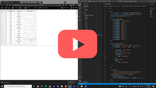

# 시리즈 컬럼

[](https://youtu.be/dcaKFH0aIgE)


## 기본 코드

예제들의 기본이 되는 코드부터 살펴보겠습니다.
서버로부터 예제 데이터를 가져와서 표시해주기까지만 적용된 상태입니다.

기본 코드의 실행결과는 아래 링크에서 확인할 수 있습니다.

* [기본 코드의 실행 결과](http://10bun.tv/samples/realgrid2/part-2/08/step-00.html)

``` html
<!DOCTYPE html>
<html>

<head>
    <meta charset="utf-8">
    <link href="/lib/realgrid-style.css" rel="stylesheet" />
    <script type="text/javascript" src="/lib/realgrid-lic.js"></script>
    <script type="text/javascript" src="/lib/realgrid.2.3.3.min.js"></script>
    <script type="text/javascript" src="/js/jquery-3.4.0.min.js"></script>
    <script type="text/javascript" src="/js/jszip.min.js"></script>
</head>

<body>
    <div id="realgrid" style="width: 100%; height: 440px;"></div>
</body>

</html>

<script>
    const provider = new RealGrid.LocalDataProvider();
    const gridView = new RealGrid.GridView("realgrid");
    gridView.setDataSource(provider);

    provider.setFields([
        { fieldName: "continent" },
        { fieldName: "country" },
        { fieldName: "2000" },
        { fieldName: "2001" },
        { fieldName: "2002" },
        { fieldName: "2003" },
        { fieldName: "2004" },
        { fieldName: "2005" },
        { fieldName: "2006" },
        { fieldName: "2007" },
        { fieldName: "2008" },
        { fieldName: "2009" },
        { fieldName: "2010" },
    ]);

    gridView.setColumns([
        { fieldName: "continent", name: "continent" },
        { fieldName: "country", name: "country" },
        { fieldName: "2000", name: "2000" },
        { fieldName: "2001", name: "2001" },
        { fieldName: "2002", name: "2002" },
        { fieldName: "2003", name: "2003" },
        { fieldName: "2004", name: "2004" },
        { fieldName: "2005", name: "2005" },
        { fieldName: "2006", name: "2006" },
        { fieldName: "2007", name: "2007" },
        { fieldName: "2008", name: "2008" },
        { fieldName: "2009", name: "2009" },
        { fieldName: "2010", name: "2010" },
    ]);

    var data_url = 
        "https://raw.githubusercontent.com/realgrid/" +
        "open-tutorial/main/datas/series.json";
    $.getJSON(data_url, function (data) {
        console.log(data);
        provider.fillJsonData(data, { fillMode: "set" });
    });
</script>
```


## 시리즈 컬럼의 기본 예제

예제 코드의 실행결과는 아래 링크에서 확인할 수 있습니다.
* [시리즈 컬럼의 기본 예제 실행결과](http://10bun.tv/samples/realgrid2/part-2/08/step-01.html)

``` html
<!DOCTYPE html>
<html>
    ...
</html>

<script>
    ...
    gridView.setColumns([
        ...
        {
            "name": "colSeries1",
            "type": "series",
            "fieldNames": "2000,2001,2002,2003,2004",
            "width": 170,
            "header": {
                "text": "Series(2000~2004)",
            },
        },
        {
            "name": "colSeries2",
            "type": "series",
            "fieldNames": "2005..2010",
            "renderer": {
                "valueSeparator": " | "
            },
            "width": 240,
            "header": {
                "text": "Series(2005~2010)",
            },
        },
    ]);
    ...
</script>
```


## 그래프 형태로 표시하기

예제 코드의 실행결과는 아래 링크에서 확인할 수 있습니다.
* [그래프 형태로 표시하기 예제 실행결과](http://10bun.tv/samples/realgrid2/part-2/08/step-02.html)

``` html
<!DOCTYPE html>
<html>
    ...
</html>

<script>
    ...
    gridView.setColumns([
        ...
        {
            "name": "colSeries1",
            "type": "series",
            "fieldNames": "2000..2010",
            "renderer": {
                "type": "sparkline"
            },
            "width": 170,
            "header": {
                "text": "Spark Line",
            },
        },
        {
            "name": "colSeries2",
            "type": "series",
            "fieldNames": "2000..2010",
            "renderer": {
                "type": "sparkcolumn"
            },
            "width": 170,
            "header": {
                "text": "Spark Column",
            },
        },
    ]);
    ...
</script>
```


## Winloss

예제 코드의 실행결과는 아래 링크에서 확인할 수 있습니다.
* [Winloss 예제 실행결과](http://10bun.tv/samples/realgrid2/part-2/08/step-03.html)

``` html
<!DOCTYPE html>
<html>
    ...
</html>

<script>
    ...
    gridView.setColumns([
        ...
        {
            "name": "colSeries",
            "type": "series",
            "fieldNames": "2000..2010",
            "renderer": {
                "type": "sparkwinloss",
                "baseValue": 10,
                "belowHeight": 0.4
            },
            "width": 170,
            "header": {
                "text": "Spark Winloss",
            },
        },
    ]);
    ...
</script>
```
