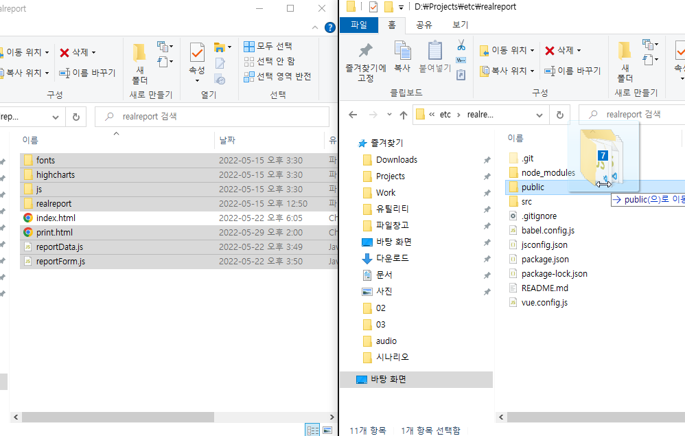

# 리얼리포트 연동하기

## 리얼리포트 기본 코드 준비

### 리얼리포트 기본 코드 복사

아래 링크를 클릭하고 기본 코드를 다운받고 압축을 해제합니다.
* [기본코드 다운받기](https://github.com/realgrid/open-tutorial/raw/main/realreport.zip)

### 라이브러리 파일 복사


* 다운받은 기본코드 폴더에서 index.html을 제외한 나머지 파일을 Vue의 public 폴더로 복사합니다.

### index.html 수정

``` html
<!DOCTYPE html>
<html lang="">
    <head>
        ...
        <script type="text/javascript" src="/js/pdfkit.js"></script>

        <link href="/highcharts/highcharts.css" rel="stylesheet" />
        <script src="/highcharts/highcharts.js"></script>
        <script src="/highcharts/highcharts-more.js"></script>

        <link href="/realreport/realreport.css" rel="stylesheet" />
        <script src="/realreport/realreport-lic.js"></script>
        <script type="text/javascript" src="/realreport/realreport.js?v=4"></script>

        <script src="/fonts/malgun.js"></script>
        <script src="/fonts/malgun-bold.js"></script>

        <title><%= htmlWebpackPlugin.options.title %></title>
    </head>
    <body>
        ...
    </body>
</html>
```

### RealReport 콤포넌트 추가 (components/RealReport.vue)

``` html
<template>
    <div>
        <el-row style="padding: 4px;">
            <el-button @click="print"><i class="fas fa-print" /></el-button>
            <el-button @click="exportPdf"><i class="fas fa-file-pdf" /></el-button>
        </el-row>
        <el-row>
            <div id="realreport"></div>
        </el-row>
        <iframe id="printPreview" src="/print.html" style="display: none"></iframe>
    </div>
</template>

<script>
/* eslint-disable */

export default {
    methods: {
        preview(form, data) {
            this.viewer = new RealReport.ReportViewer("realreport", form);
            this.viewer.dataSet = data;
            this.viewer.preview();
        },

        print() {
            const container = printPreview.contentWindow.document.getElementById("realreport");
            container.innerHTML = this.viewer.getHtml();
            printPreview.contentWindow.print();
        },

        exportPdf() {
            const pdfFonts = [
                {
                    name: "regular",
                    content: malgun,
                    style: "normal",
                    weight: "normal",
                },
                {
                    name: "bold",
                    content: malgunBold,
                    style: "normal",
                    weight: "bold",
                },
            ];
            this.viewer.exportPdf(pdfFonts);
        },
    }
};
</script>
```

### 리얼리포트 폼 파일 추가

급여명서세 리포트 문서 파일입니다.

* [report/salaryMonthly.js](https://github.com/realgrid/open-tutorial/blob/main/vue.js/part-4/10/src/report/salaryMonthly.js)

### 리얼리포트 데이터 파일 추가

급여명서세 출력 데이터입니다.

* [data/salaryMonthly.js](https://github.com/realgrid/open-tutorial/blob/main/vue.js/part-4/10/src/data/salaryMonthly.js)

### Rest API 추가

* [급여 데이터 가져오기](https://github.com/realgrid/open-tutorial/blob/main/vue.js/part-4/10/src/api/salary.js)


## 급여 명세서 출력 메뉴 추가

### components/SideMenu.vue 수정

``` html
<template>
    <div class="title-area">
        <router-link to="/">
            <h3 class="title-text">Dashboard</h3>
        </router-link>

        <div class="client">
            ...
                <el-menu-item-group title="리포트">
                    <el-menu-item index="/report/member/salary/monthly">
                        <i class="fas fa-list-alt"></i>
                        <span>급여명세서</span>
                    </el-menu-item>
                </el-menu-item-group>
            </el-menu>
        </div>
    </div>
</template>
...
```

### 라우터 수정

``` js
...
const routes = [
    ...
    {
        path: '/report/member/salary/monthly',
        component: () => import('@/views/report/member/SalaryMonthly.vue')
    },
]
...
```

## 급여명서세 리포트 구현 (report/member/SalaryMonthly.vue)

``` html
<template>
    <RealReport ref="realReport" />
</template>

<script>
/* eslint-disable */

import RealReport from '@/components/RealReport';
import salary from '@/api/salary';
import salaryMonthly from '@/report/salaryMonthly';

export default {
    components: {
        RealReport
    },

    mounted() {
        salary.monthly()
            .then((response) => {
                this.$refs.realReport.preview(salaryMonthly, response.data);
            })
            .catch((e) => {
                console.log(e);
            });
    },
};
</script>
```