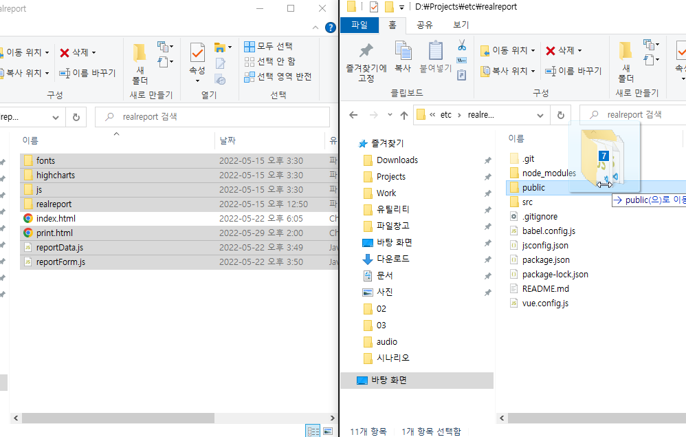

# Vue.js 연동하기


## Vue.js 프로젝트 생성

### Vue.js 개발환경 준비하기

Vue.js 개발환경을 준비하기 위해서는 아래 문서를 참고하시기 바랍니다.
* [docs/part-3/01](../../part-3/01)

### Vue 프로젝트 생성하기

```
C:..> vue create realreport
```
* Default (Vue 3)를 선택하고 엔터를 칩니다.
* 생성된 realreport 폴더를 VS Code를 이용해서 오픈합니다.


## 기본 코드 준비

### 리얼리포트 기본 코드 복사

아래 링크를 클릭하고 기본 코드를 다운받고 압축을 해제합니다.
* [기본코드 다운받기](https://github.com/realgrid/open-tutorial/raw/main/realreport.zip)

### 라이브러리 파일 복사


* 다운받은 기본코드 폴더에서 index.html을 제외한 나머지 파일을 Vue의 public 폴더로 복사합니다.

### index.html 수정

``` html
<!DOCTYPE html>
<html lang="">
    <head>
        ...
        <script type="text/javascript" src="/js/pdfkit.js"></script>

        <link href="/highcharts/highcharts.css" rel="stylesheet" />
        <script src="/highcharts/highcharts.js"></script>
        <script src="/highcharts/highcharts-more.js"></script>

        <link href="/realreport/realreport.css" rel="stylesheet" />
        <script src="/realreport/realreport-lic.js"></script>
        <script type="text/javascript" src="/realreport/realreport.js?v=4"></script>

        <script src="/fonts/malgun.js"></script>
        <script src="/fonts/malgun-bold.js"></script>

        <title><%= htmlWebpackPlugin.options.title %></title>
    </head>
    <body>
        ...
    </body>
</html>
```

### 리포트 폼 및 데이터 파일 복사

* src 밑에 data 폴더를 생성하고 아래 두 파일을 복사합니다.
  * [리포트 폼 파일 복사](https://github.com/realgrid/open-tutorial/blob/main/vue.js/part-5/04/src/data/reportForm.js)
  * [리포트 데이터 파일 복사](https://github.com/realgrid/open-tutorial/blob/main/vue.js/part-5/04/src/data/reportData.js)


## 실습

### 리얼리포트 표시하기

``` html
<template>
    <div>
        <div id="realreport"></div>
    </div>
</template>

<script>
/* eslint-disable */

import reportForm from "./data/reportForm";
import reportData from "./data/reportData";

export default {
    mounted() {
        this.viewer = new RealReport.ReportViewer("realreport", reportForm);
        this.viewer.dataSet = reportData;
        this.viewer.preview();
    },
};
</script>
```

### 리포트 출력하기

``` html
<template>
    <div>
        <div style="height: 32px; position: fixed">
            <button @click="print()">print</button>
        </div>

        <div style="height: 32px"></div>

        <div id="realreport" class="scroller"></div>

        <iframe id="printPreview" src="/print.html" style="display: none"></iframe>
    </div>
</template>

<script>
...
export default {
    mounted() {
        ...
    },

    methods: {
        print() {
            const container = printPreview.contentWindow.document.getElementById("realreport");
            container.innerHTML = this.viewer.getHtml();
            printPreview.contentWindow.print();
        },
    },
};
</script>

<style scoped>
.scroller {
    flex: 1;
    direction: ltr;
    height: 90vh;
    width: 100%;
    overflow: auto;
    position: relative;
}
</style>
```
