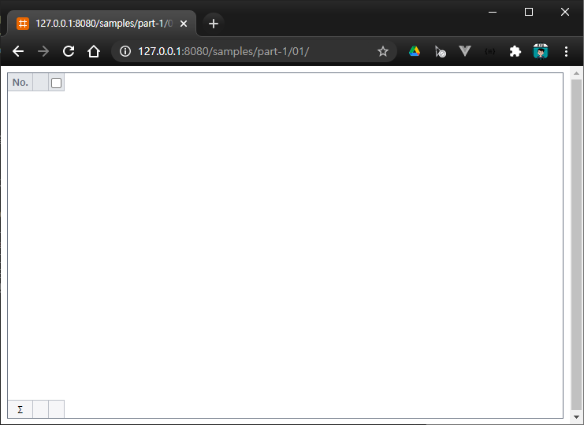
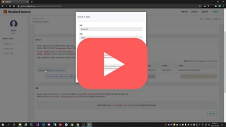

# Hello, World? I'm RealGrid!

[](https://youtu.be/xck4lfhmdQ0)

## 리얼그리드를 사용하는 최소한의 코드

``` html
<!DOCTYPE html>
<html>
	<head>
		<meta charset="utf-8">
		<link href="/lib/realgrid-style.css" rel="stylesheet" />
		<script type="text/javascript" src="/lib/realgrid-lic.js"></script>
		<script type="text/javascript" src="/lib/realgrid.2.2.2.min.js"></script>
	</head>
	<body>
		<div id="realgrid" style="width: 100%; height: 440px;">
		</div>
	</body>
</html>

<script>
	document.addEventListener("DOMContentLoaded", function () {
		const provider = new RealGrid.LocalDataProvider();
		const gridView = new RealGrid.GridView("realgrid");
		gridView.setDataSource(provider);
	});
</script>
```
* 4: 한글을 사용하는 경우 인코딩을 지정하지 않으면 오류가 발생할 수 있습니다.
* 5: 리얼그리드의 스타일이 담겨진 파일을 가져옵니다.
  * 다른 스타일을 지정하여 색상 등을 마음대로 변경하실 수 있습니다.
* 6: 리얼그리드 라이센스 키가 담긴 파일입니다. 개발이나 테스트 용도로 요청해서 받아서 사용하실 수도 있습니다.
* 7: 리얼그리드 라이브러리 파일입니다.
* 10-11: 리얼그리드가 표시될 영역을 &lt;div> 태그로 지정합니다.
  * 이곳에 리얼그리드가 표시됩니다.
  * style을 적용해서 크기를 지정하였습니다. (가로 100%, 세로 440 픽셀)
* 16-20: 페이지 로딩이 완료되면 그리드를 초기화하는 자바스크립트 코드입니다.
* 17: 데이터를 관리해주는 객체를 생성합니다. 나중에 다시 설명합니다.
* 18: 리얼그리드 객체를 생성하고 id가 "realgrid"인 엘리먼트에 표시합니다.
* 19: 리얼그리드에 "provider"를 데이터 제공자로 지정합니다.
  * setDataSource() 메소드로 인해서 "provider"에서 관리되고 있는 데이터가 그리드에 표시됩니다.


## 실행 결과 화면

아래 링크를 클릭하시면 위에 작성된 코드의 결과를 확인하실 수 있습니다.

* [예제-01 빈 그리드 표시하기](http://10bun.tv/samples/realgrid2/part-1/01)

아무런 문제가 없다면 아래의 그림처럼 빈 그리드가 표시될 것 입니다.
리얼그리드를 사용할 기초적인 준비가 된 것입니다.




## Visual Studio Code를 이용한 테스트 환경 구축

리얼그리드를 테스트하기 위해서는 웹서버를 사용하는 것이 편리합니다.
비주얼 스튜디오 코드를 사용하면 편리하게 웹서버를 구축해서 테스트하는 것이 가능한데요.
아래와 같이 Live Server를 설처하고 이용하는 방법에 대해서 알아보도록 하겠습니다.


### Live Server extention 설치


* 비주얼 스튜디오 코드를 실행합니다.
* 1: Extentions 탭을 클릭합니다.
* 2: "live server"라고 입력하고 엔터를 쳐서 익스텐션을 검색합니다.
* 3: Install 버튼을 클릭하고 설치를 합니다.


### 리얼 그리드 샘플 폴더 열기


* 미니 웹서버와 함께 받은 샘플 파일이 있는 폴더를 워크스페이스로 지정하기 위해서 아래와 같이 폴더를 오픈합니다.
* 1: Explorer 탭을 클릭합니다.
* 2: "Open Folder" 버튼을 클릭하시고 다운받은 폴더를 선택합니다.


### Live Server를 이용해서 페이지 열기


* 1: index.html 파일을 더블 클릭해서 선택합니다.
* 2: index.html 코드가 에디터에 나타나면 에디터에서 마우스의 오른쪽 버튼을 클릭하시고, "Open with Live Server"를 선택합니다.

문제가 없으면 브라우저가 나타나면서 리얼그리드가 표시될 것입니다.


## 미니 웹서버를 이용한 테스트 환경 구축

아래 설명은 윈도우즈에서 설치과정 없이 최대한 간편하게 개발환경을 구축하는 방법에 대해서 설명합니다.
웹서버를 설치하지 않고 바로 리얼그리드를 테스트하고 싶으실 때 사용하실 수 있습니다.


### 미니 웹서버 다운받기

아래의 링크를 클릭하시고 미니 웹서버를 다운 받습니다.

[미니 웹서버 다운로드 링크](/downloads/realgrid2.zip)


### 미니 웹서버 실행 및 방화벽 허용하기

압축을 풀고 WebServer.exe 파일을 실행합니다.
아래와 같이 방화벽 허용 메시지가 나타나면 "엑서스 허용" 버튼을 클릭합니다.


프로그램이 정상적으로 실행되면 아래의 이미지처럼 미니 웹서버가 화면에 보이게 됩니다.


### 웹 브라우저에서 웹 페이지 확인하기

웹 서버가 문제없이 동작하면 자동으로 웹 브라우저를 열어서 아래의 이미지처럼 그리드를 표시해줍니다.


	기본으로 7777 포트를 사용하고 있습니다. 다른 프로그램에서 사용중인 포트라면 
	Stop 버튼을 클릭하시고 포트 번호를 변경한 다음 다시 Start 버튼을 클릭하세요.


### 리얼그리드 코드 작성하고 테스트하기

WebServer.exe가 설치된 폴더가 웹 루트 폴더로 지정됩니다.
웹 브라우저에 샘플 페이지가 표시되는 것을 확인하셨으면, 
WebServer.exe와 같은 폴더에 있는 index.html 파일을 열어서
코드를 수정하시고 웹 브라우저에서 새로 고침을 하여 확인하시면 됩니다.


## 라이센스 파일 및 리얼그리드2 다운받기

[](https://youtu.be/M8bWc0p86lM)

만약 리얼그리드를 여러분들의 웹 사이트에서 동작하는 것을 확인하고 싶을 실 때에는 라이센스를 신청하시고 발급받아야 합니다.
라이센스 신청페이지의 링크는 아래와 같습니다.

[리얼그리드2 라이센스 신청하기](https://service.realgrid.com/start)
