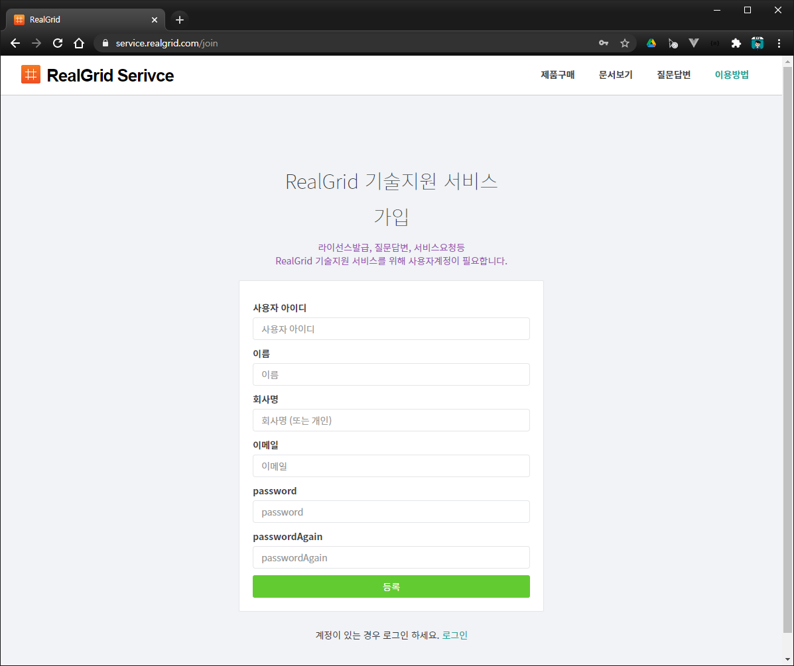
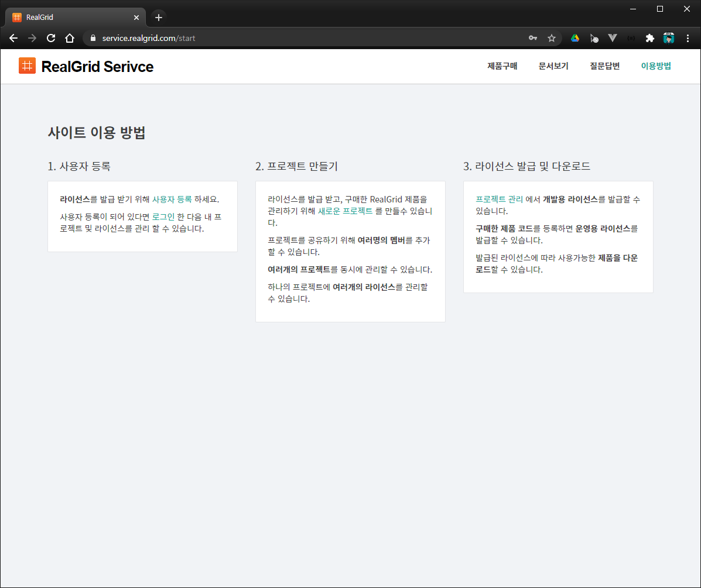
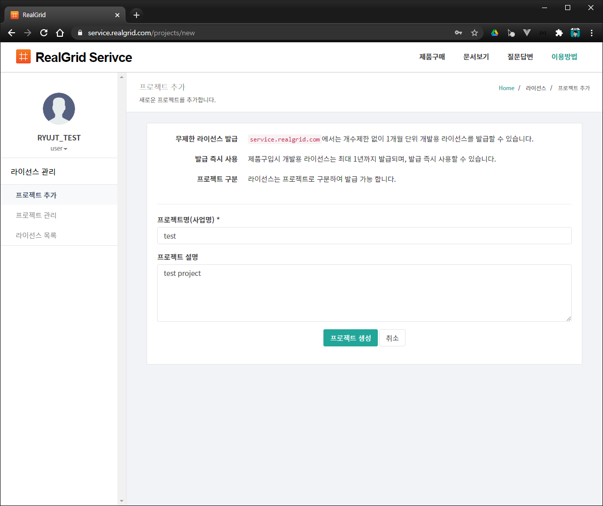
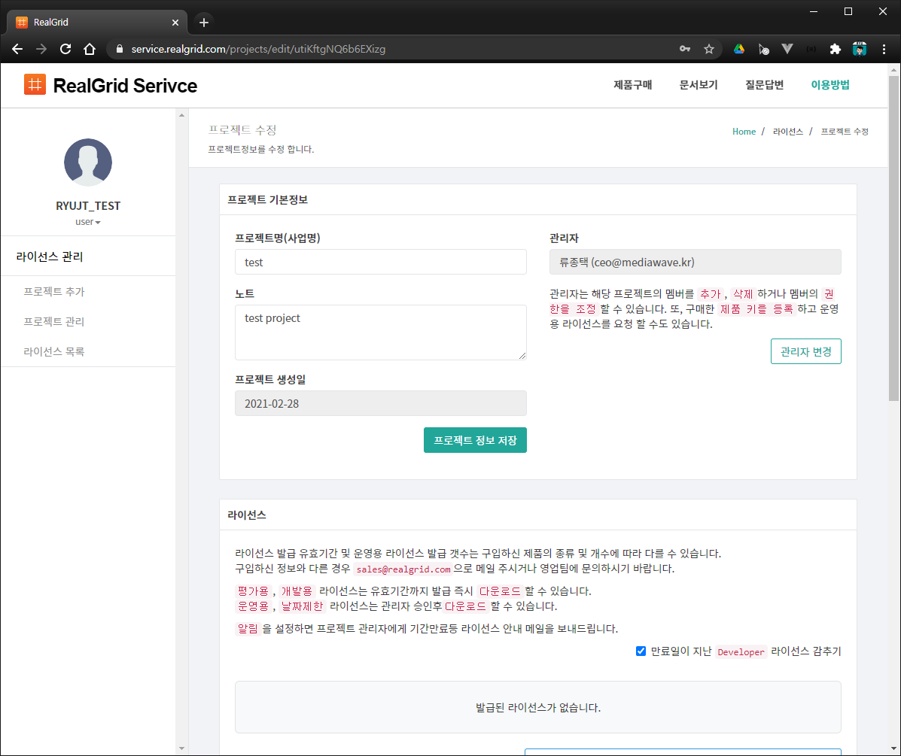
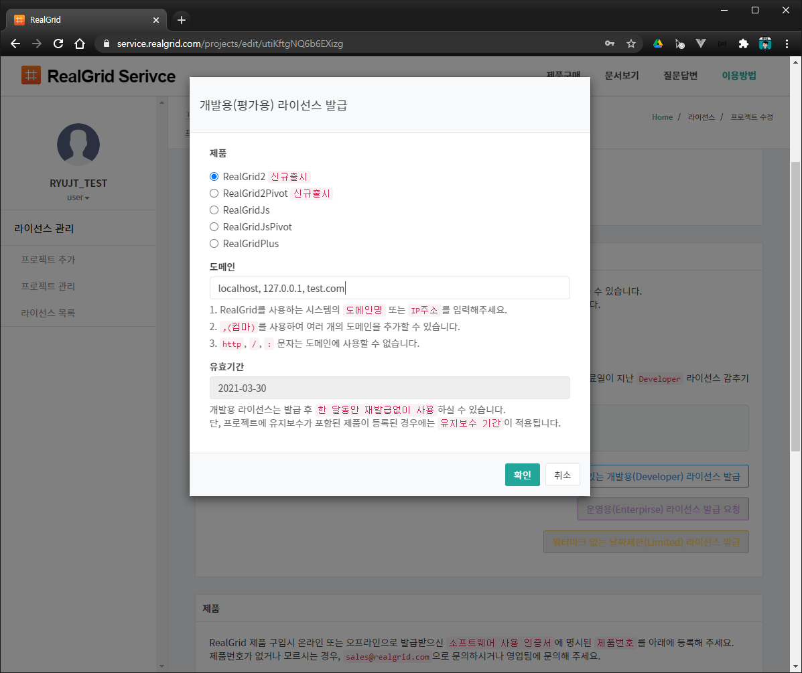
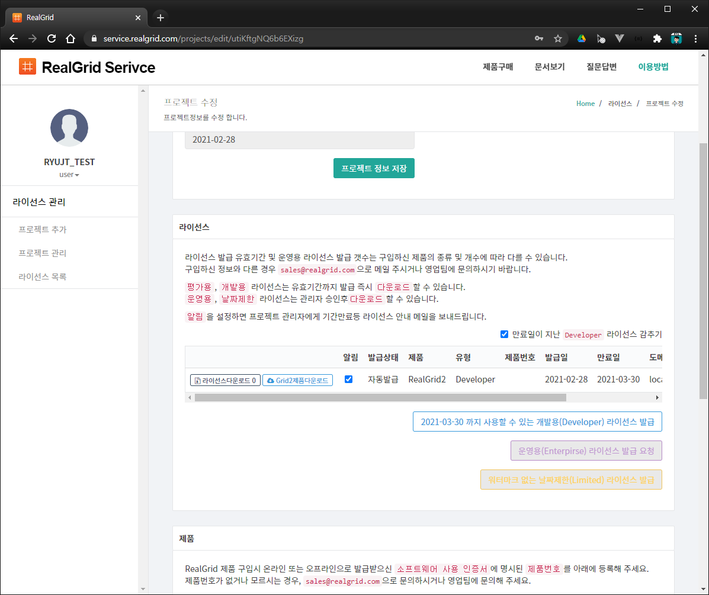

# Cut 1 - 리얼그리드를 사용하는 최소한의 코드


## Scene 1

이제부터 리얼그리드2에 대한 영상을 하나씩 소개할 예정입니다.
오늘은 그 첫번째로 최소한의 코드를 이용해서 리얼그리드를 화면에 띄우는 방법에 대해서 설명할 예정입니다.

우선은 깃헙에서 realgrid open tutorial 사이트에 접속하셔서, 미니 웹서버를 다운로드 받습니다.


## Scene 2

다운로드가 완료되면 다운로드가 완료된 폴더에서 압축을 해제합니다.
압축이 풀린 폴더를 보시면 테스트에 필요한 여러 파일들이 있는데요,

그중에서 WebServer.exe는 윈도우 환경에서 웹서버를 따로 설정하지 않고 테스트를 할 수 있는 기능을 제공합니다.
WebServer.exe는 튜토리얼 문서를 참고해주시고요,
이 영상에서는 윈도우 사용자는 물론 맥 사용자들도 따라 할 수 있도록 Visual studio code를 사용하겠습니다.

## Scene 3

이제 비주얼 스튜디오 코드를 실행하시고요, 다운로드 받은 폴더를 오픈합니다.

리얼그리드를 테스트하려면 웹서버가 필요한데요,
익스텐션 탭을 클릭하셔서 live server를 검색한 후 설치해서 사용하도록 하겠습니다.

* live server 인스톨
* live server로 index.html 오픈


## Scene 4

* 잠시 화면을 정리하고요

이제 직접 코드를 작성해서 리얼그리드를 화면에 표시해보도록 하겠습니다.

* 파일 열기 및 기존 코드 삭제

우선 html의 골격 정도는 복사해서 사용하겠습니다.

``` html
<!DOCTYPE html>
<html>
	<head>
		<meta charset="utf-8">
		<link href="/lib/realgrid-style.css" rel="stylesheet" />
		<script type="text/javascript" src="/lib/realgrid-lic.js"></script>
		<script type="text/javascript" src="/lib/realgrid.2.2.2.min.js"></script>
	</head>
	<body>
	</body>
</html>
```
* utf-8
* css
* 라이센스
  * 라이센스 발급은 나중에 자세히 설명하기로 하고
  * 발급 절차없이 로컬에서 테스트할 수 있는 방법을 먼저 설명드리겠습니다.
* 리얼그리드 라이브러리


## Scene 4

``` html
<div id="realgrid" style="width: 100%; height: 440px;">
</div>
```
* div 태그로 리얼그리드를 표시할 영역을 설정합니다.
* style 태크를 이용해서 그리드의 크기를 정하도록 하겠습니다.


## Scene 5

DOMContentLoaded 이벤트를 이용해서 
html 문서가 완전히 로딩되었을 때 초기화 실행을 할 코드를 작성하도록 하겠습니다.

``` html
<script>
	document.addEventListener('DOMContentLoaded', function () {
	});
</script>
```


## Scene 6

``` js
const provider = new RealGrid.LocalDataProvider();
const gridView = new RealGrid.GridView("realgrid");
gridView.setDataSource(provider);
```
* data 프로바이더를 생성하여 provider 변수에 넣어 둡니다.
  * 그리드에 데이터를 제공하는 역할을 하는 넘입니다.
  * 자세한 것은 나중에 다시 다루도록 하겠습니다.
* 그리드의 화면을 그리는 역할을 담당하는 뷰를 생성하여 gridView 변수에 넣어 둡니다.
* 그리드 뷰 객체의 DataSource를 방금 생성한 provider로 설정합니다.
  * 이제 provider로부터 데이터를 공급하면 그리드 뷰에도 데이터가 표시됩니다.
  * 아직까지는 데이터를 공급하는 코드가 없기 때문에 방금 전처럼 빈 그리드가 표시될 것입니다.

* 결과 화면 보기


## Scene 7

* 이제까지 간단하게 빈 그리드를 화면에 표시하는 방법에 대해서 알아보았습니다.
* 다음부터는 리얼그리드가 가지고 있는 풍부한 기능에 대해서 하나 둘 씩 살펴보도록 하겠습니다.


# Cut 2 - 라이센스 파일 및 리얼그리드2 다운받기


## Scene 1

리얼그리드를 자신의 웹 사이트에서 동작하는 것을 테스트하기 위해서는 라이센스를 발급 받아야 하는데요
이번에는 리얼그리드의 라이센스를 발급 받는 방법에 대해서 알아보도록 하겠습니다.


## Scene 2

* https://service.realgrid.com/


## Scene 2


## Scene 3



## Scene 4



## Scene 5



## Scene 6

* 도메인은 콤마로 분리해서 여러 개를 동시에 입력하실 수 있습니다.
* 로컬 환경에서 테스트하고 실제 서버에 배포하기 위해서 localhost와 127.0.0.1을 함께 추가하는 것이 편리합니다.


## Scene 7



## Scene 8
* 파일 다운로드 및 압축 풀기
* 미니웹 폴더이 복사 및 실행

아지까지는 데이터를 제공하고 있지 않기 때문에 그리드에는 아무것도 표시되지 않는데요,
이어지는 영상들에서 데이터를 끌어오고 화면에 표시하는 등 다양한 기능에 대해서 계속 설명하도록 하겠습니다.
"이것이 진짜 그리드 리얼그리드"였습니다.