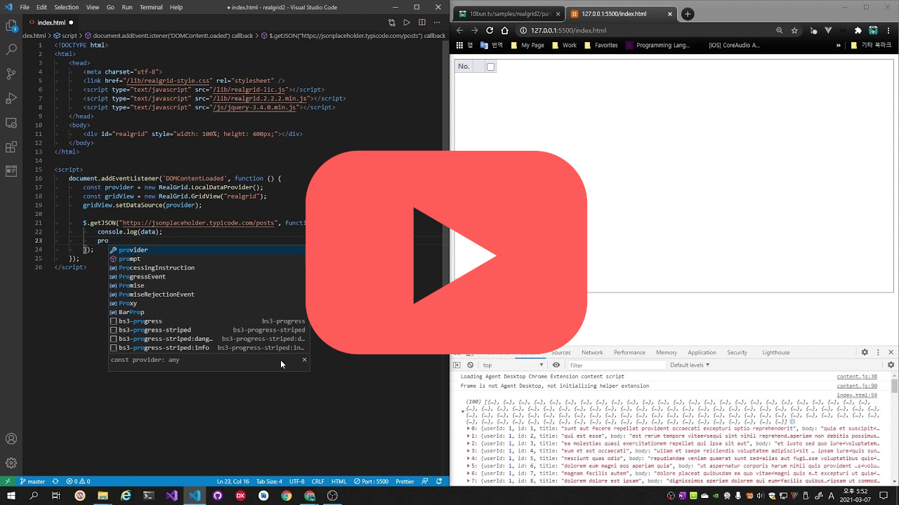
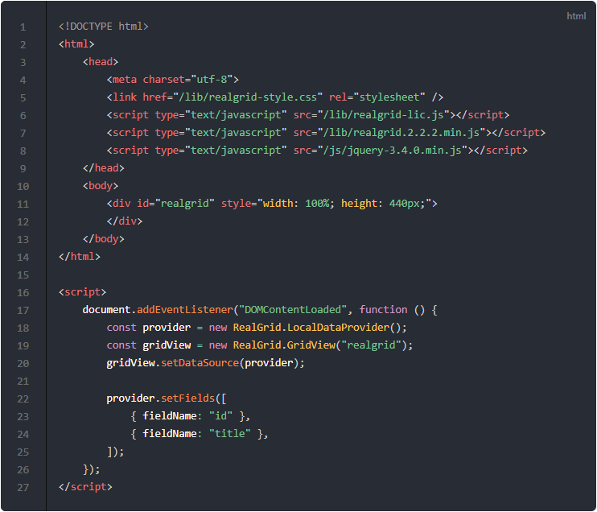
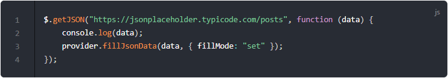

# 데이터 가져와서 그리드에 표시하기

[](https://youtu.be/LH84dpk76mo)

Rest API 서버로부터 JSON 데이터를 가져와서 그리드에 표시하는 방법에 대해서 알아보겠습니다.
실행 예제는 아래의 링크를 통해서 확인하실 수가 있습니다.

* [예제-02 데이터 가져와서 그리드에 표시하기](http://10bun.tv/samples/realgrid2/part-1/02)
  * 그리드에 번호와 제목 컬럼을 추가하여 표시합니다.
  * [https://jsonplaceholder.typicode.com/posts](https://jsonplaceholder.typicode.com/posts) 링크의 호출 결과를 그리드에 표시합니다.

> [https://jsonplaceholder.typicode.com/](https://jsonplaceholder.typicode.com/) 사이트에 가보시면 가상의 API를 서버를 통해서 기본적인 Rest API 테스트를 할 수 있는 URI들을 확인하실 수 있습니다.


## 그리드의 필드 설정 방법

가져온 데이터는 사용할 필드를 설정해야만 그리드에 데이터를 넘겨줄 수가 있습니다.

여기서는 기본적인 필드 설정 방법에 대해서 알아봅니다.
세밀한 부분은 "Part 3. 고급 사용자를 위한 Tip"에서 다루도록 하겠습니다.


[예제-01](http://10bun.tv/samples/realgrid2/part-1/01)의 기본 형태의 코드에서 아래의 몇 가지가 변경되었습니다.

* 8: 웹에서 JSON 데이터를 가져오기 위해서 JQuery를 가져옵니다.
* 22-25: 데이터의 필드를 정의하는 부분입니다.

데이터를 제공하는 Provider의 필드 정의는 setFields() 메소드를 사용하며 기본적인 형태는 다음과 같습니다.

``` js
provider.setFields( [{필드정의1, 필드정의2, ...}] );
```
* setFields는 파라미터로 필드가 정의된 배열을 넘겨줍니다.
* 각 배열의 요소는 fieldName과 DataType 속성을 가진 객체로 구성해주시면 됩니다.


### 필드이름 (fieldName)

필드이름 속성은 문자열로 필드의 이름을 정의해주시기만 하면 됩니다.
다만 데이터 안에 없는 필드를 사용하실 수는 없습니다.
JSON 데이터의 Key 이름을 확인하시고 동일한 이름을 사용하세요.


### 데이터 타입 (dataType)

위의 코드에서는 필드이름만을 사용하고 있습니다. 이런경우에는 text 타입으로 지정되는데요.
데이터 타입을 직접 지정해주고 싶을 때에는 아래와 같은 형식을 사용합니다.

``` js
provider.setFields([
	{ fieldName: "id",    dataType: "number" },
	{ fieldName: "title", dataType: "text"   },
]);
```

데이터 타입은 아래와 같이 준비되어 있습니다.
* text: 문자형
* bool: 논리형 (true or false)
* number: 숫자형
* datetime: 날짜형

보다 자세한 설명은 [데이터 타입의 API 문서](http://help.realgrid.com/api/types/DataType/)를 확인해주세요.


## 그리드의 컬럼 설정 방법

그리드에 어떤 필드를 어떠한 방식으로 표시해줄 지를 결정하기 위해서는 컬럼을 설정해야 합니다.
컬럼을 설정하지 않으면 Provider에 의해서 데이터를 공급받는다고 해도 그리드에는 표시되지 않습니다.

여기서는 기본적인 컬럼 설정 방법에 대해서 알아봅니다. 
세밀한 부분은 "Part 3. 고급 사용자를 위한 Tip"에서 다루도록 하겠습니다.

``` html
	...
	<script>
		...
		gridView.setColumns([
			{ name: "id",    fieldName: "id" },
			{ name: "title", fieldName: "title" },
		]);
	});
</script>
```

GridView의 컬럼 정의는 setColumns() 메소드를 사용하며 기본적인 형태는 다음과 같습니다.

``` js
provider.setColumns( [{컬럼정의1, 컬럼정의2, ...}] );
```
* setColumns는 파라미터로 컬럼이 정의된 배열을 넘겨줍니다.
* 각 배열의 요소에 대한 자세한 설명은 [컬럼 설정에 대한 API 문서](http://help.realgrid.com/api/types/DataColumn/)를 참고하시기 바랍니다.


### 컬럼 이름 (name)

컬럼 객체의 아이디에 해당하는 속성입니다.
그리드 내에서 유일하면 되며, 데이터 필드의 이름과 동일하지 않아도 됩니다.


### 필드 이름 (fieldName)

Provider에서 제공하는 데이터의 필드 이름입니다.
필드 정의했을 때의 이름을 사용하시면 됩니다.
데이터에 존재하지 않은 필드 이름을 지정하면 그리드의 컬럼에는 아무것도 표시되지 않습니다.


### 컬럼 넓이 (width)

표시되는 컬럼의 넓이를 지정하고 싶을 때에는 아래와 같은 형식을 사용합니다.

``` js
gridView.setColumns([
	{ name: "id",    fieldName: "id",    width: 50  },
	{ name: "title", fieldName: "title", width: 400 },
]);
```

컬럼의 넓이가 지정이되어도 사용자의 마우스 동작에 의해서 컬럼의 넓이를 변경할 수가 있습니다.


### 컬럼 헤더 (header)

header를 지정하면 컬럼의 헤더 표시 방식을 다양하게 설정할 수 있습니다.
아래 예제에서는 header의 text 속성을 이용해서 컬럼 헤더가 한글로 표시되도록 하고 있습니다.

``` js
gridView.setColumns([
	{
		name: "id",    fieldName: "id",    width: 50,
		header: {
			text: "번호",
		},
	},
	{
		name: "title", fieldName: "title", width: 400,
		header: {
			text: "제목",
		},
	},
]);
```

헤더 설정 방법에 대한 자세한 내용은 [헤더 설정에 대한 API 문서](http://help.realgrid.com/api/types/ColumnHeader/)를 참고하시기 바랍니다.


## JSON 데이터를 가져와서 표시하기

아래는 Rest API 서버에서 데이터를 가져와서 그리드에 표시하는 전체 코드입니다.

``` html
<!DOCTYPE html>
<html>
	<head>
		<meta charset="utf-8">
		<link href="/lib/realgrid-style.css" rel="stylesheet" />
		<script type="text/javascript" src="/lib/realgrid-lic.js"></script>
		<script type="text/javascript" src="/lib/realgrid.2.2.2.min.js"></script>
		<script type="text/javascript" src="/js/jquery-3.4.0.min.js"></script>
	</head>
	<body>
		<div id="realgrid" style="width: 100%; height: 440px;">
		</div>
	</body>
</html>

<script>
	document.addEventListener("DOMContentLoaded", function () {
		const provider = new RealGrid.LocalDataProvider();
		const gridView = new RealGrid.GridView("realgrid");
		gridView.setDataSource(provider);

		provider.setFields([
			{ fieldName: "id",    dataType: "number" },
			{ fieldName: "title", dataType: "text"   },
		]);

		gridView.setColumns([
			{
				name: "id",    fieldName: "id",    width: 50,
				header: {
					text: "번호",
				},
			},
			{
				name: "title", fieldName: "title", width: 400,
				header: {
					text: "제목",
				},
			},
		]);

		$.getJSON("https://jsonplaceholder.typicode.com/posts", function (data) {
			console.log(data);
			provider.fillJsonData(data, { fillMode: "set" });
		});
	});
</script>
```

JSON 데이터 가져오기 관련 코드만 분리하면 아래와 같습니다.
데이터를 가져오는 부분은 독자분들의 상황에 따라 달라질 수 있기 때문에
JQuery에 대한 설명은 생략하도록 하겠습니다.


* 1: https://jsonplaceholder.typicode.com/posts 에서 JSON 데이터를 가져옵니다.
* 2: 가져온 데이터를 콘솔에 확인합니다.
* 3: 가져온 데이터를 Provider에 집어넣습니다. 데이터가 입력되면 Provider에 연결된 모든 그리드에 데이터가 표시됩니다.
  * 두 번째 파라미터에는 데이터를 추가하는 옵션을 전달해야합니다.
    * set: 받은 데이터 그대로 입력
    * append: 기존 데이터에 추가하는 형식으로 입력
    * insert: 기존 데이터에서 지정된 위치에 입력
    * update: 기존 데이터에서 지정된 위치의 데이터들을 현재의 데이터로 치환
  * 자세한 설명은 [DataFillOptions](http://help.realgrid.com/api/types/DataFillOptions/)을 참고하시기 바랍니다.


## XML, CSV 등의 데이터 사용하기

리얼그리드에서 사용할 수 있는 데이터는 JSON, XML, CSV가 있습니다.
세 가지의 데이터 포멧마다 각각 아래의 함수를 사용하시면 됩니다.
사용방법은 동일하기 때문에 반복적인 설명은 하지 않겠습니다.

* fillJsonData(data, options)
* fillXmlData(data, options)
* fillCsvData(data, options)

[XML 데이타 가져오기에 대한 예제와 설명](http://docs.realgrid.com/guides/fill-data/load-xml-data)

