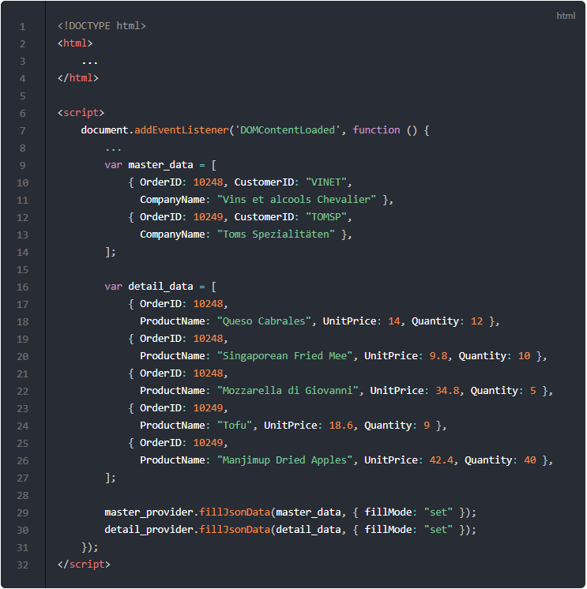

# 마스터 디테일

이번 포스트에서는 마스터 디테일 형식으로 그리드를 표현하는 방법에 대해서 알아보겠습니다.
실행 예제는 아래의 링크를 통해서 확인하실 수가 있습니다.

* [예제-03 마스터 디테일](http://10bun.tv/samples/realgrid2/part-1/03)
  * 그리드는 상단과 하단에 두 개가 표시됩니다.
  * 주문 목록이 상단 그리드에 표시됩니다.
  * 주문 목록에서 주문을 선택(클릭)하면 해당 주문에 대한 자세한 정보가 하단 그리드에 표시됩니다.

## 기본 형태

그리드를 두 개 표시하기 위핸 기본 형태의 코드는 아래와 같습니다.
필드 설정과 컬럼 설정만을 마친 상태로 아직은 그리드에 데이터를 제공하지 않기 때문에 빈 그리드 두 개가 나타나게 됩니다.

[코드 실행화면 보기](http://10bun.tv/samples/realgrid2/part-1/03/step-01.html)

* 10-11, 12-13: 마스터(master_grid) 그리드와 디테일(detail_grid) 그리드가 들어갈 영역을 div 태크로 설정합니다.
* 19-21, 23-25: 마스터 그리드와 디테일 그리드의 초기화를 진행합니다. 그리드가 하나 더 늘었을 뿐 이전 문서의 설명과 방법은 동일합니다.
* 27-31: 마스터 그리드에 데이터를 제공할 master_provider의 컬럼을 설정합니다. 이전과 달리 필드의 dataType을 지정하지 않았습니다. 이렇게 dataType을 지정하지 않으면 text 필드가 됩니다.
* 33-37: 마스터 그리드의 컬럼을 설정합니다. 헤더 정의를 생략했는데요. 이런 경우에는 필드 이름이 헤더에 표시 됩니다.
* 39-44: 디테일 그리드에 데이터를 제공할 detail_provider의 컬럼을 설정합니다.
* 46-51: 디테일 그리드의 컬럼을 설정합니다.

## 그리드에 데이터 제공하기

위에서 설명한 "기본 형태"에서 추가되는 부분만 아래와 같이 표시하였습니다.
이번 포스트에서는 REST API 서버를 사용하지 않고 코드를 통해서 데이터를 입력하는 방식으로 설명하고 있습니다.

코드를 완성하고 실행해보면 두 개의 그리드에 각각 master_data, detail_data가 표시되는 것을 확인할 수가 있습니다.

[코드 실행화면 보기](http://10bun.tv/samples/realgrid2/part-1/03/step-02.html)

* 9-14: master_provider에 제공할 데이터를 서버가 아닌 코드로 직접 생성하여 사용하고 있습니다.
* 16-27: detail_provider에 제공할 데이터를 서버가 아닌 코드로 직접 생성하여 사용하고 있습니다.
* 29: master_provider에 master_data를 set 방식으로 덮어 씁니다.
* 30: detail_provider에 detail_data를 set 방식으로 덮어 씁니다.

## 데이터 제공 및 마스터 디테일 적용

이제 마스터 그리드에서 열을 선택했을 때 디테일 정보가 디테일에 표시되도록 하기 위해서
마스터 그리드의 onCurrentRowChanged 이벤트를 이용하는 코드를 완성해야 할 차례입니다.

아래 코드를 적용하면 [예제-03](http://10bun.tv/samples/realgrid2/part-1/03)과 동일한 코드가 됩니다.

* 10: 초기 화면에서는 디테일 그리드에 데이터가 표시되면 안되기 때문에 주석으로 처리하였습니다.
* 12-21: 마스터 그리드의 onCurrentRowChanged 이벤트를 핸들링하는 코드입니다.
* 13: detail_provider의 데이터를 모두 삭제합니다. 기존의 표시되었던 데이터는 무시되고 새로운 데이터를 적용할 준비를 합니다.
* 14: 만약 선택된 열(row)이 없다면 리턴합니다.
* 16: 선택된 열에서 OrderID 필드의 값을 가져와서 정수형으로 형변환을 합니다. 결과값은 mstKey에 입력됩니다.
* 17-19: detail_datad에서 같은 마스터 그리드의 선택된 OrderID과 같은 데이터만 골라서 datas에 담습니다.
* 20: 골라낸 데이터를 detail_provider에 적용합니다. 따라서 디테일 그리드에 골라낸 데이터가 표시됩니다. 
