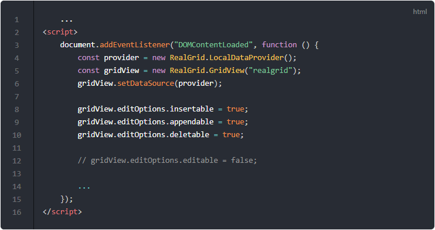
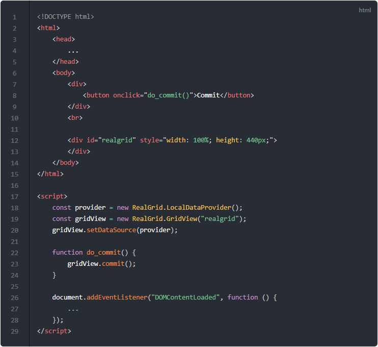
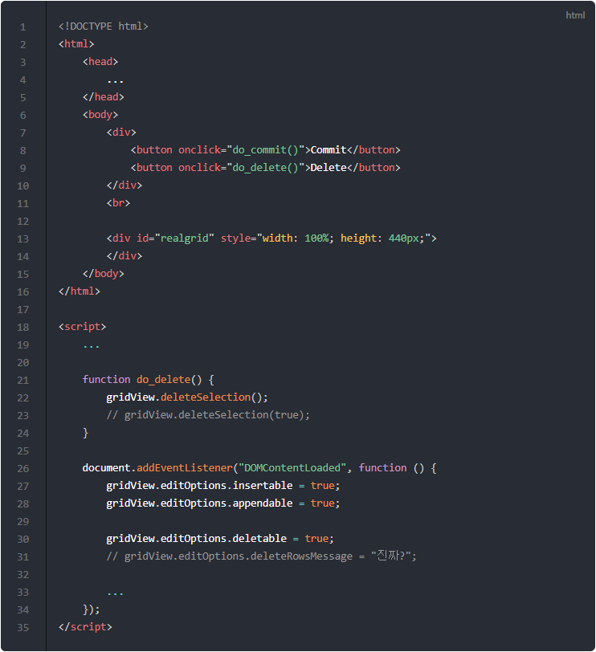
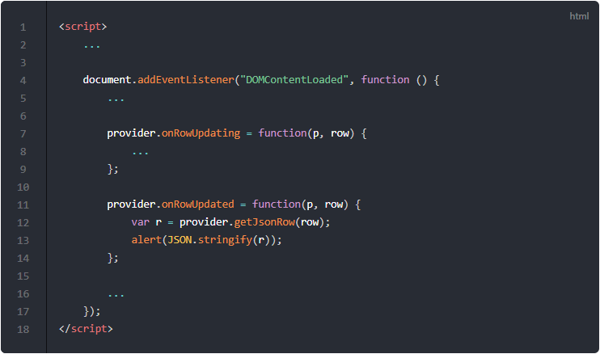

# 데이터 수정하기

이번 포스트에서는 리얼그리드의 데이터를 편집, 삭제 그리고 새로운 행을 추가하는 방법에 대해서 알아보겠습니다.

## 데이터 수정에 관련된 중요 옵션 살펴보기

기본적이 코드는 ["예제-02 데이터 가져와서 그리드에 표시하기"](http://10bun.tv/samples/realgrid2/part-1/02/)에서 가져와서 필요한 부분만 수정하여 사용하도록 하겠습니다.

전체 코드 및 결과물은 [데이터 수정에 관련된 중요 옵션 살펴보기 예제](http://10bun.tv/samples/realgrid2/part-1/04/step-01.html)를 참고해주세요.

* 8: 현재 위치에 행을 추가할 수 있도록 옵션을 변경합니다.
  * true일 경우에만 insert 키를 눌러서 행을 추가 할 수 있습니다.
  * 기본은 false입니다.
* 9: 그리드 마지막 행 뒤에 행을 추가할 수 있도록 옵션을 변경합니다.
  * true일 경우에만 그리드 마지막행에서 아랫쪽 방향키로 행을 추가할 수 있습니다.
  * 기본은 false입니다.
* 10: 선택된 행 또는 행들을 삭제할 수 있도록 옵션을 변경합니다.
  * true일 경우에만 "ctrl + delete" 키를 눌러서 행을 삭제 할 수 있습니다.
  * 기본은 false입니다.
* 12: 그리드의 데이터의 변경 가능여부를 결정하는 옵션입니다.
  * 다른 기본 옵션과 달리 기본이 true입니다.
  * false 상태가 되면 모든 데이터 변경 기능이 멈추게 됩니다. 즉, 편집, 삭제 또는 행 추가 등이 되지 않습니다.

> 보다 다양하고 자세한 옵션 설정 방법에 대해서는 [EditOptions](http://docs.realgrid.com/refs/edit-options) 문서를 참고하시기 바랍니다.

## 코드로 수정사항 저장하기 (commit)

그리드의 데이터를 수정하고 저장하기 위해서는 위 아래 방향키를 눌러서 행을 이동하시면 됩니다. 리얼그리드에서는 이러한 과정을 commit이라고 부르고 있습니다.

이것을 현재 행의 위치를 변경하지 않고 저장 버튼을 클릭해서 commit 할 수도 있는데요. 그 코드는 아래와 같습니다.

전체 코드 및 결과물은 [코드로 수정사항 저장하기 예제](http://10bun.tv/samples/realgrid2/part-1/04/step-02.html)를 참고해주세요. 그리드의 내용을 변경하고 Commit 버튼을 클릭하면 변경사항이 저장되는 것을 확인할 수가 있습니다.

* 7-10: 그리드 위에 저장 버튼을 추가하는 코드입니다.
* 8: 버튼의 onclick 이벤트를 이용해서 버튼이 클릭되면 do_commit() 함수를 실행할 예정입니다.
* 18-20: addEventListener() 밖에서도 provider와 gridView를 사용할 수 있도록 상수 선언을 밖으로 꺼내두었습니다.
* 22-24: 버튼이 클릭되면 실행될 do_commit()함수의 구현 부분입니다. gridView.commit()를 실행하여 변경된 내용을 저장하고 있습니다.

## 코드로 선택된 행들을 삭제하기

그리드에서 "ctrl + delete" 키를 누르는 대신 코드로 선택된 행들을 삭제하는 방법을 살펴보도록 하겠습니다.

전체 코드 및 결과물은 [코드로 선택된 행들을 삭제하기 예제](http://10bun.tv/samples/realgrid2/part-1/04/step-03.html)를 참고해주세요. 행을 선택하고 Delete 버튼을 클릭하면 선택된 행들이 삭제되는 것을 확인할 수가 있습니다.

* 9: 그리드 위에 삭제 버튼을 추가하는 코드입니다. 버튼의 onclick 이벤트를 이용해서 버튼이 클릭되면 do_delete() 함수를 실행할 예정입니다.
* 21-24: 버튼이 클릭되면 실행될 do_delete()함수의 구현 부분입니다. gridView.deleteSelection()를 실행하여 선택된 행들을 삭제합니다.
* 23: 22 라인을 삭제하고 23 라인의 주석을 해제하면, 즉 deleteSelection() 메소드에 true 인자를 넘기면, 삭제 확인 메시지 없이 바로 행들을 삭제합니다.
* 31: 삭제 확인 메시지를 변경하고 싶을 때에는 주석을 해제하시고, 메시지를 문자열로 입력하시면 됩니다.

## 데이터가 저장되기 전에 발생하는 이벤트 onRowUpdating

onRowUpdating 이벤트를 이용하면 데이터가 저장되기 전에 전처리 작업을 하는 것이 가능합니다.
또한 변경되는 데이터의 문제를 미리 검사하여 저장을 계속 진행할 것인지 또는 취소할 것인지 선택하는 것도 결정할 수가 있습니다.

아래는 id에 0보다 작은 수가 입력되면 에러 메시지를 표시하고 저장을 취소하는 예제입니다.

전체 코드 및 결과물은 [onRowUpdating 예제](http://10bun.tv/samples/realgrid2/part-1/04/step-04.html)를 참고해주세요.
id에 음수를 넣고 Commit 버튼을 클릭해서 저장하면 에러 메시지와 함께 저장이 취소되는 것을 확인할 수가 있습니다.

* 9-20: 데이터가 저장되기 전에 발생하는 onRowUpdating 이벤트를 구현하는 부분입니다.
* 10-18: 현재 수정 중인 행에서 id 값이 음수인지 판별하는 부분입니다.
* 16: false를 리턴하면 변경 내용이 취소됩니다.
* 19: true를 리턴하면 변경 내용이 저장됩니다.

## 데이터가 저장된 이후에 발생하는 이벤트 onRowUpdated

onRowUpdated 이벤트를 이용하면 그리드의 변경 내용을 서버로 전송하여 저장하는 등에 활용하실 수가 있습니다.

아래는 변경된 내용을 json 문자열로 변경하고 alert 참으로 표시하는 예제입니다.

전체 코드 및 결과물은 [onRowUpdated 예제](http://10bun.tv/samples/realgrid2/part-1/04/step-05.html)를 참고해주세요.
데이터를 변경하고 Commit 버튼을 클릭해서 저장하면 변경된 행을 json 문자열로 변경해서 alert 참으로 표시해줍니다.

* 11-14: 데이터가 저장된 이후에 발생하는 onRowUpdated 이벤트를 구현하는 부분입니다.
* 12: 저장 중인 row의 json 데이터를 가져옵니다.
* 13: json 데이터를 문자열로 변경하여 alert 창으로 표시합니다.

> onRowUpdating과 onRowUpdated 이외의 다른 이벤트를 참고하시려면 [LocalTreeDataProvider](http://docs.realgrid.com/refs/local-tree-data-provider) 문서를 확인해주시기 바랍니다.
