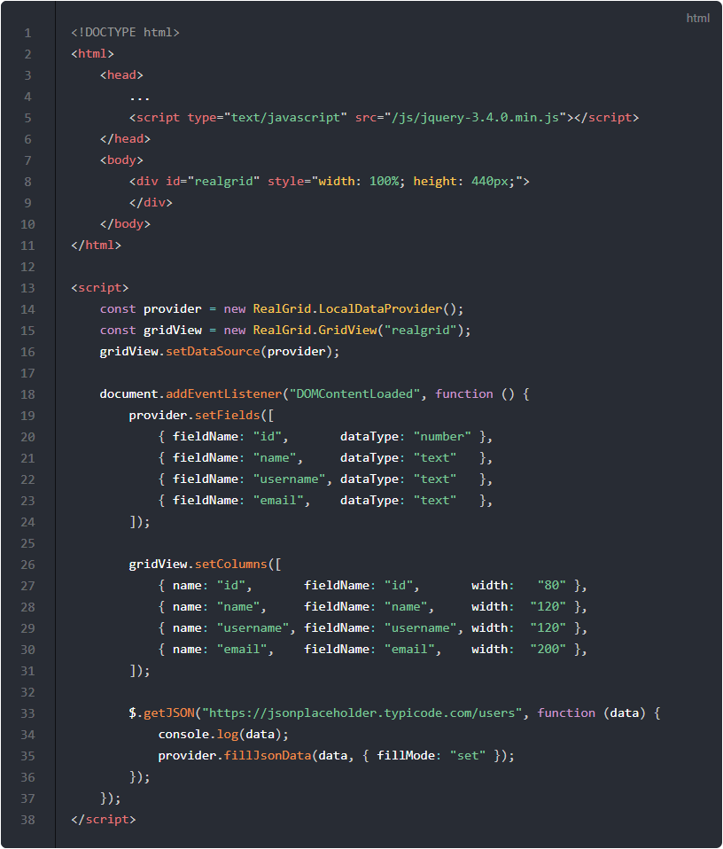
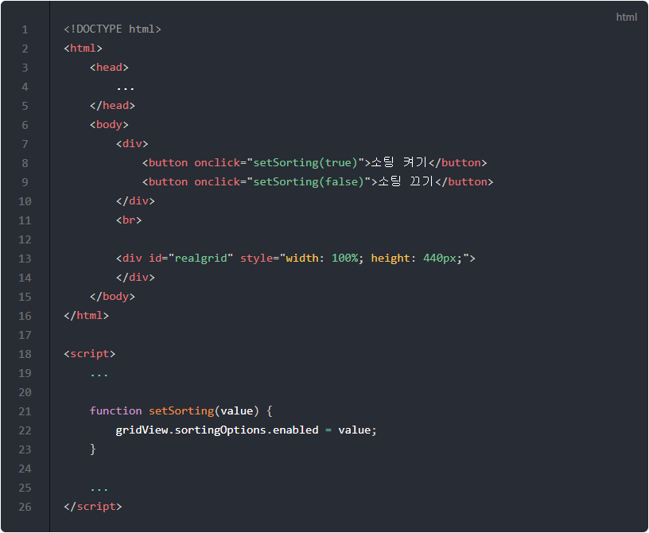
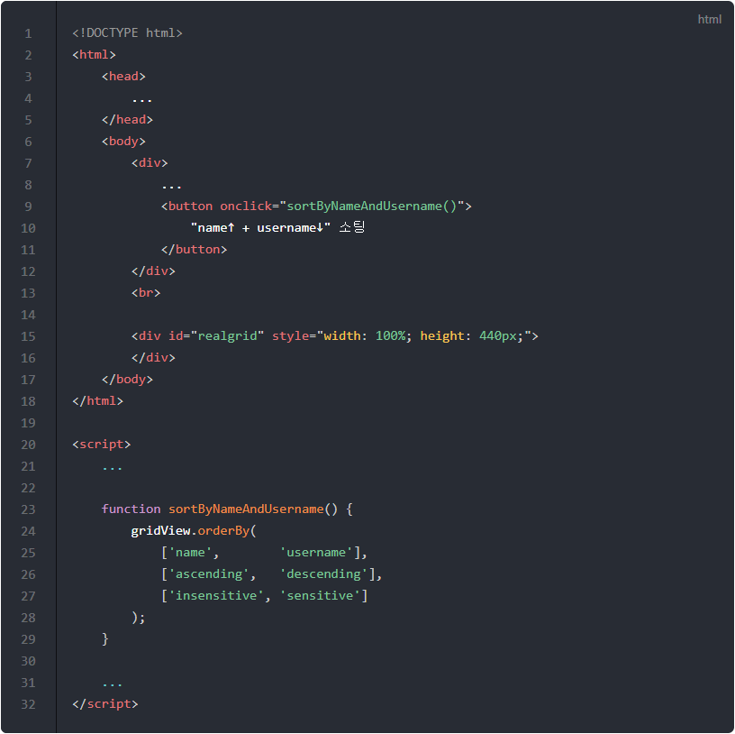
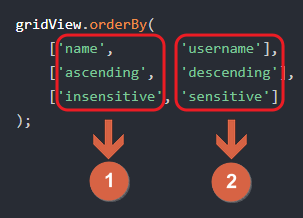
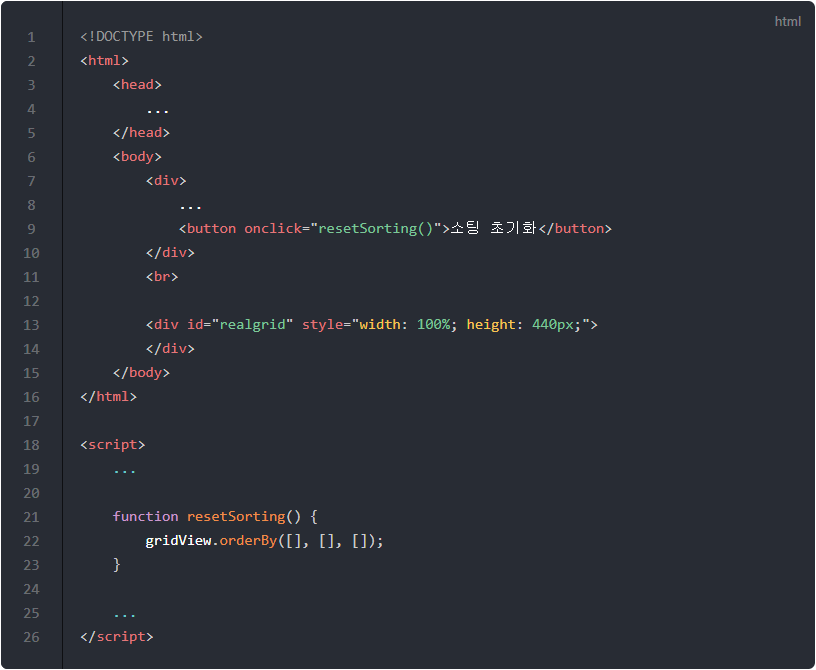
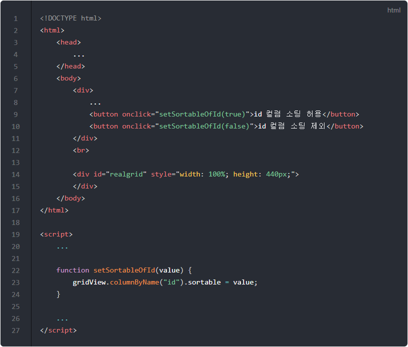
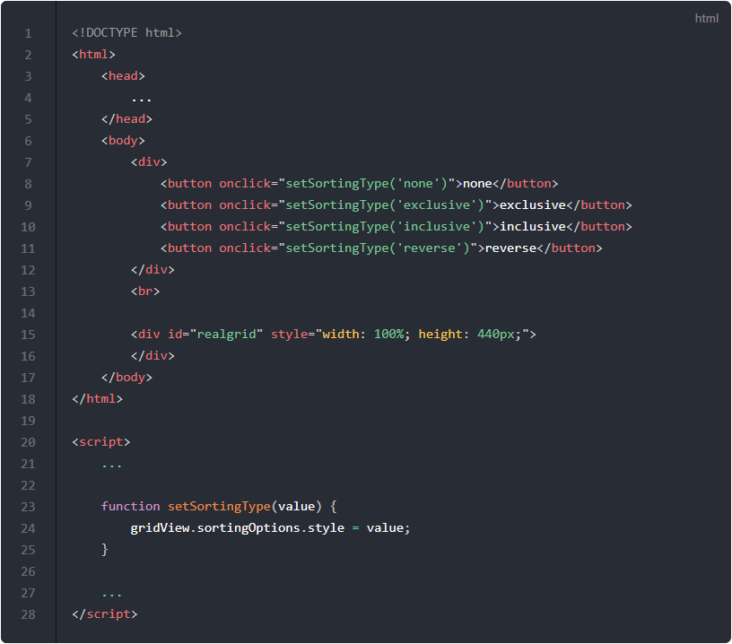

# 소팅

이번 포스트에서는 리얼그리드를 컬럼 데이터의 순서대로 소팅하는 방법에 대해서 알아보겠습니다.


## 기본 코드 작성하기

아래 코드는 이번 포스트에 필요한 기본 골격에 해당하는 예제입니다.

아래의 예제를 실행하면 서버로부터 데이터를 가져와서 그리드에 표시해줍니다.
그 상태에서 그리드의 컬럼 이름을 클릭하면 해당 컬럼을 기준으로 그리드가 정렬되는 것을 확인할 수 있습니다.

기본적으로 리얼그리드는 헤더를 클릭했을 때 해당 컬럼의 데이터를 기존으로 소팅되도록 설정되어 있습니다.
컬럼을 클릭할 때마다 오름차순, 내림차순 그리고 초기상태로 번갈아가면서 정렬을 하게 됩니다.

기본 코드의 실행결과는 아래 링크에서 확인할 수 있습니다.
* [기본 코드의 실행 결과](http://10bun.tv/samples/realgrid2/part-1/05/step-00.html)


* 5: 서버(https://jsonplaceholder.typicode.com)로부터 데이터를 가져오기 위해서 JQuery를 사용합니다.
* 8-9: 리얼그리드가 표시될 영역입니다.
* 14-16: ["데이터 수정하기"](../04)처럼 provider와 gridView 상수를 DOMContentLoaded 이벤트 핸들러 밖에서도 사용할 수 있도록 선언 위치를 변경하였습니다.
* 19-24: 데이터의 필드를 정의하는 영역입니다.
* 26-31: 그리드의 컬럼을 정의하는 영역입니다.
* 33-36: 데이터는 [https://jsonplaceholder.typicode.com/users](https://jsonplaceholder.typicode.com/users)에서 가져옵니다.


## 소팅 켜고 끄기

아래 코드는 sortingOptions를 이용하여 소팅 기능의 동작을 멈추거나 다시 시작할 수 있도록 해주는 예제입니다.
"소팅켜기"와 "소팅 끄기" 버튼을 클릭한 후 컬럼을 클릭해보세요.

예제의 전체 코드 및 실행결과는 아래 링크에서 확인할 수 있습니다.
* [소팅 켜고 끄기 예제](http://10bun.tv/samples/realgrid2/part-1/05/step-01.html)


* 8: "소팅 켜기" 버튼이 클릭되면 setSorting(true) 함수가 실행되고, 결과적으로 gridView.sortingOption의 enabled 속성이 true가 되어 그리드의 헤더를 클릭하면 해당 컬럼 기준으로 소팅이 되도록 할 수 있습니다.
* 9: "소팅 끄기" 버튼이 클릭되면 enabled 속성이 false가 되어 그리드 헤더를 클릭해도 변화가 생기지 않습니다.
  * 기존에 소팅이 되어 있던 것들은 그대로 유지됩니다.

::: tip
setSortingOptions() 메소드의 자세한 설명은 [SortingOptions](http://docs.realgrid.com/refs/sorting-options) 문서를 참고해주세요.
:::


## 코드로 소팅하기 (orderBy)

아래 코드는 orderBy() 메소드를 이용하여 선택된 컬럼을 기준으로 소팅하는 예제입니다.
"name↑ + username↓ 소팅" 버튼을 클릭하면 name 컬럼을 오름 차순으로 그리고 username 컬럼을 내림차순으로 조합하여 소팅이 되는 것을 확인할 수 있습니다.

예제의 전체 코드 및 실행결과는 아래 링크에서 확인할 수 있습니다.
* [코드로 소팅하기 예제](http://10bun.tv/samples/realgrid2/part-1/05/step-02.html)


* 9-11: 버튼이 클릭되면 sortByNameAndUsername() 함수를 실행합니다.
* 23-29: 버튼이 클릭되었을 때 실행되는 sortByNameAndUsername() 함수의 구현 코드입니다.
  * gridView의 orderBy() 메소드에 의해서 소팅이 실행됩니다.

orderBy() 메소드는 3개의 파라메터가 필요한데요. 각각 아래와 같습니다.

``` js
gridView.orderBy(
    [컬럼 목록],
    [소팅 방식],
    [대소문자 구분 유형]
);
```

orderBy()의 파라메터들은 세로로 한 묶음이 되는데요. 이는 아래의 그림과 같습니다.


* 1: name 컬럼을 ascending(오름차순)으로 정렬하면서, 대소문자는 구별하지 않습니다(insensitive).
* 2: username 컬럼을 descending(내림차순)으로 정렬하면서, 대소문자는 구별합니다(sensitive).


## 소팅 초기화하기

아래 코드는 orderBy() 메소드를 이용하여 소팅을 초기화하는 예제입니다.
다양한 소팅을 테스트해보고 "소팅 초기화"을 클릭하여 정렬 순서가 처음 상태로 초기화되는 지 확인해보세요.

예제의 전체 코드 및 실행결과는 아래 링크에서 확인할 수 있습니다.
* [소팅 초기화하기 예제](http://10bun.tv/samples/realgrid2/part-1/05/step-03.html)


* 9-11: 버튼이 클릭되면 resetSorting() 함수를 실행합니다.
* 21-23: 버튼이 클릭되었을 때 실행되는 resetSorting() 함수의 구현 코드입니다.
  * orderBy() 메소드의 세 개의 파라메터에 모두 빈 배열을 넘겨서 소팅을 초기화합니다. 데이터가 서버로부터 가져올 때의 순서대로 표시됩니다.


## 특정컬럼 소팅 여부 지정

아래 코드는 컬럼의 sortable 속성을 이용하여 특정 컬럼에 대해서만 소팅을 켜고 끄는 예제입니다.
허용 버튼 또는 제외 버튼을 클릭 한 후 id 컬럼을 클릭해보세요.
id 컬럼을 클릭해도 소팅이 되지 않거나 다시 소팅이 되는지 확인해보세요.

예제의 전체 코드 및 실행결과는 아래 링크에서 확인할 수 있습니다.
* [특정컬럼 소팅 여부 지정 예제](http://10bun.tv/samples/realgrid2/part-1/05/step-04.html)


* 9-10: 특정 컬럼의 소팅 켜고 끄기 버튼들이 정의되는 영역입니다. setSortableOfId() 함수의 boolean 파라메터를 이용해서 소팅을 켜거나 끄게 됩니다.
* 22-24: setSortableOfId() 함수의 구현 코드입니다.
  * gridView.columnByName("id")를 통해서 "id"라는 이름을 가진 컬럼을 가져옵니다.
  * 찾아낸 컬럼의 sortable 속성을 전달받은 인자로 변경합니다.
  * true이면 소팅을 할 수 있는 컬럼이 되고 false이면 소팅을 할 수 없는 컬럼이 됩니다.


## 소팅 스타일 지정

아래 코드는 헤더를 클릭했을 때 소팅 방식을 결정하는 예제입니다.
각각의 버튼들은 다음과 같은 의미가 있습니다.
버튼을 하나씩 클릭한 후에 컬럼을 클릭해서 확인해보세요.
* none: 정렬하지 않습니다.
* exclusive: 마지막으로 클릭한 컬럼으로 정렬합니다.
* inclusive: 처음으로 클릭한 컬럼을 우선으로 순서대로 정렬합니다.
* reverse: 마지막으로 클릭한 컬럼을 우선으로 순서대로 정렬합니다.

예제의 전체 코드 및 실행결과는 아래 링크에서 확인할 수 있습니다.
* [소팅 스타일 지정 예제](http://10bun.tv/samples/realgrid2/part-1/05/step-04.html)


* 8-11: 소팅 스타일을 결정하는 버튼들이 정의되어 있는 영역입니다.
* 23-25: setSortingType() 함수의 구현 코드입니다.
