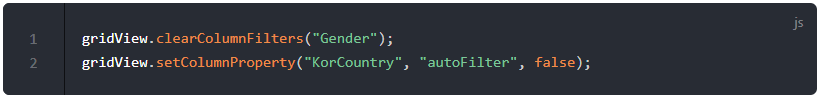
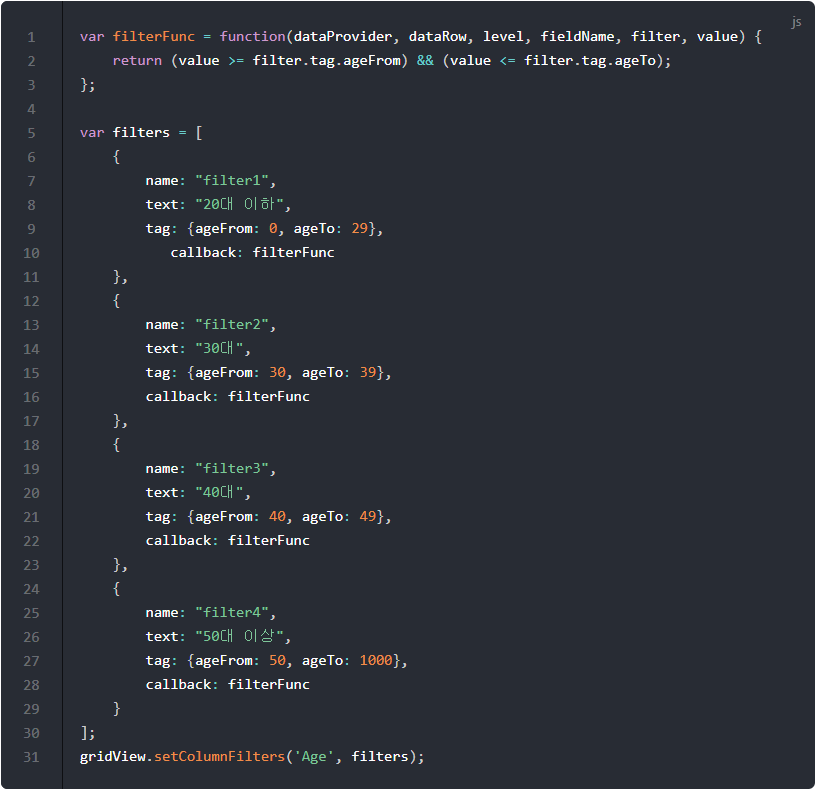

# 필터링

이번 포스트에서는 필터링하는 방법에 대해서 알아보겠습니다.

## 기본코드

필터링 코드를 작성하기 이전에 서버로부터 데이터를 가져와서 그리드에 표시하는 기본코드부터 살펴보겠습니다.
이미 이전 포스트에서 살펴본 내용이기 때문에 자세한 설명은 생략하겠습니다.

기본 코드의 실행결과는 아래 링크에서 확인할 수 있습니다.
* [기본 코드의 실행 결과](http://10bun.tv/samples/realgrid2/part-1/06/step-01.html)

* 우선 DOMContentLoaded 이벤트를 사용하던 것을 삭제하였습니다. 이것은 경우에 따라서 문제가 될 수도 있지만 현재 강의를 진행하는 예제의 구조에서는 문제가 없기 때문에 코드를 좀 더 단순하게 보이기 위해서 변경하였습니다.
* 다양한 데이터를 예제로 사용하기 위해서 github에 샘플 데이터를 올려두고 가져와서 사용할 예정입니다.

## 필터링 다루기 #1

이번 포스트에서는 다뤄야할 내용이 조금 많은 편입니다.
따라서 여러 파트로 나눠서 설명을 드리도록 하겠습니다.

"필터링 다루기 #1 예제"의 코드 및 실행결과는 아래 링크에서 확인할 수 있습니다.
* [필터링 다루기 #1 예제](http://10bun.tv/samples/realgrid2/part-1/06/step-02.html)

### 필터 켜고 끄기

setFilteringOptions() 메소드를 사용하여 필터를 사용할 지 말지를 결정하는 코드입니다.
true로 설정하면 필터가 동작하고, false로 설정하면 필터가 동작하지 않게 됩니다.

### 자동 필터링

자동 필터링은 컬럼을 선택하면 해당 컬럼에 있는 데이터를 중복 없이 필터로 등록하게 됩니다.
즉, 데이터가 ("남", "여", "여", ...)처럼 되어 있다면 필터는 ("남", "여") 두 개만 생성됩니다.

* 1: setColumnProperty() 메소드는 column 이름으로 컬럼을 찾아서 property에 해당하는 속성을 value 값으로 변경합니다.
* 2: "KorCountry"라는 이름의 속성을 찾아서 "autoFilter" 속성 값을 true로 바꿔줍니다. 따라서 해당 컬럼에 있는 데이터를 근거로 자동으로 필터를 만들어 줍니다.

setColumnProperty() 메소드의 보다 자세한 내용은 GridBase 설명 문서에서 [setColumnProperty](http://docs.realgrid.com/refs/grid-base#setcolumnproperty-column-prop-value) 부분을 살펴보세요.

### 필터 지정하기

setColumnFilters() 메소드는 코드로 필터를 지정하고 싶을 때 사용합니다.

* 1-10: 필터를 정의 합니다.
* 3: 필터의 이름을 지정합니다. 지정된 이름이 그리드의 필터에 표시됩니다.
* 4: 필터가 선택됐을 때 사용할 데이터 값입니다. value와 같은 데이터만 그리드에 표시되게 됩니다.
* 11: 정의한 필터를 "Gender" 컬럼에 적용합니다.

setColumnFilters() 메소드의 보다 자세한 내용은 GridBase 설명 문서에서 [setColumnFilters](http://docs.realgrid.com/refs/grid-base#setcolumnfilters-column-filters) 부분을 살펴보세요.

### 필터 삭제하기

* 1: "Gender" 컬럼에 정의된 필터를 삭제합니다.
* 2: "KorCountry" 컬럼은 자동 필터이기 때문에 clearColumnFilters() 메소드로 삭제할 수가 없습니다. 따라서 "KorCountry" 컬럼의 autoFilter 속성을 false로 변경해야 필터가 사라지게 됩니다.

## 필터링 다루기 #2

"필터링 다루기 #2 예제"의 코드 및 실행결과는 아래 링크에서 확인할 수 있습니다.
* [필터링 다루기 #2 예제](http://10bun.tv/samples/realgrid2/part-1/06/step-03.html)

### 필터 추가 및 제거

addColumnFilters() 메소드는 setColumnFilters() 메소드와 유사합니다.
setColumnFilters() 메소드가 정의된 필터를 컬럼에 적용하는 것과 달리 addColumnFilters() 메소드는 기존의 필터에서 새로운 필터를 추가한다는 점이 다릅니다.

* 1-6: 추가할 필터를 정의합니다. 배열이기 때문에 여러 개의 필터를 한 번에 추가할 수도 있습니다.
* 7: addColumnFilters() 메소드는 column 이름으로 컬럼을 찾아서 정의된 filter를 추가해 줍니다. overwrite가 true이면 이미 있는 필터라고 해도 덮어쓰게 되며, false 일 때 같은 필터가 이미 있다면 에러가 발생합니다.
* 8: "KorCountry" 컬럼에 filters에서 정의된 필터들을 추가합니다. overwrite가 true이기 때문에 기존에 같은 필터가 있다고 해도 무시하게 됩니다.

removeColumnFilters() 메소드는 반대로 필터를 제거하는 역활을 합니다.

* 1: column 이름으로 컬럼을 찾아서 뒤에 오는 필터명과 같은 필터를 모두 삭제합니다.
* 2: "KorCountry" 컬럼에서 "우크라이나", "브라질" 필터를 찾아서 삭제합니다.

### 필터 적용 및 해제

activateColumnFilters() 메소드를 사용하면 선택된 필터가 선택된 상태가 되거나 선택 안된 상태로 변경할 수가 있습니다.

* 1: column 이름으로 컬럼을 찾아서 filterNames에 해당하는 필터들의 선택 상태를 active 값으로 지정합니다. active 값이 true이면 선택된 상태가 되고, false이면 선택되지 않은 상태가 됩니다.
* 4: "모잠비크", "캐나다" 필터를 선택된 상태로 변경합니다.
* 7: "모잠비크" 필터를 선택되지 않은 상태로 변경합니다.

### 모든 필터 적용 및 해제

* 1: column 이름으로 컬럼을 찾아서 모든 필터들의 선택 상태를 active 값으로 지정합니다. active 값이 true이면 선택된 상태가 되고, false이면 선택되지 않은 상태가 됩니다.
* 4: "KorCountry" 컬럼의 모든 필터를 선택된 상태로 변경합니다.
* 7: "KorCountry" 컬럼의 모든 필터를 선택되지 않은 상태로 변경합니다.

## 필터링 다루기 #3

"필터링 다루기 #3 예제"의 코드 및 실행결과는 아래 링크에서 확인할 수 있습니다.
* [필터링 다루기 #3 예제](http://10bun.tv/samples/realgrid2/part-1/06/step-04.html)

### 필터 숨기기 및 보이기

* 1: column 이름으로 컬럼을 찾아서 모든 필터들의 숨기기 속성을 변경합니다. hide 값이 true이면 숨기기가 되고, false이면 보이기가 됩니다.
* 4: "KorCountry" 컬럼의 "우크라이나", "브라질" 필터를 숨깁니다.
* 7: "KorCountry" 컬럼의 "우크라이나", "브라질" 필터를 보입니다.

### 모든 필터 숨기기 및 보이기

* 1: column 이름으로 컬럼을 찾아서 모든 필터들의 숨기기 속성을 변경합니다. hide 값이 true이면 숨기기가 되고, false이면 보이기가 됩니다.
* 4: "KorCountry" 컬럼의 모든 필터를 숨깁니다.
* 7: "KorCountry" 컬럼의 모든 필터를 보입니다.

### 필터 토글

* 1: column 이름으로 컬럼을 찾아서 filterNames에 해당하는 필터들의 active 속성을 반대로 변경합니다. 선택된 상태와 선택되지 않은 상태가 계속 번갈아 바뀌게 됩니다.
* 2: "KorCountry" 컬럼의 "모잠비크", "캐나다" 필터들의 선택 상태를 반전시킵니다.

### 모든 필터 토글

* 1: column 이름에 해당하는 컬럼의 모든 필터들의 active 속성을 반대로 변경합니다. 선택된 상태와 선택되지 않은 상태가 계속 번갈아 바뀌게 됩니다.
* 2: "KorCountry" 컬럼의 모든 필터들의 선택 상태를 반전시킵니다.

## 필터링 다루기 #4 - 함수를 이용한 필터링

이번에는 함수를 이용해서 데이터를 필터링하는 방법에 대해서 알아보겠습니다.

"함수를 이용한 필터링 예제"의 코드 및 실행결과는 아래 링크에서 확인할 수 있습니다.
* [함수를 이용한 필터링 예제](http://10bun.tv/samples/realgrid2/part-1/06/step-05.html)

* 1-3: 필터에 사용할 함수를 정의하는 부분입니다. 아래 두 조건이 맞으면 true를 리턴해서 해당 데이터가 선택되어 그리드에 표시됩니다.
  * value >= filter.tag.ageFrom
    * 현재 데이터가 filter의 속성 중 tag.ageFrom보다 크거나 같으면 true가 됩니다.
  * value <= filter.tag.ageTo
    * 현재 데이터가 filter의 속성 중 tag.ageTo보다 작거나 같으면 false가 리턴됩니다.
  * 위의 두 조건이 모드 만족하면 해당 나이 사이에 있는 사용자가 되어서 함수는 true를 리턴합니다. 따라서 선택한 연령에 해당하는 데이터만 표시됩니다.
* 5-30: 필터를 정의하는 부분입니다.
* 9, 15, 21, 27: 필터의 tag 속성에 {ageFrom, ageTo} 객체를 대입하여 연령대별로 데이터를 거를 수 있도록 기준값을 정합니다.
* 10, 16, 22, 28: 필터가 선택되었을 때 데이터를 추려내는 조건을 계산할 함수를 지정합니다.

