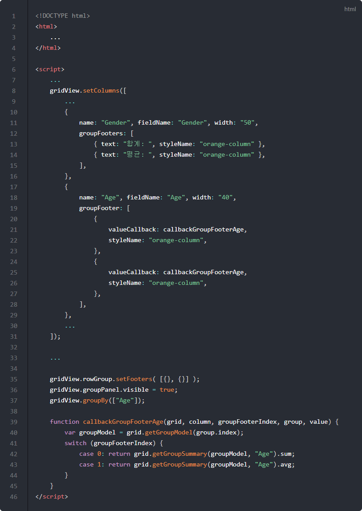

# 행그룹

이번 포스트에서는 행을 기준으로 그룹핑을 하는 방법에 대해서 알아보겠습니다.
행그룹은 SQL의 "Group By" 명령어와 같은 기능을 합니다.

## 기본 코드

행그룹에서 사용할 예제들의 기본이 되는 코드부터 살펴보겠습니다.
서버로부터 데이터를 가져와서 표시해주기까지만 적용된 상태입니다.

기본 코드의 실행결과는 아래 링크에서 확인할 수 있습니다.
* [기본 코드의 실행 결과](http://10bun.tv/samples/realgrid2/part-1/07/step-00.html)

6: 새로운 CSS 파일이 추가되었습니다. 컬럼의 스타일을 변경하는데 사용합니다.

## 그룹 패널 숨기기 / 보이기

아래는 그룹 패널을 숨기거나 보이기 예제 코드입니다.
그룹 패널이 표시되면 컬럼을 마우스로 드래그해서 놓으면 해당 컬럼을 기준으로 그룹핑이 처리됩니다.

예제 코드의 실행결과는 아래 링크에서 확인할 수 있습니다.
링크의 페이지를 여시고 "GroupPanel 보이기" 버튼을 클릭하신다음 컬럼을 마우스로 끌어서 놓아보세요.
* [그룹 패널 숨기기 / 보이기 예제 실행결과](http://10bun.tv/samples/realgrid2/part-1/07/step-01.html)

* 16-18: 버튼이 클릭되었을 때 그룹 패널의 visible 속성을 변경시키는 함수의 구현 부분입니다.
* 17: gridView.groupPanel의 visible 속성이 true가 되면 패널이 보이고, false이면 사라지게 됩니다.

## 코드로 그룹 묶기

GridView의 groupBy() 메소드를 이용하면 마우스 조작을 하지 않고 코드만으로도 그룹을 묶을 수 있습니다.
아래는 Age 컬럼을 기준으로 그룹핑하는 예제와 설명입니다.

예제 코드의 실행결과는 아래 링크에서 확인할 수 있습니다.
* [코드로 그룹 묶기 예제 실행결과](http://10bun.tv/samples/realgrid2/part-1/07/step-02.html)

* 16: 그룹 패널을 보이도록 합니다. 그룹 패널이 보이지 않아도 그룹핑은 되지만 눈으로 확인할 수 있도록 true로 세팅하였습니다.
* 19: "Gender"와 "KorCountry" 컬럼을 기준으로 그룹핑합니다.

## 그룹 헤더와 푸터 표시 변경하기

GridView의 setRowGroup() 메소드를 이용하면 그룹의 헤더와 푸터의 표시 내용을 변경할 수 있습니다.
표시할 수 있는 속성들은 아래와 같습니다.
* groupField
* fieldHeader
* groupColumn
* columnHeader
* columnFooter
* groupValue
* rowCount

예제 코드의 실행결과는 아래 링크에서 확인할 수 있습니다.
* [그룹 헤더와 푸터 표시 변경하기 예제 실행결과](http://10bun.tv/samples/realgrid2/part-1/07/step-03.html)

* 13: 해더의 표시 방법을 정의하고 있습니다.
* 14: 푸터의 표시 방법을 정의하고 있습니다.

## 그룹 푸터와 그리드 푸터 설정 변경하기

컬럼을 설정할 때 groupFooter와 footer 속성을 변경하여 평균값이나 합계 등의 부가적인 정보를 표시할 수 있습니다.

groupFooter 속성은 모든 그룹마다 적용되며, footer 속성은 그리드 하단에서 전체 데이터에 대한 값이 적용됩니다.

예제 코드의 실행결과는 아래 링크에서 확인할 수 있습니다.
* [그룹 푸터와 그리드 푸터 설정 변경하기 예제 실행결과](http://10bun.tv/samples/realgrid2/part-1/07/step-04.html)

* 12-16: 그룹 푸터 설정을 변경하는 부분입니다.
* 17-21: 그리드의 푸터 설정을 변경하는 부분입니다.
* 14, 19. 숫자 표현 방식을 정의합니다.
* 15, 20: 푸터의 스타일을 적용합니다. "right-column"은 common.css에 정의되어 있습니다.

> expression에 들어갈 수 있는 연산식은 [Expression](http://help.realgrid.com/api/features/Expression/) 문서를 참고해주시기 바랍니다.

## 그룹 푸터의 동적계산

groupFooter의 valueCallback 속성을 이용하면 그룹 푸터의 내용을 직접 계산해서 처리할 수 있습니다.

예제 코드의 실행결과는 아래 링크에서 확인할 수 있습니다.
* [그룹 푸터의 동적계산 예제 실행결과](http://10bun.tv/samples/realgrid2/part-1/07/step-05.html)

* 13: valueCallback 속성에 callbackGroupFooterAge() 함수를 대입하고 있습니다. 그룹 푸터를 표시할 때 해당 함수의 리턴값을 이용하게 됩니다.
* 26-19: callbackGroupFooterAge() 함수의 구현 영역입니다.
* 28: getGroupSummary() 메소드를 이용해서 Age 컬럼의 그룹 요약 정보 객체를 가져와서 count 속성 값을 리턴하고 있습니다. 결과적으로 몇 건의 데이터가 현재 그룹에 묶여져 있는지 리턴합니다.

getGroupModel() 메소드와 getGroupSummary() 메소드의 자세한 설명은 아래의 링크를 참고하시기 바랍니다.
* [getGroupModel() 설명](http://docs.realgrid.com/refs/grid-base#getgroupmodel-itemindex-extended)
* [getGroupSummary() 설명](http://docs.realgrid.com/refs/grid-base#getgroupsummary-model-field-statistical)

## 그룹 푸터를 여러 줄로 표시하기

setFooters() 메소드를 이용하면 그룹 푸터를 여러 줄로 표시할 수 있습니다.

예제 코드의 실행결과는 아래 링크에서 확인할 수 있습니다.
* [그룹 푸터의 동적계산 예제 실행결과](http://10bun.tv/samples/realgrid2/part-1/07/step-06.html)

* 35: setFooters() 메소드에 파라메터로 전달되는 배열의 요소 개수만큼 그룹 푸터 표시 줄이 늘어나게 됩니다. 이번 예제에서는 두 줄로 그룹 푸터가 표시됩니다.
* 39-45: 그룹 푸터에 표시될 내용을 리턴하는 함수를 구현합니다.
* 42: 첫 번째 줄에 그룹의 합계를 표시합니다.
* 43: 두 번째 줄에 그룹의 평균을 표시합니다.

## 행그룹 이벤트

onGrouping 이벤트는 그룹이 묶여지기 전에 발생합니다.
이벤트 핸들러에서 false를 리턴하면 그룹핑이 취소되는데요.
조건에 따라 그룹핑을 취소해야 할 때 이용하시면 됩니다.

onGrouped 이벤트는 그룹핑이 완료되면 발생합니다.
그룹핑 이후에 처리해야할 작업이 필요할 때 이용하시면 됩니다.

예제 코드의 실행결과는 아래 링크에서 확인할 수 있습니다.
* [행그룹 이벤트 예제 실행결과](http://10bun.tv/samples/realgrid2/part-1/07/step-07.html)

* 11: false로 변경해서 실행하면 그룹핑이 안되는 것을 확인할 수 있습니다.
* 14-19: 그룹핑이 완료되면 그룹핑이 되었는지와 머지 모드로 그룹핑되었는지 여부가 다이얼로그 창에 표시됩니다.