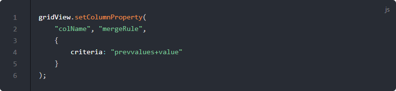
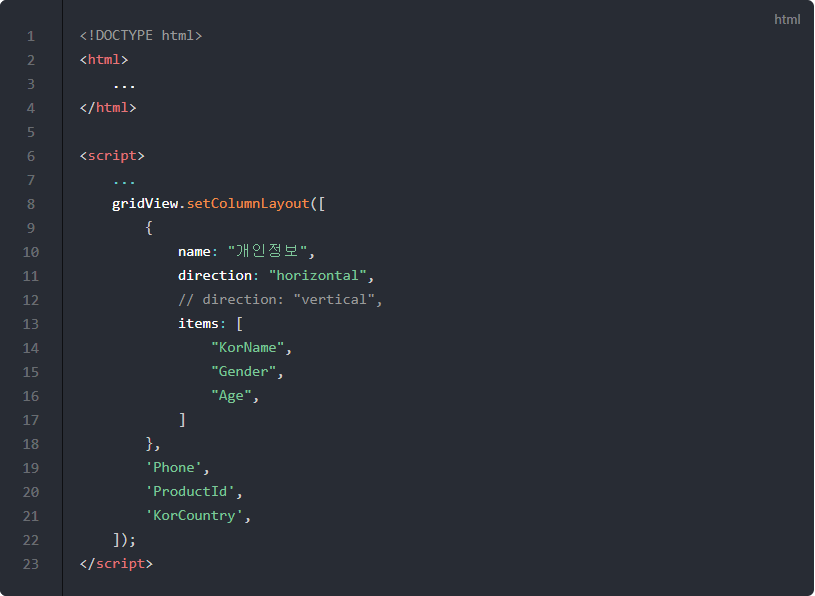
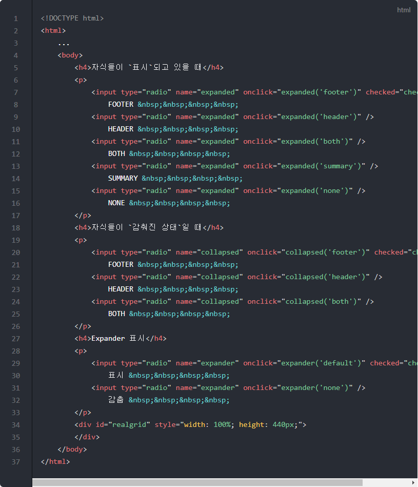
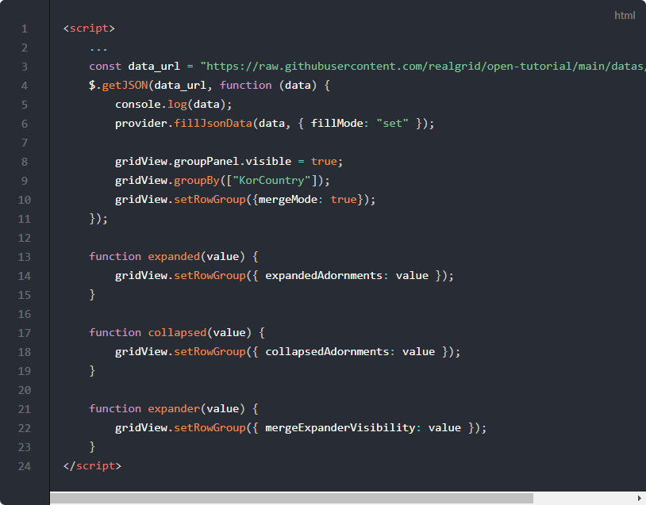
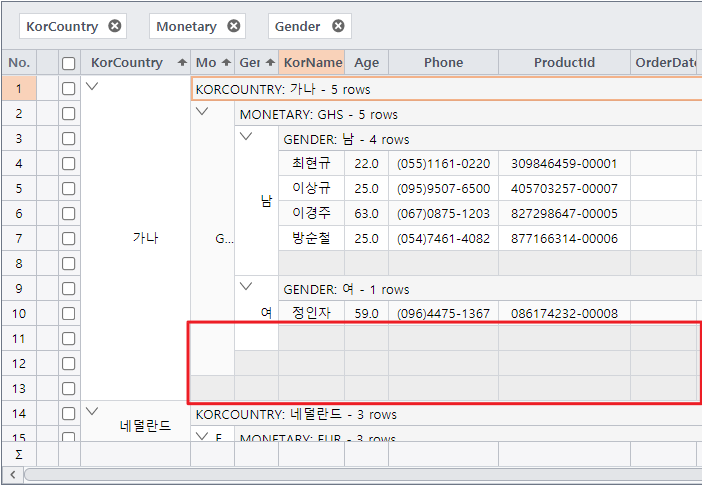
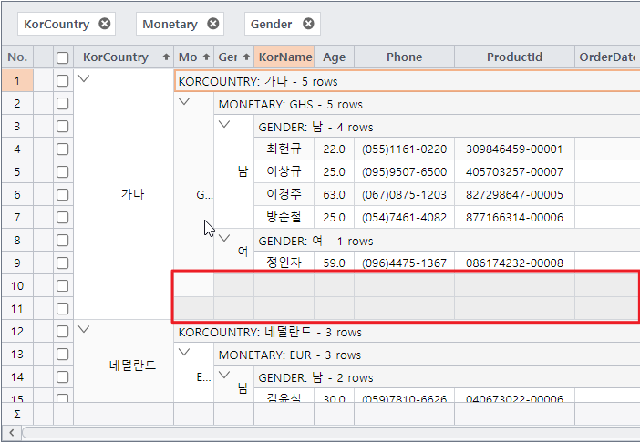
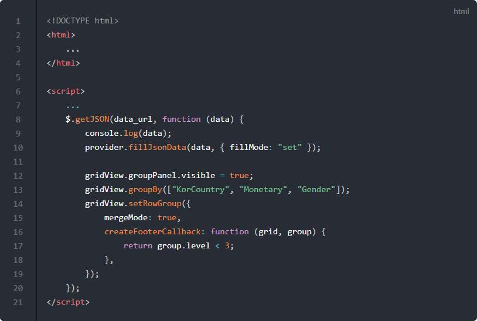

# 셀 병합

이번 포스트에서는 셀을 병합하고 컬럼 헤더를 그룹핑하는 방법에 대해서 알아보겠습니다.

## 기본 코드

예제들의 기본이 되는 코드부터 살펴보겠습니다.
서버로부터 예제 데이터를 가져와서 표시해주기까지만 적용된 상태입니다.

기본 코드의 실행결과는 아래 링크에서 확인할 수 있습니다.
* [기본 코드의 실행 결과](http://10bun.tv/samples/realgrid2/part-1/08/step-00.html)

## 셀 병합하기

아래 예제를 실행하면 성별(Gender)을 같은 값을 가진 셀끼리 묶어서 보여줍니다.
setColumns() 메소드로 컬럼을 초기화할 때 mergeRule을 설정했기 때문입니다.

이후 버튼을 클릭하시면 병합하는 기준이 달라지는데요.
자세한 설명은 코드 안을 참고하시기 바랍니다.

예제 코드의 실행결과는 아래 링크에서 확인할 수 있습니다.
* [셀 병합하기 예제 실행결과](http://10bun.tv/samples/realgrid2/part-1/08/step-01.html)

* 20: 컬럽을 설정할 때 병합할 기준을 정합니다. 'value'로 지정하면 값이 같은 것끼리 이웃해 있는 경우 병합하게 됩니다.
* 6: 성별(Gender) 컬럼을 3줄씩 묶어서 보여줍니다.
* 7: 성별(Gender) 컬럼을 5줄씩 묶어서 보여줍니다.
* 8: 20번 째 줄과 같이 같은 값을 가진 셀을 병합합니다.
* 9: criteria에 널 문자를 넣으면 초기화되어 셀을 묶지 않고 보여줍니다.

## 선택컬럼을 참조하여 병합하기

셀 병합 시 특정 컬럼 값을 참조해서 병합할 수 있습니다.

셀 병합 시 모든 선행 컬럼 값을 참조해서 병합할 수 있습니다.

## 컬럼 헤더 그룹핑

아래의 그림에서처럼 유사한 컬럼 여러개를 하나의 묶음으로 표시하고자 할 때 활용할 수 있는 예제입니다.
KorName, Gender, Age 세 개의 컬럼 헤더를 하나로 묶어서 그룹화한 예입니다.

예제 코드의 실행결과는 아래 링크에서 확인할 수 있습니다.
* [컬럼 푸터 병합 예제 실행결과](http://10bun.tv/samples/realgrid2/part-1/08/step-02.html)

* 10: 헤더 그룹에 표시될 텍스트입니다.
* 11: 컬럼들을 수평 방향으로 그룹핑합니다.
* 12: 11번 라인을 주석처리하고 12번 라인의 주석을 제거하면 수직방향으로 컬럼들을 그룹핑합니다.
* 13-17: 그룹으로 묶을 컬럼들입니다.
* 19-21: 표시할 컬럼들의 목록입니다.

## 행 병합 그룹핑

아래 예제는 그룹핑된 셀들을 병합해서 표시합니다.
표시할 때 헤더나 푸터 등을 표시하는 방식을 변경하는 방법을 함께 설명합니다.

코드가 길어서 html 태그 영역과 스크립트 영역으로 나눠서 설명을 진행합니다.

예제 코드의 실행결과는 아래 링크에서 확인할 수 있습니다.
* [행 병합 그룹핑 예제 실행결과](http://10bun.tv/samples/realgrid2/part-1/08/step-03.html)

* 5-17: 병합된 셀의 자식 셀들이 표시되고 있을 때, 헤더와 푸터를 표시하는 방법을 선택하기 위해 라디오 버튼을 정의하는 영역입니다.
* 18-26: 병합된 셀의 자식 셀들이 보이지 않을 때, 헤더와 푸터를 표시하는 방법을 선택하기 위해 라디오 버튼을 정의하는 영역입니다.
* 27-33: Expander 아이콘을 보이거나 감추기를 선택하기 위해 라디오 버튼을 정의하는 영역입니다.

* 8-10: 데이터가 다운로드되고 난 이후 setRowGroup() 메소를 실행하기 위해서 $.getJSON() 안쪽에 코드를 구현하였습니다.
* 13-15: 병합된 셀의 자식 셀들이 표시되고 있을 때, 선택된 라디오 버튼에 따라서 헤더와 푸터를 표시하는 방식을 변경합니다.
* 17-19: 병합된 셀의 자식 셀들이 보이지 않을 때, 선택된 라디오 버튼에 따라서 헤더와 푸터를 표시하는 방식을 변경합니다.
* 21-23: Expander 아이콘을 보이거나 사라지게 합니다.

## 그룹 푸터 표시 제한 설정

여러 개의 컬럼을 기준으로 그룹핑되었을 때 푸터가 표시되는 래밸을 정하는 예제입니다.

아래의 이미지는 createFooterCallback 설정을 하지 않은 디폴트 상태에서의 그룹핑입니다.
그룹핑된 컬럼의 갯수와 동일하게 푸터가 생성되어 있는 것을 알 수 있습니다.

아래 이미지는 createFooterCallback 설정을 통해서 두 번 째 컬럼까지만 푸터가 생기도록 코드를 구현했을 때의 결과입니다.
그룹핑된 컬럼은 3개이지만 푸터는 2개만 생성되어 있는 것을 알 수 있습니다.

예제 코드의 실행결과는 아래 링크에서 확인할 수 있습니다.
* [그룹 푸터 표시 제한 설정 예제 실행결과](http://10bun.tv/samples/realgrid2/part-1/08/step-04.html)

* 12-19: 데이터가 다운로드되고 난 이후 setRowGroup() 메소를 실행하기 위해서 $.getJSON() 안쪽에 코드를 구현하였습니다.
* 16-18: createFooterCallback을 구현해서 group.level이 3보다 작은 경우에만 true가 리턴되도록 하였습니다. 결과적으로 group.level이 2 이하까지만 푸터가 표시됩니다.
