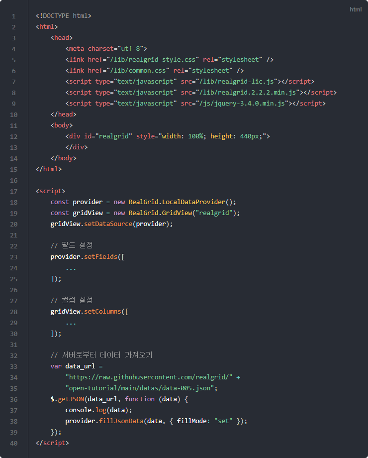
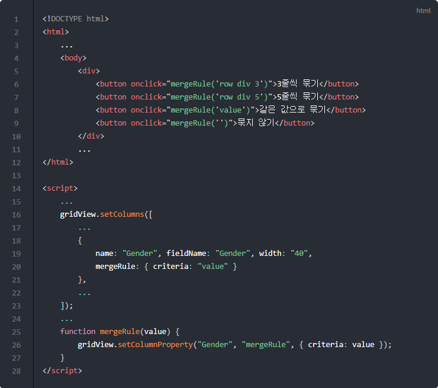

# 셀 병합

이번 포스트에서는 셀 병합에 대해서 알아보겠습니다.

## 기본 코드

예제들의 기본이 되는 코드부터 살펴보겠습니다.
서버로부터 예제 데이터를 가져와서 표시해주기까지만 적용된 상태입니다.

기본 코드의 실행결과는 아래 링크에서 확인할 수 있습니다.
* [기본 코드의 실행 결과](http://10bun.tv/samples/realgrid2/part-1/08/step-00.html)

## 셀 병합하기

아래 예제를 실행하면 성별(Gender)을 같은 값을 가진 셀끼리 묶어서 보여줍니다.
setColumns() 메소드로 컬럼을 초기화할 때 mergeRule을 설정했기 때문입니다.

이후 버튼을 클릭하시면 병합하는 기준이 달라지는데요.
자세한 설명은 코드 안을 참고하시기 바랍니다.

예제 코드의 실행결과는 아래 링크에서 확인할 수 있습니다.
* [셀 병합하기 예제 실행결과](http://10bun.tv/samples/realgrid2/part-1/08/step-01.html)

* 20: 컬럽을 설정할 때 병합할 기준을 정합니다. 'value'로 지정하면 값이 같은 것끼리 이웃해 있는 경우 병합하게 됩니다.
* 6: 성별(Gender) 컬럼을 3줄씩 묶어서 보여줍니다.
* 7: 성별(Gender) 컬럼을 5줄씩 묶어서 보여줍니다.
* 8: 20번 째 줄과 같이 같은 값을 가진 셀을 병합합니다.
* 9: criteria에 널 문자를 넣으면 초기화되어 셀을 묶지 않고 보여줍니다.

## 선택 컬럼을 참조하여 병합하기

아래는 여러 개의 컬럼의 값을 기준으로 셀을 병합하는 예제입니다.

화살표가 가리키는 CustomerID 컬럼의 셀들을 병합하는데, 
병합하는 기준이 OrderID, Country, CustomerID 세 컬럼의 데이터가 모두 같은 경우 
CustomerID 컬럼의 셀을 병합하는 경우입니다.

윗쪽 네모 박스를 보면 앞의 두 컬럼의 값은 같지만, 
마지막 CustomerID 컬럼의 값이 아래 컬럼과 다르기 때문에
세 컬럼의 데이터가 모두 같아야한다는 조건을 만족하지 않습니다.
따라서 컬럼을 병합하지 한 줄만 표시됩니다.

아랫쪽 박스를 보면 4번 5번 줄 세 컬럼의 데이터가 모두 같기 때문에 
CustomerID 컬럼의 셀이 병합되어 있는 것을 알 수 있습니다.

예제 코드의 실행결과는 아래 링크에서 확인할 수 있습니다.
* [선택 컬럼을 참조하여 병합하기 예제 실행결과](http://10bun.tv/samples/realgrid2/part-1/08/step-02.html)

* 10-12: OrderID, Country, CustomerID 세 컬럼의 데이터가 모두 같은 경우 CustomerID 셀을 병합합니다.

아래 세 표현 모두 같은 의미입니다. (주석 처리된 부분과 11번의 코드)
* {criteria: "prevvalues + value"}
* {criteria: "values['OrderID'] + values['Country'] + value"}
* {criteria: "values['OrderID'] + values['Country'] + values['CustomerID']"};