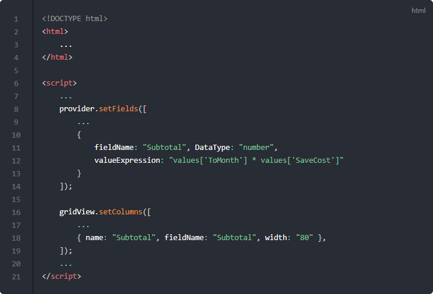
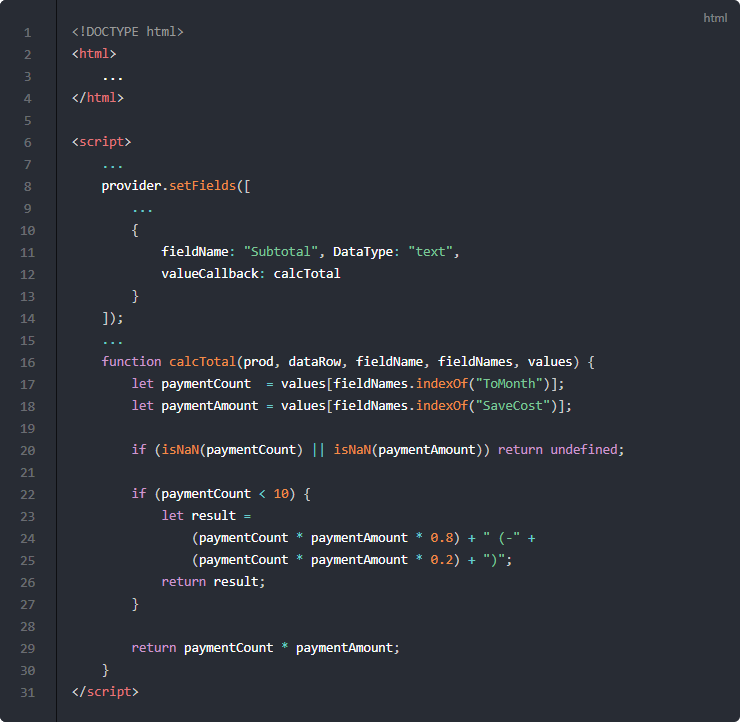

# 계산 필드

다른 컬럼을 계산해서 결과값을 가지는 계산 필드에 대해서 알아보겠습니다.

## 기본 코드

예제들의 기본이 되는 코드부터 살펴보겠습니다.
서버로부터 예제 데이터를 가져와서 표시해주기까지만 적용된 상태입니다.

기본 코드의 실행결과는 아래 링크에서 확인할 수 있습니다.
* [기본 코드의 실행 결과](http://10bun.tv/samples/realgrid2/part-1/09/step-00.html)

## valueExpression

주문수량과 제품단가 컬럼이 있다고 가정하겠습니다.
이런 경우 전체 주문금액을 DB에 직접 저장하지 않는 경우가 대부분입니다.
이런 경우 실제 데이터에는 없지만 주문금액을 주문수량과 제품단가를 곱한 계산 결과를 표시하는
가상의 컬럼을 만드는 방법에 대해서 설명하겠습니다.

예제 코드의 실행결과는 아래 링크에서 확인할 수 있습니다.
* [valueExpression 예제 실행결과](http://10bun.tv/samples/realgrid2/part-1/09/step-01.html)

* 12: 필드 설정에서 valueExpression 속성을 추가합니다.
  * 따옴표 안 식의 계산 결과값이 필드의 데이터 값이 됩니다.
  * values["필드명"]은 같은 row 데이터에서 해당 필드명의 값이 됩니다.
  * 결과적으로 12라인은 ToMonth 컬럼과 SaveCost 컬럼의 값을 곱한 결과값이 가상으로 생성된 Total 필드의 값이 됩니다.
* 18: 가상으로 만들어진 가상 필드도 일반 필드와 동일하게 취급되기 때문에 컬럼 설정에서 fieldName에 지정하여 사용합니다.

## valueCallback

단순한 계산이 아닌 복잡한 계산이나 절차가 필요한 경우라면
valueCallback을 사용해서 함수의 리턴값으로 계산 필드의 데이터를 구할 수 있습니다.

예제 코드의 실행결과는 아래 링크에서 확인할 수 있습니다.
* [valueCallback 예제 실행결과](http://10bun.tv/samples/realgrid2/part-1/09/step-02.html)

* 12: 필드 설정에서 valueCallback 속성을 추가합니다. calcTotal 함수가 지정되어 있어서 각 row가 표시될 때마다 calcTotal 함수의 결과값이 Total 필드의 값이 됩니다.
* 16-30: calcTotal 함수의 구현 코드입니다.
* 20: ToMonth 필드와 SaveCost 필드 둘 중 하나만이라도 숫자 속성이 아니면 undefined를 리턴합니다.
* 22-27: paymentCount가 10개 미만이면 20% 할인한다는 가정으로 계산합니다. 괄호안에는 할인된 금액이 표시됩니다.
* 29: 위의 조건들이 맞지 않는 경우에는 "개수 * 금액"의 결과값을 리턴합니다.

> valueCallback 계산 시간만큼 그리드의 속도가 느려질 수 있습니다.
