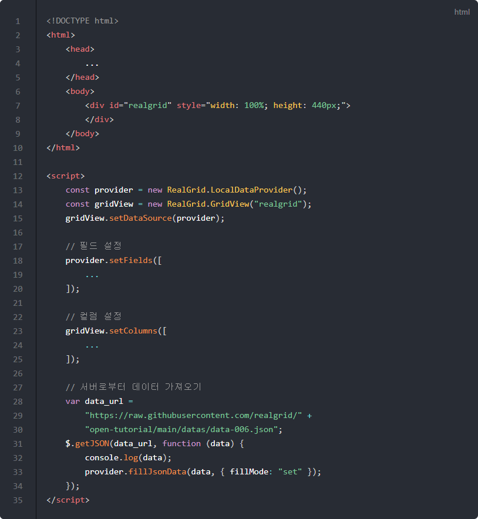
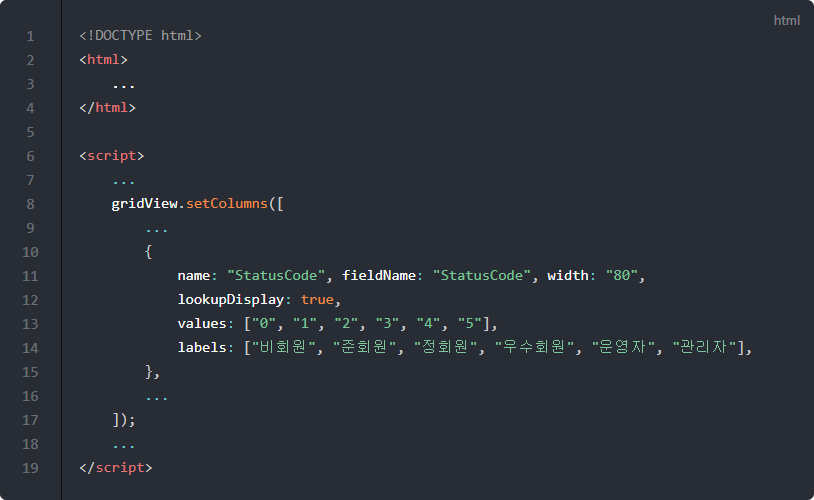
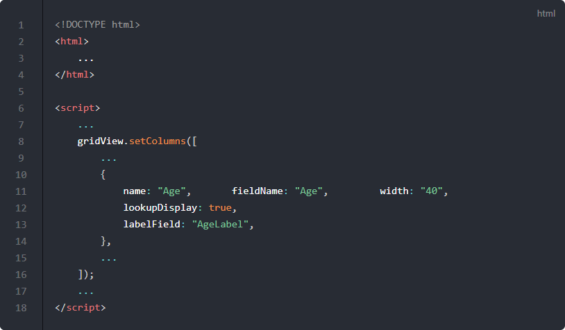
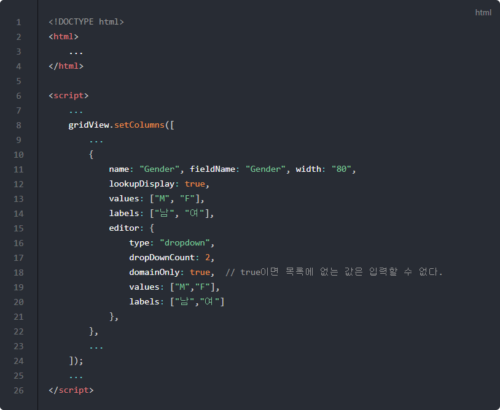
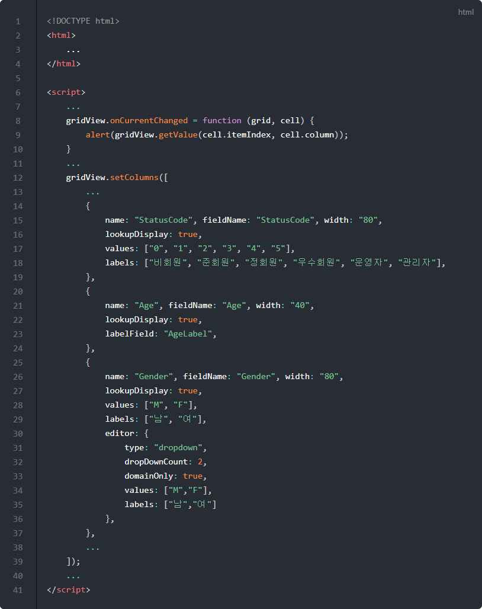

# Lookup 컬럼

데이터의 실제 값이 아닌 다른 의미를 부여받은 값으로 바꿔서 그리드에 표시하는 방법을 다룹니다.

탈퇴여부와 같은 필드가 하나의 예가 될 수 있는데요.
보통의 경우 DB에는 **Y** 또는 **N**과 같이 1 바이트 문자나 숫자로 저장되는 경우가 많습니다.
컴퓨터의 입장에서는 그것이 더욱 효율적이지요.
하지만 사람의 입장에서는 **탈퇴함** 또는 **탈퇴안함** 등으로 표시하는 것이 더욱 효율적입니다.
이런 경우 Lookup 컬럼을 이용해서 실제 데이터는 **Y** 또는 **N** 이지만 표시는 **탈퇴함** 또는 **탈퇴안함**으로 표시할 수 있습니다.

## 기본 코드

예제들의 기본이 되는 코드부터 살펴보겠습니다.
서버로부터 예제 데이터를 가져와서 표시해주기까지만 적용된 상태입니다.

기본 코드의 실행결과는 아래 링크에서 확인할 수 있습니다.
* [기본 코드의 실행 결과](http://10bun.tv/samples/realgrid2/part-1/10/step-00.html)

## values와 labels 설정

아래 예제는 values와 labels 속성을 이용해서 데이터의 값마다 표시되는 값을 지정하는 방법을 보여주고 있습니다. 
데이터가 "0"일 때는 "비회원"으로 표시되고, "1"일 때는 "준회원" 등으로 표시되도록 하는 예제입니다.

예제 코드의 실행결과는 아래 링크에서 확인할 수 있습니다.
* [values와 labels 설정 예제 실행결과](http://10bun.tv/samples/realgrid2/part-1/10/step-01.html)

* 12: lookupDisplay의 값을 true로 설정하면 values와 labels의 규칙에 의해서 데이터의 값이 셀에 표시됩니다.
* 13-14: 셀에 표시되는 값이 나열되는 배열 중에 하나이면 실제 데이터 값 대신 labelsd에서 같은 순서의 값이 셀에 표시됩니다.

## labelField 설정

labelField를 이용하면 실제 값이 아닌 다른 필드의 값을 해당 셀에 표시할 수 있습니다.
셀에 표시되는 필드와 실제 셀에 저장된 값이 다른 상태가 됩니다.

실데 데이터가 아닌 표시되는 데이터를 서버 쪽에서 제공받고자 할 때 유용할 수 있습니다.

values와 labels의 경우에는 데이터의 변경 방식이 바뀌면 적용된 코드를 모두 찾아서 수정해야하지만,
labelField의 경우에는 데이터를 제공하는 서버(API)만 수정하면 됩니다.
다만, 서버에서 데이터를 조작해야하는 계산 비용과 전송되는 데이터의 크기가 늘어나는 단점이 있습니다.

예제 코드의 실행결과는 아래 링크에서 확인할 수 있습니다.
* [labelField 설정 예제 실행결과](http://10bun.tv/samples/realgrid2/part-1/10/step-02.html)

## Dropdown lookup 설정

셀의 값을 변경할 때 드롭다운 목록에서 하나를 선택하는 것이 효율적인 경우가 있는데요.
이런 경우에 lookup 컬럼을 응용해서 실제 데이터가 아닌 표시 데이터를 선택하는 방법을 알아보겠습니다.

Gender(성별) 필드에는 **M**, **F** 두 가지 데이터가 저장되어 있습니다.
이것을 드롭다운 목록에서 선택하고자 한다면 목록도 **M**, **F** 두 가지를 표시하고 고르도록 하면됩니다.

하지만 이것을 **남**과 **여**로 바꾸고 싶을 경우 아래와 같은 예제를 활용할 수 있습니다.

예제 코드의 실행결과는 아래 링크에서 확인할 수 있습니다.
* [dropDown lookup 설정 예제 실행결과](http://10bun.tv/samples/realgrid2/part-1/10/step-03.html)

* 13-14: values와 labels를 이용해서 실제 데이터 대신 lables의 데이터가 셀에 표시되도록 합니다.
* 15-21: 셀의 데이터를 변경할 때 사용할 에디터를 설정합니다. type 속성이 dropdown이기 때문에 드롭다운 형식으로 데이터를 수정할 수 있게 됩니다.
* 17: 드롭다운 목록의 아이템 개수를 지정합니다.
* 18: domainOnly가 false가 되면 목록에 표시되지 않은 데이터를 입력하는 것이 가능하지만, true가 되면 목록에 있는 데이터만 입력할 수 있게 됩니다.
* 19: 드롭다운 목록이 선택되면 셀에 입력될 실제 데이터입니다.
* 20: 드롭다운 목록에 표시될 데이터입니다.

## value값 확인하기

아래 예제는 지금껏 살펴본 예제들의 실제값을 확인 할 수 있도록 작성되었습니다.
셀을 클릭하면 alert() 창으로 셀의 값이 표시됩니다.

예제 코드의 실행결과는 아래 링크에서 확인할 수 있습니다.
* [value값 확인하기 예제 실행결과](http://10bun.tv/samples/realgrid2/part-1/10/step-04.html)

* 8-10: 그리드의 셀 선택이 변경되면 발생하는 이벤트를 처리하는 코드입니다.
* 9: 현재 셀의 데이터 값을 alert() 창으로 표시합니다.