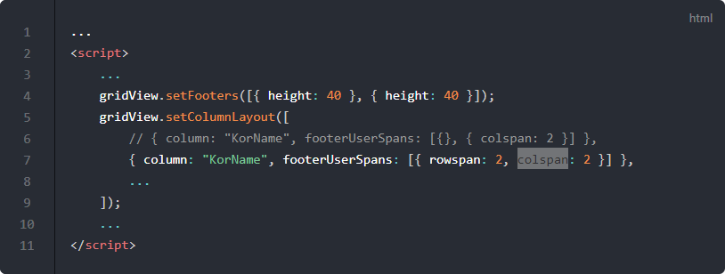

# 헤더와 푸터

## 기본 코드

예제들의 기본이 되는 코드부터 살펴보겠습니다.
서버로부터 예제 데이터를 가져와서 표시해주기까지만 적용된 상태입니다.

기본 코드의 실행결과는 아래 링크에서 확인할 수 있습니다.
* [기본 코드의 실행 결과](http://10bun.tv/samples/realgrid2/part-2/02/step-00.html)

## 헤더와 푸터의 높이 조절

예제 코드의 실행결과는 아래 링크에서 확인할 수 있습니다.
* [헤더와 푸터의 높이 조절 예제 실행결과](http://10bun.tv/samples/realgrid2/part-2/02/step-01.html)

## 그룹컬럼 헤더 높이 변경

예제 코드의 실행결과는 아래 링크에서 확인할 수 있습니다.
* [그룹컬럼 헤더 높이 변경 예제 실행결과](http://10bun.tv/samples/realgrid2/part-2/02/step-02.html)

## 헤더 체크박스

예제 코드의 실행결과는 아래 링크에서 확인할 수 있습니다.
* [헤더 체크박스 예제 실행결과](http://10bun.tv/samples/realgrid2/part-2/02/step-03.html)

## 여러 줄로 표시하기

예제 코드의 실행결과는 아래 링크에서 확인할 수 있습니다.
* [여러 줄로 표시하기 예제 실행결과](http://10bun.tv/samples/realgrid2/part-2/02/step-04.html)

## 컬럼 푸터

예제 코드의 실행결과는 아래 링크에서 확인할 수 있습니다.
* [컬럼 푸터 예제 실행결과](http://10bun.tv/samples/realgrid2/part-2/02/step-05.html)

## 컬럼 푸터 동적 계산

예제 코드의 실행결과는 아래 링크에서 확인할 수 있습니다.
* [컬럼 푸터 동적 계산 예제 실행결과](http://10bun.tv/samples/realgrid2/part-2/02/step-06.html)

## 상단 요약 표시

예제 코드의 실행결과는 아래 링크에서 확인할 수 있습니다.
* [상단 요약 표시 예제 실행결과](http://10bun.tv/samples/realgrid2/part-2/02/step-07.html)

## 상단 요약 동적 표시

예제 코드의 실행결과는 아래 링크에서 확인할 수 있습니다.
* [상단 요약 동적 표시 예제 실행결과](http://10bun.tv/samples/realgrid2/part-2/02/step-08.html)

## 컬럼 푸터 병합

예제 코드의 실행결과는 아래 링크에서 확인할 수 있습니다.
* [컬럼 푸터 병합 예제 실행결과](http://10bun.tv/samples/realgrid2/part-2/02/step-08.html)

