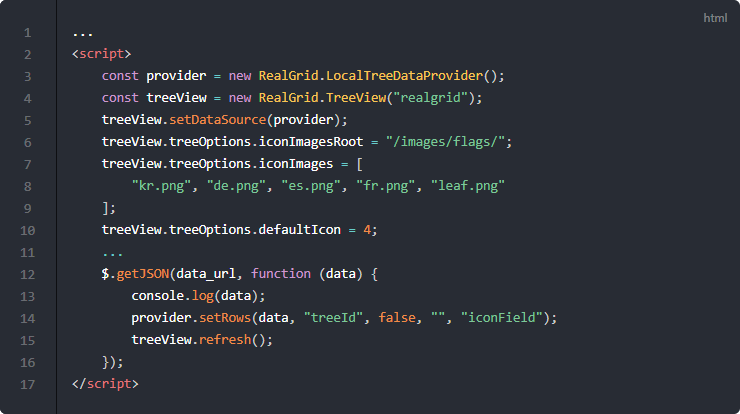

# 트리뷰

[](https://youtu.be/KzaDWCNmpNg)


## 기본 코드

예제들의 기본이 되는 코드부터 살펴보겠습니다.
서버로부터 예제 데이터를 가져와서 표시해주기까지만 적용된 상태입니다.

트리뷰(TreeView)가 아닌 그리드뷰(GridView)를 사용하는 코드인데요.
지금까지 설명했던 기본코드에서 어떤 부분들을 변경해야 트리뷰를 사용할 수 있는지 유의해서 살펴보시기 바랍니다.

기본 코드의 실행결과는 아래 링크에서 확인할 수 있습니다.
* [기본 코드의 실행 결과](http://10bun.tv/samples/realgrid2/part-2/03/step-00.html)


## 트리뷰로 전환하기

다른 예제와 달리 LocalDataProvider가 아닌 LocalTreeDataProvider를 사용하는 것과
GridView가 아닌 TreeView를 사용하고 있는 점을 유의하셔야 합니다.

예제 코드의 실행결과는 아래 링크에서 확인할 수 있습니다.
* [트리뷰로 전환하기 예제 실행결과](http://10bun.tv/samples/realgrid2/part-2/03/step-01.html)


* 3: LocalDataProvider가 아닌 LocalTreeDataProvider를 사용합니다.
* 4: GridView가 아닌 TreeView를 사용합니다.
* 6-10: 트리 노드에 표시할 아이콘의 경로와 이미지 파일명을 설정합니다.
* 11: 아이콘이 지정되지 않았을 경우 표시할 기본 이미지의 순번입니다. iconImages 배열에서 해당 순번의 이미지가 표시됩니다.
* 13: GridView가 아닌 TreeView로 변경해야 하는 점에 유의하세요.
* 19: 서버로부터 가져온 데이터를 provider에 입력합니다.
* 20: 새로 변경된 데이터를 TreeView에 적용합니다.


### LocalTreeDataProvider.setRows()

``` js
setRows(rows, treeField, needSorting, childrenField, iconField)
```
* rows: 설정할 데이터
* treeField: 트리로 묶을 정보가 담긴 필드 명
* needSorting: 소팅 여부
* childrenField: 자식 행이 있는 지를 지시하는 필드, 자식의 필드 명
* iconField: 트리 노드에 표시할 아이콘 경로를 값으로 가지고 있는 필드 이름


### 트리뷰 제약 사항

트리뷰(TreeView)는 그리드뷰(GridView)와 달리 몇 가지 제약사항이 있습니다.
* RowGrouping: 트리는 그룹핑을 지원하지 않습니다.
* Filtering: 부모 행이 필터로 제외되면 자식 행들 역시 제외됩니다.
* Sorting: 정렬시 계층 구조를 유지한 채 자식들만 정렬됩니다.
* 트리 컬럼: 트리가 보여지는 컬럼은 항상 첫 번째 컬럼 입니다.
* 트리가 보여지는 첫 번째 컬럼에는 html renderer 사용이 제한됩니다.


## 모두 펼치기, 모두 접기

예제 코드의 실행결과는 아래 링크에서 확인할 수 있습니다.
* [모두 펼치기, 모두 접기 예제 실행결과](http://10bun.tv/samples/realgrid2/part-2/03/step-02.html)


* 6: expandAll() 메소드는 트리뷰의 모든 노드를 펼쳐줍니다.
* 7: collapseAll() 메소드는 트리뷰의 모든 노드를 접어줍니다.


## 펼침, 닫힘 아이콘 지정

예제 코드의 실행결과는 아래 링크에서 확인할 수 있습니다.
* [펼침, 닫힘 아이콘 지정 예제 실행결과](http://10bun.tv/samples/realgrid2/part-2/03/step-03.html)


* 4: 아이콘 이미지 파일이 있는 폴더(주소)를 지정합니다.
* 5-6: 노드의 상태에 따라 표시할 세 개의 이미지 파일의 배열을 iconImages에 적용합니다.
* 7: 펼쳐져 있을 때 표시할 아이콘의 순서를 expandedIcon에 지정합니다.
* 8: 닫혀져 있을 때 표시할 아이콘의 순서를 collapsedIcon에 지정합니다.
* 9: 자식 노드가 없는 경우 표시할 아이콘의 순서를 defaultIcon에 지정합니다.


## 트리 이벤트

예제 코드의 실행결과는 아래 링크에서 확인할 수 있습니다.
* [트리 이벤트 예제 실행결과](http://10bun.tv/samples/realgrid2/part-2/03/step-04.html)


트리뷰에는 4개의 이벤트가 사용되고 있습니다.
* 4-7: onTreeItemExpanding 이벤트는 노드가 펼쳐지려고 할 때 발생합니다.
  * 6: 리턴값이 false면 노드를 클릭해도 펼쳐지지 않습니다. 예제에서는 종로구가 아닌 경우에만 true가 되기 때문에 종로구에 해당하는 노드는 펼쳐지지 않게 됩니다.
* 8-11: onTreeItemCollapsing 이벤트는 노드가 닫혀지려고 할 때 발생합니다.
  * 10: 리턴값이 false면 노드를 클릭해도 접혀지지 않습니다. 예제에서는 중구가 아닌 경우에만 true가 되기 때문에 중구에 해당하는 노드는 답혀지지 않게 됩니다.
* 12-14: onTreeItemExpanded 이벤트는 노드가 펼쳐지고 난 뒤에 발생합니다.
* 15-17: onTreeItemCollapsed 이벤트는 노드가 닫혀지고 난 뒤에 발생합니다.


## Object Data

이번 예제에서는 tree 구조를 가진 json 데이터를 트리뷰에 표시하는 방법에 대해서 알아봅니다.

예제 코드의 실행결과는 아래 링크에서 확인할 수 있습니다.
* [Object Data 예제 실행결과](http://10bun.tv/samples/realgrid2/part-2/03/step-05.html)


``` html
...
<script>
    provider.setFields([
        { fieldName: "col0", dataType: "text"   },
        { fieldName: "icon", dataType: "text"   },
        { fieldName: "col1", dataType: "number" },
        ...
    ]);
    treeView.setColumns([
        { fieldName: "col0", name: "col0", width: 150 },
        { fieldName: "icon", name: "icon" },
        { fieldName: "col1", name: "col1" },
        ...
    ]);
    var data_url = 
		"https://raw.githubusercontent.com/realgrid/" +
    	"open-tutorial/main/datas/treedata.json";
    $.getJSON(data_url, function (data) {
        console.log(data);
        provider.setObjectRows(data, "rows", "", "icon");
        treeView.expandAll();
    });
</script>
```

### 예제에 사용된 데이터 포멧

[데이터 포멧 확인하기](https://raw.githubusercontent.com/realgrid/open-tutorial/main/datas/treedata.json)


* "남자" 노드 밑에 "rows"라는 배열로 아시아, 북아메리카 등이 바로 밑에 저장되어 있습니다.
* 아시아의 경우 밑에 키프로스, 일본, 마카오, 터키가 묶여 있고 그림에서는 너무 길어서 아시아 밑에 저장된 데이터들을 접어서 표시해 둔 상태입니다.


### LocalTreeDataProvider.setObjectRows()

``` js
setObjectRows(json, rowsProp, childrenProp, iconProp)
```
* json: 설정할 데이터. Json 배열이거나 Json 배열을 속성으로 갖는 object. Json 배열이 아닌 경우 rowsProp에 지정된 속성을 배열로 지정해야 한다.
* rowsProp: Json 중 트리의 데이터 행들로 사용될 배열을 값으로 하는 속성의 이름
* childrenProp: 자식 행이 있는 지를 지시하는 속성 이름. 해당 속성의 값이 자식의 필드 이름과 같아야한다.
* iconProp: 트리 노드에 표시할 아이콘 경로를 값으로 가지고 있는 속성 이름