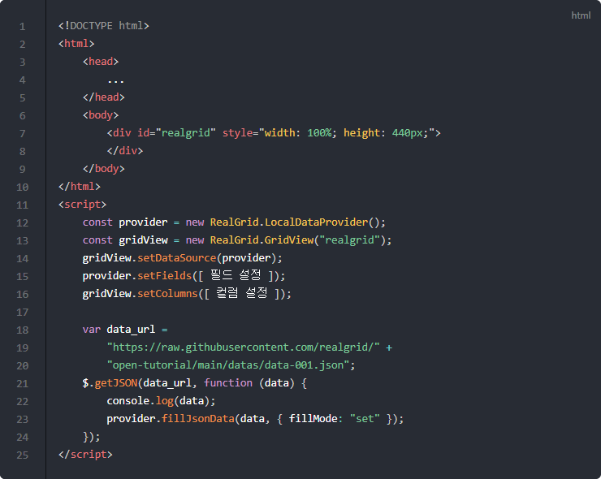
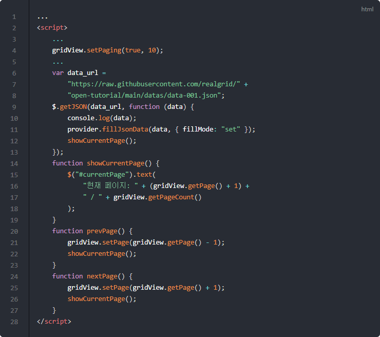
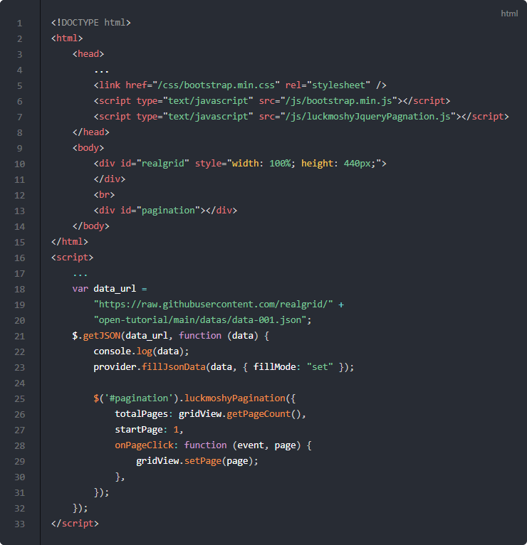

# 페이징

## 기본 코드

예제들의 기본이 되는 코드부터 살펴보겠습니다.
서버로부터 예제 데이터를 가져와서 표시해주기까지만 적용된 상태입니다.

기본 코드의 실행결과는 아래 링크에서 확인할 수 있습니다.
* [기본 코드의 실행 결과](http://10bun.tv/samples/realgrid2/part-2/04/step-00.html)

## 페이징 처리 1

페이징 처리를 위해서 기본코드에서 아래와 같은 부분들을 수정합니다.

예제 코드의 실행결과는 아래 링크에서 확인할 수 있습니다.
* [트리뷰로 전환하기 예제 실행결과](http://10bun.tv/samples/realgrid2/part-2/04/step-01.html)

* 4: setPaging() 메소드를 이용해서 10개의 레코드 단위로 페이징을 시작합니다. true가 아닌 false가 전달되면 페이징이 중단됩니다.
* 14-19: 현재 페이징 상태를 화면에 표시하는 함수입니다.
* 20-23: 이전 페이지로 이동하는 함수입니다.
* 24-27: 다음 페이지로 이동하는 함수입니다.
* 12: 데이터를 로딩하고 난 뒤 현재 페이지 정보를 표시합니다.
* 22, 26: 페이지를 이동하고 난 뒤 현재 페이지 정보를 표시합니다.

## 페이징 처리 2

이번에는 Pagination 라이브러리를 이용해서 페이지 이동하는 방법에 대해서 알아보겠습니다.

예제 코드의 실행결과는 아래 링크에서 확인할 수 있습니다.
* [트리뷰로 전환하기 예제 실행결과](http://10bun.tv/samples/realgrid2/part-2/04/step-02.html)

* 13: 페이지 이동 버튼들이 있는 컨트롤이 들어갈 위치를 div 태그로 선점합니다.
* 25-31: 데이터가 로딩된 이후 페이지 이동 바를 생성하여 #pagination id를 가진 div 태그에 적용합니다.
  * 26: totalPages에는 전체 페이지 수를 입력합니다.
  * 27: startPage에는 처음에 보여줄 페이지를 입력합니다.
  * 28-30: onPageClick에는 페이지가 클릭되었을 때 실행할 코드를 입력합니다.

* 예제에서 사용하고 있는 페이징 라이브러리는 아래 링크를 참고하시기 바랍니다.
[luckmoshypagnation](https://github.com/luckmoshy/luckmoshypagnation.js)
