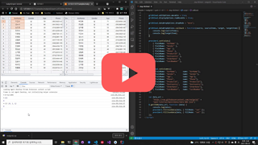

# Drag & Drop

[](https://youtu.be/ELtj5eskI7I)


## 기본 코드

예제들의 기본이 되는 코드부터 살펴보겠습니다.
서버로부터 예제 데이터를 가져와서 표시해주기까지만 적용된 상태입니다.

기본 코드의 실행결과는 아래 링크에서 확인할 수 있습니다.

* [기본 코드의 실행 결과](http://10bun.tv/samples/realgrid2/part-2/07/step-00.html)

``` html
<!DOCTYPE html>
<html>
	<head>
		<meta charset="utf-8">
		<link href="/lib/realgrid-style.css" rel="stylesheet" />
		<script type="text/javascript" src="/lib/realgrid-lic.js"></script>
		<script type="text/javascript" src="/lib/realgrid.2.3.3.min.js"></script>
		<script type="text/javascript" src="/js/jquery-3.4.0.min.js"></script>
        <script type="text/javascript" src="/js/jszip.min.js"></script>
	</head>
	<body>
		<div id="realgrid" style="width: 100%; height: 440px;">
		</div>
	</body>
</html>

<script>
    const provider = new RealGrid.LocalDataProvider();
    const gridView = new RealGrid.GridView("realgrid");
    gridView.setDataSource(provider);

    provider.setFields([
        { fieldName: "KorName" },
        { fieldName: "Gender" },
        { fieldName: "Age" },
        { fieldName: "Phone" },
        { fieldName: "ProductId" },
        { fieldName: "KorCountry" },
        { fieldName: "OrderDate" },
        { fieldName: "CardNumber" },
    ]);

    gridView.setColumns([
        { fieldName: "KorName",      name: "KorName"},
        { fieldName: "Gender",       name: "Gender"},
        { fieldName: "Age",          name: "Age"},
        { fieldName: "Phone",        name: "Phone"},
        { fieldName: "ProductId",    name: "ProductId"},
        { fieldName: "KorCountry",   name: "KorCountry"},
        { fieldName: "OrderDate",    name: "OrderDate"},
        { fieldName: "CardNumber",   name: "CardNumber"},
    ]);

    var data_url = 
        "https://raw.githubusercontent.com/realgrid/" +
        "open-tutorial/main/datas/data-001.json";
    $.getJSON(data_url, function (data) {
        console.log(data);
        provider.fillJsonData(data, { fillMode: "set" });
    });
</script>
```

## Drag & Drop 옵션 설정하기

예제 코드의 실행결과는 아래 링크에서 확인할 수 있습니다.
* [Drag & Drop 옵션 설정하기 예제 실행결과](http://10bun.tv/samples/realgrid2/part-2/07/step-01.html)

``` html
<!DOCTYPE html>
<html>
    ...
</html>

<script>
    ..
    gridView.editOptions.movable = true;
    gridView.displayOptions.rowMovable = true;
    ...
</script>
```


## 그리드 간 이동하기

예제 코드의 실행결과는 아래 링크에서 확인할 수 있습니다.
* [그리드 간 이동하기 예제 실행결과](http://10bun.tv/samples/realgrid2/part-2/07/step-02.html)

``` html
<!DOCTYPE html>
<html>
    ...
    <body>
        <div id="realgrid1" style="float: left; width: 50%; height: 440px;"></div>
        <div id="realgrid2" style="float: right; width: 50%; height: 440px;"></div>
    </body>
    ...
</html>

<script>
    const provider1 = new RealGrid.LocalDataProvider();
    const gridView1 = new RealGrid.GridView("realgrid1");
    gridView1.setDataSource(provider1);

    const provider2 = new RealGrid.LocalDataProvider();
    const gridView2 = new RealGrid.GridView("realgrid2");
    gridView2.setDataSource(provider2);

    gridView1.editOptions.movable = true;
    gridView1.displayOptions.rowMovable = true;

    gridView2.editOptions.movable = true;
    gridView2.displayOptions.rowMovable = true;

    gridView1.dataDropOptions.dropMode = "copy";
    gridView2.dataDropOptions.dropMode = "move";

    const fields = [
        { fieldName: "KorName" },
        { fieldName: "Gender" },
        { fieldName: "Age" },
        { fieldName: "Phone" },
        { fieldName: "ProductId" },
        { fieldName: "KorCountry" },
        { fieldName: "OrderDate" },
        { fieldName: "CardNumber" },
    ];

    const columns =[
        { fieldName: "KorName",      name: "KorName"},
        { fieldName: "Gender",       name: "Gender"},
        { fieldName: "Age",          name: "Age"},
        { fieldName: "Phone",        name: "Phone"},
        { fieldName: "ProductId",    name: "ProductId"},
        { fieldName: "KorCountry",   name: "KorCountry"},
        { fieldName: "OrderDate",    name: "OrderDate"},
        { fieldName: "CardNumber",   name: "CardNumber"},
    ];

    provider1.setFields(fields);
    gridView1.setColumns(columns);

    provider2.setFields(fields);
    gridView2.setColumns(columns);

    var data_url = 
        "https://raw.githubusercontent.com/realgrid/" +
        "open-tutorial/main/datas/data-001.json";
    $.getJSON(data_url, function (data) {
        provider1.fillJsonData(data, { fillMode: "set" });
        provider2.fillJsonData(data, { fillMode: "set" });
    });
</script>
```

## callback 이벤트

예제 코드의 실행결과는 아래 링크에서 확인할 수 있습니다.
* [callback 이벤트 예제 실행결과](http://10bun.tv/samples/realgrid2/part-2/07/step-03.html)

``` html
<!DOCTYPE html>
<html>
    ...
</html>

<script>
    ...
    gridView2.dataDropOptions.callback = function (source, sourceItems, target, targetItem) {
        console.log(sourceItems);
        console.log(targetItem);
    }
    ...
</script>
```

## dragCallback 이벤트

예제 코드의 실행결과는 아래 링크에서 확인할 수 있습니다.
* [dragCallback 이벤트 예제 실행결과](http://10bun.tv/samples/realgrid2/part-2/07/step-04.html)

``` html
<!DOCTYPE html>
<html>
    ...
</html>

<script>
    ...
    gridView2.dataDropOptions.dragCallback  = function (source, sourceItems, target, targetItem) {
        return targetItem % 2 == 0;
    }
    ...
</script>
```

## fieldMapCallback 이벤트

예제 코드의 실행결과는 아래 링크에서 확인할 수 있습니다.
* [fieldMapCallback 이벤트 예제 실행결과](http://10bun.tv/samples/realgrid2/part-2/07/step-05.html)

``` html
<!DOCTYPE html>
<html>
    ...
</html>

<script>
    ...
    gridView2.dataDropOptions.fieldMapCallback = function (source, sourceItems, target, targetItem) {
        return {
            KorName: "Age",
            Gender: "Phone",
        }
    }
    ...
</script>
```


## labelCallback 이벤트

예제 코드의 실행결과는 아래 링크에서 확인할 수 있습니다.
* [labelCallback 이벤트 예제 실행결과](http://10bun.tv/samples/realgrid2/part-2/07/step-06.html)

``` html
<!DOCTYPE html>
<html>
    ...
</html>

<script>
    ...
    gridView2.dataDropOptions.labelCallback = function (source, sourceItems, target, targetItem) {
        return sourceItems.length + " 개의 행";
    }
    ...
</script>
```