# Vue.js 개발환경 준비하기

Part-3에서는 Vue.js를 이용해서 게시판 만들기 프로젝트를 진행하겠습니다.
이어서 Part-4에서는 Vue.js와 RealGrid를 사용하여
얼마나 쉽고 빠르게 관리사이트(Back Office) 구축이 가능한지
실제 프로젝트를 진행하듯이 강의를 진행 할 예정입니다.

이번 영상에서는 Vue.js 개발환경을 준비하고 Vue.js 프로젝트를 생성하는 과정을 설명합니다.

영상에서 사용된 코드는 아래 링크에서 확인 가능합니다.
* [https://github.com/realgrid/open-tutorial/tree/main/vue.js/part-3/01](https://github.com/realgrid/open-tutorial/tree/main/vue.js/part-3/01)

[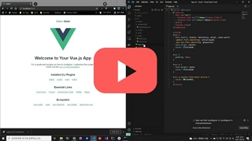](https://youtu.be/oV-vBrnkUyY)

## NodeJS 설치하기

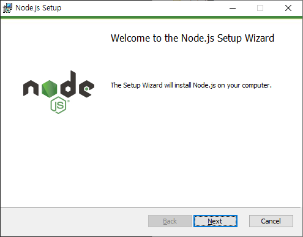

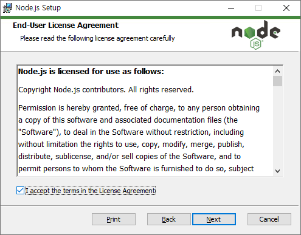

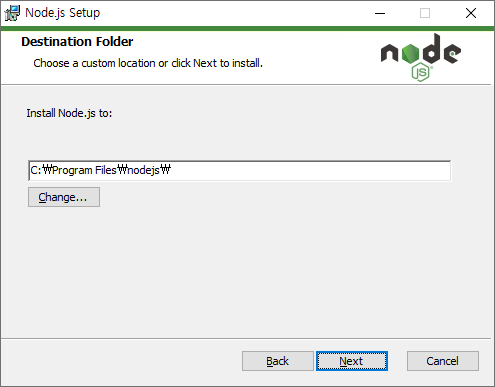

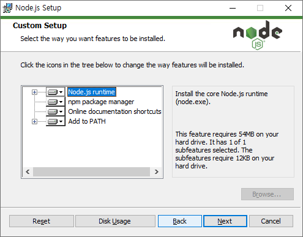

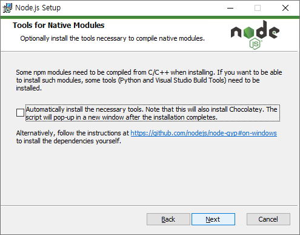

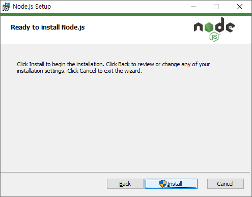

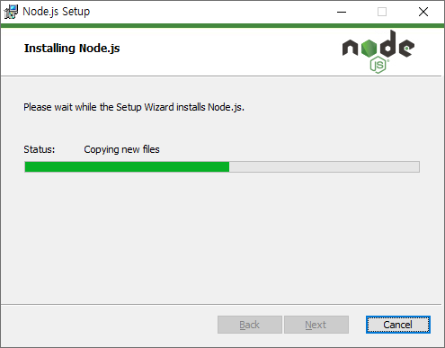

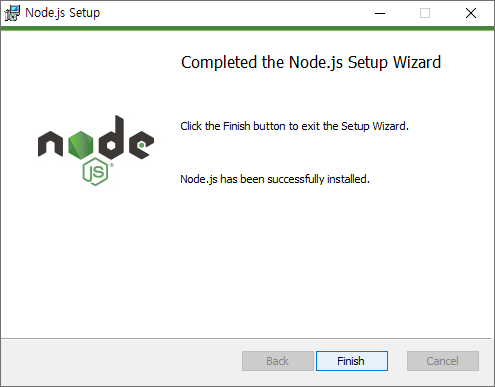

## Vue.js 설치하기

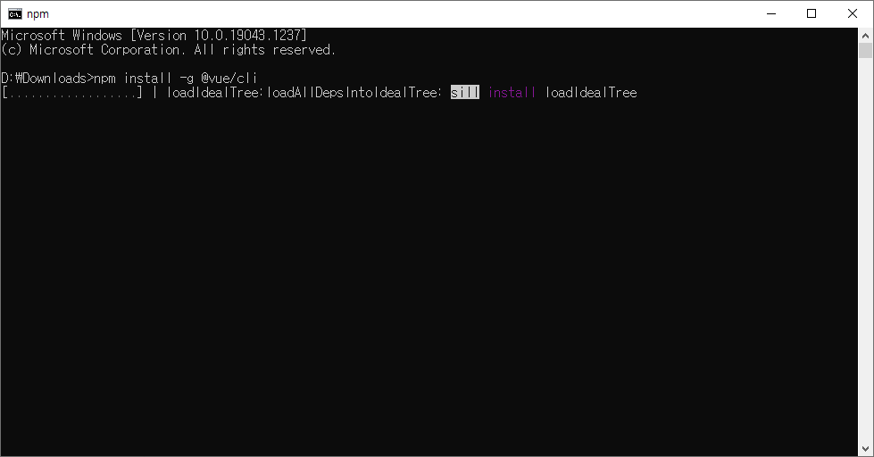

> npm install -g @vue/cli

## Vue.js 프로젝트 생성하기

> vue create board

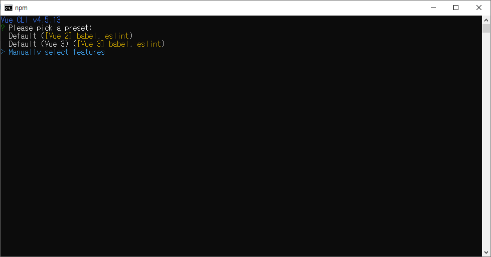

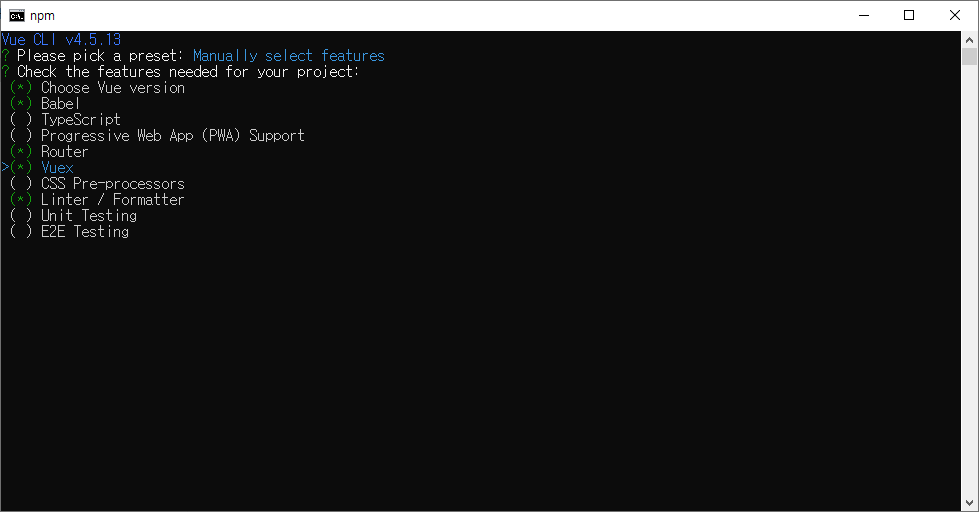

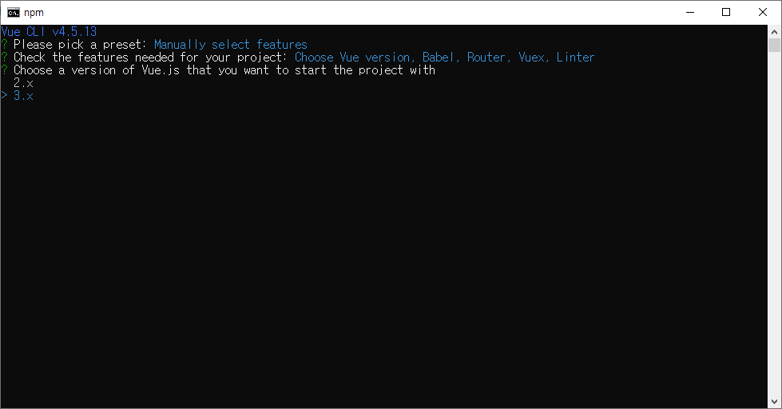

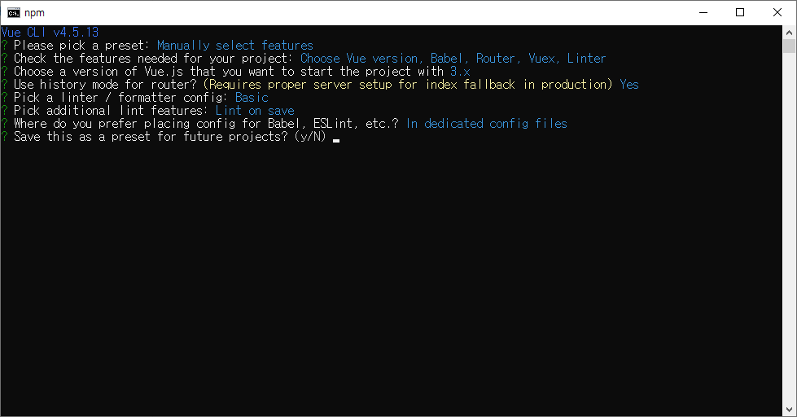

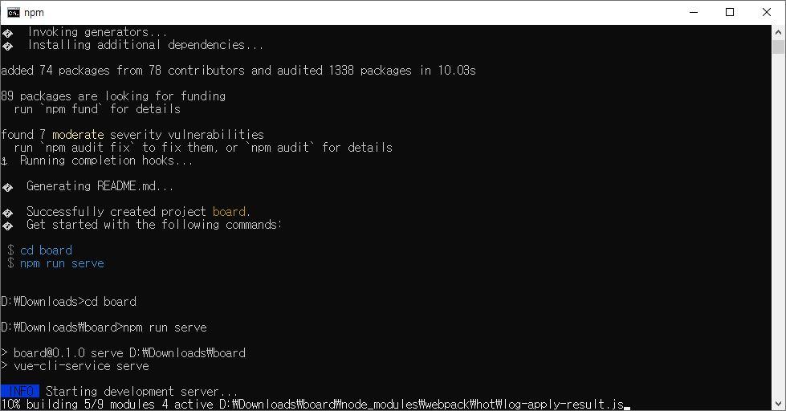

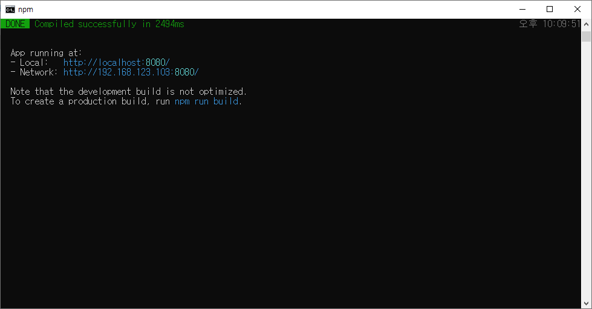