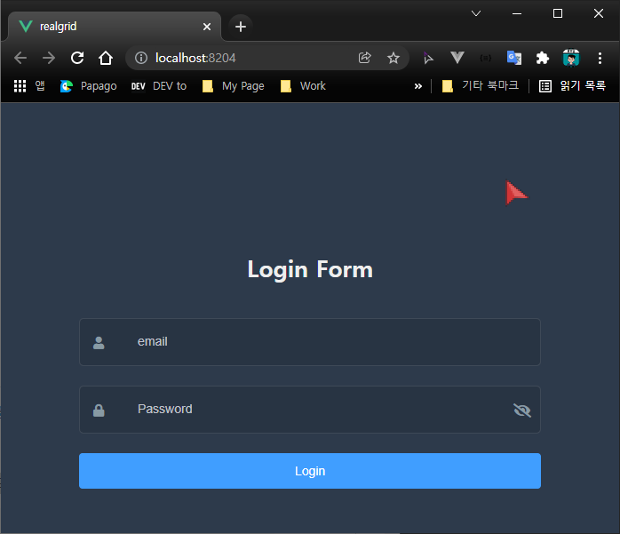

# 로그인 처리


## 개요

지난 에피소드에서 작성했던 기본 코드를 토대로 로그인 처리를 추가하도록 하겠습니다.


## Login.vue 생성하기

src/components/Login.vue 파일을 생성하고 아래와 같이 코드를 작성한 뒤 저장합니다.

``` html
<template>
    <h3>Login</h3>
</template>

<script>
export default {
};
</script>
```

## Main.vue 생성하기

src/components/Main.vue 파일을 생성하고 아래와 같이 코드를 작성한 뒤 저장합니다.

``` html
<template>
    <h3>Main</h3>
</template>

<script>
export default {
};
</script>
```

## Home.vue 수정하기

로그인이 되었을 때에는 Main.vue가 표시되도록 하여 앞으로 작성하려는
관리 화면을 보이도록 하려고 합니다.
로그인이 되지 않은 사용자에게는 로그인 화면을 띄워서 사용자를 인증하는 과정을 거치겠습니다.

아래 코드를 저장하면 에러가 발생하는데요.
로그인 유무는 store를 이용하려고 하지만, 아직 코드가 작성되기 전이기 때문입니다.

``` html
<template>
    <div>
        <Login v-if="!this.$store.getters.isLogined" />
        <Main v-if="this.$store.getters.isLogined" />
    </div>
</template>

<script>
import Main from "@/components/Main.vue";
import Login from "@/components/Login.vue";

export default {
    components: { Main, Login },
};
</script>
```


## store 수정

store는 Vue.js에서 상태관리를 담당하고 있습니다.
우선 상태관리에 익숙하지 않으신 분들은
어플리케이션 전역에서 사용할 수 있는 특수한 전역 변수라고 생각하셔도 됩니다.

다만 일반적인 변수와 가장 다른 점은 store에서 관리하는 데이터인 state(상태)가 변경되면
이것을 사용하고 있는 모든 UI에 바로 변경된 데이터가 자동으로 적용이 된다는 점입니다.

보다 자세한 것은 차차 배워가도록 하겠습니다.

src/store/index.js를 열고 아래와 같이 수정해줍니다.

``` js
...
export default createStore({
    state: {
        token: "",
    },
    mutations: {
        UPDATE_TOKEN(state, token) {
            state.token = token;
        },
    },
    actions: {
        updateToken({commit}, token) {
            commit("UPDATE_TOKEN", token);
        },
    },
    getters: {
        isLogined: (state) => {
            return state.token !== "";
        },
    },
    ...
})
```

코드를 저장하면 로그인 한 적이 없기 때문에 Login.vue가 표시되면 정상입니다.


## Login.vue 수정

``` html
<template>
    <div>
        <el-input type="text" v-model="loginForm.email" /><br><br>
        <el-input type="password" v-model="loginForm.password" /><br><br>
        <el-button @click="login">Login</el-button>
    </div>
</template>

<script>
import apiManagers from '@/api/manager'

export default {
    data() {
        return {
            loginForm: {
                email: "",
                password: "",
            },
        };
    },
    methods: {
        login() {
            apiManagers
                .signin(this.loginForm.email, this.loginForm.password)
                .then((response) => {
                    if (response.data.resultCode !== 0) {
                        this.$message.error(response.data.errorMsg);
                        return;
                    }
                    this.$router.push({path: "/"});
                })
                .catch((e) => {
                    console.log(e);
                });
        },
    },
};
</script>
```


## md5 설치

암호를 그대로 DB에 저장하고 사용하는 것은 위험하므로
md5를 이용해서 암호를 인코딩 후 저장하는 방식을 사용하겠습니다.

```
C:\..> npm install md5 --save
```


## 로그인 / 로그아웃 API 추가

DB와 마찬가지로 실제 API 서버를 구축하지 않고
자바스크립트로 쉽게 처리하여 Vue.js 실습에 보다 무게를 두겠습니다.

src 폴더 밑에 api 폴더를 생성하고 manager.js 파일을 추가하겠습니다.
그리고 아래의 코드를 입력하고 저장합니다.

``` js
import store from '@/store'
import managers from '@/data/managers'
import md5 from 'md5'

let response = {
    data: {
        resultCode: 0,
        errorMsg: ""
    }
}

export default {
    signin: async function (email, pw) {
        pw = md5(pw).toUpperCase();
        return new Promise((resolve) => {
            const found = managers.find((e) => {
                console.log("manager.signin", email, pw, e.email, e.pw);
                if ((e.email === email) && (e.pw === pw)) return e;
            });
            setTimeout(() => {
                if (found) {
                    store.dispatch("updateToken", found.email);
                    response.data.resultCode = 0;
                    response.data.errorMsg = "";
                } else {
                    store.dispatch("updateToken", "");
                    response.data.resultCode = 101;
                    response.data.errorMsg = "아이디 또는 암호가 틀렸습니다.";
                }
                resolve(response);
            }, 1000);
        });
    },
    signout: async function () {
        return new Promise((resolve) => {
            store.dispatch("updateToken", "");
            let response = {
                data: {
                    resultCode: 0
                }
            }
            setTimeout(() => resolve(response), 1000);
        });
    },
}
```


## 초기 계정 설정하기

src 폴더 밑에 data 폴더를 생성하고 managers.js 파일을 추가하겠습니다.
그리고 아래의 json 코드를 입력하고 저장합니다.
초기 계정의 아이디와 암호를 아래와 같이 지정하고 사용하겠습니다.

* admin / 81DC9BDB52D04DC20036DBD8313ED055 (1234의 md5 인코딩 결과값)

실제 DB 시스템을 사용하지 않고 자바스크립트로 쉽게 처리하여 Vue.js 실습에 보다 무게를 두겠습니다.

``` json
export default [
      {
        email: "admin",
        pw: "81DC9BDB52D04DC20036DBD8313ED055",
        name: "기본관리자",
        rule: "관리자",
        phoneNumber: "000-0000-0000"
      },
]
```


## 로그인 테스트


## 로그아웃 기능 추가하기


### 라우터 수정

``` js
...
import Login from '../views/Login.vue'
import Logout from '../views/Logout.vue'

const routes = [
    ...
    {
        path: '/logout',
        component: Logout
    },
]
...
```

### Logout.vue 생성하기

src/components/Logout.vue 파일을 생성하고 아래와 같이 코드를 작성한 뒤 저장합니다.

``` html
<template>
    <div>
    </div>
</template>

<script>
import apiManagers from '@/api/manager'

export default {
    mounted() {
        apiManagers.signout();
        this.$router.push({path: "/"});
    }
}
</script>
```

### 로그아웃 테스트

브로우저 주소창의 주소 뒤에 /logout을 입력하고 엔터를 치게되면
로그아웃이 진행되어 다시 로그인 화면이 나와야 합니다.

