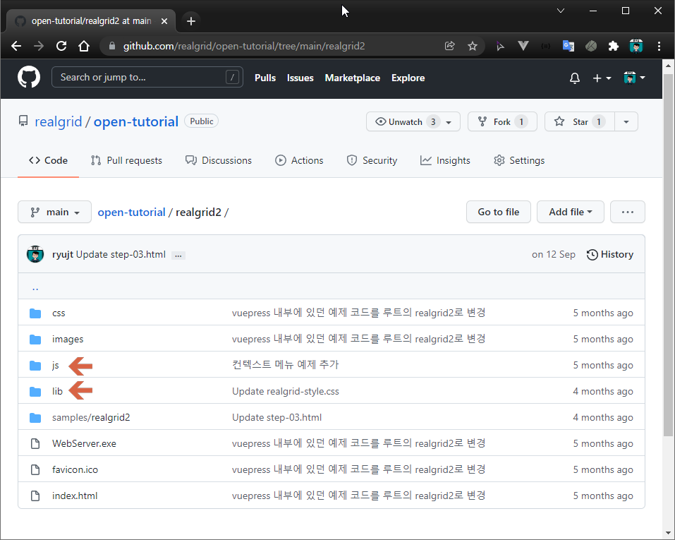
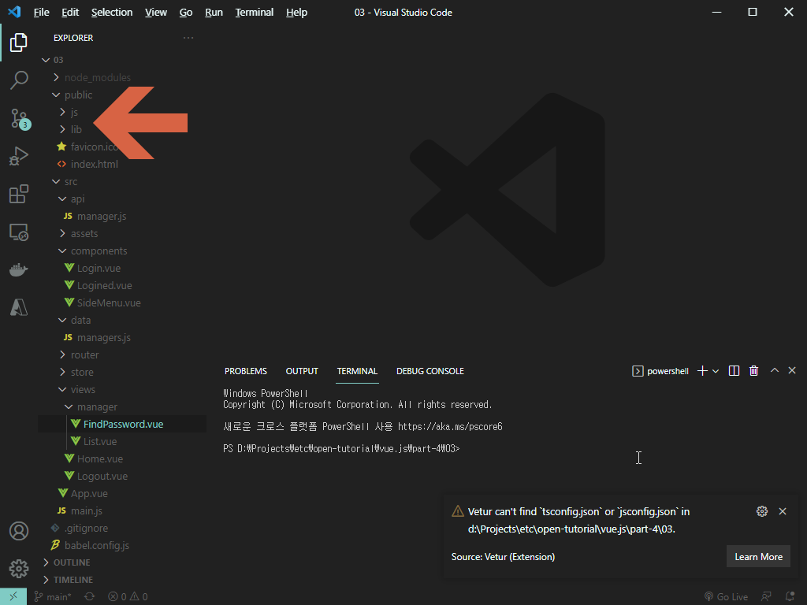

# 사이드 메뉴 및 관리자 목록


## 개요

element-ui를 이용해서 사이드 메뉴를 구성하고 RealGrid를 이용해서 관리자 목록을 불러오는 방법에 대해서 설명합니다.


## RealGrid 라이브러리 복사


### 필요한 라이브러리 복사하기


https://github.com/realgrid/open-tutorial/tree/main/realgrid2 폴더에 있는 js 폴더와 lib 폴더를 복사합니다.


## 필요한 라이브러리 붙여 넣기


작업 중인 Vue.js 프로젝트의 public 폴더에 붙여넣기 해주세요.


## 필요한 파일 추가 및 준비 작업


### index.html 수정

``` html
<!DOCTYPE html>
<html lang="">
  <head>
    ...
    <!-- RealGrid 관련 라이브러리 추가 -->
    <link href="/lib/realgrid-style.css" rel="stylesheet" />
    <script type="text/javascript" src="/lib/realgrid-lic.js"></script>
    <script type="text/javascript" src="/lib/realgrid.2.3.3.min.js"></script>
    ...
  </head>

  <!-- 배경색 원래대로 변경함 -->
  <body>
    ..
  </body>
</html>
```


### /src/api/manager.js API 수정

``` js
...
export default {
    ...
    list: async function () {
        return new Promise((resolve) => {
            response.data.resultCode = 0;
            response.data.rows = managers;
            setTimeout(() => resolve(response), 500);
        });
    },
}
```
* list() 메소드 추가


### src/data/managers.js 데이터 수정

``` js
export default [
    {
        email: "admin",
        pw: "81DC9BDB52D04DC20036DBD8313ED055",
        name: "기본관리자",
        rule: "관리자",
        phoneNumber: "000-0000-0000"
      },
      {
        email: "User 1",
        pw: "81DC9BDB52D04DC20036DBD8313ED055",
        name: "관리자1",
        rule: "관리자1",
        phoneNumber: "000-0000-0000"
      },
      {
        email: "User 2",
        pw: "81DC9BDB52D04DC20036DBD8313ED055",
        name: "관리자2",
        rule: "관리자2",
        phoneNumber: "000-0000-0000"
      },
      {
        email: "User 3",
        pw: "81DC9BDB52D04DC20036DBD8313ED055",
        name: "관리자3",
        rule: "관리자3",
        phoneNumber: "000-0000-0000"
      },
]
```
* 목록이 너무 썰렁하지 않도록 추가 유저 등록


### /src/router/index.js 수정

``` js
...
const routes = [
    ...
    {
        path: '/manager/list',
        component: () => import('@/views/manager/List.vue')
    },
    {
        path: '/manager/findPassword',
        component: () => import('@/views/manager/FindPassword.vue')
    },
]
...
```
* /manager/list 추가
* /manager/findPassword 추가


### /src/views/manager/List.vue 추가

``` html
<template>
    <div>
        관리자 목록
    </div>
</template>

<script>
export default {
}
</script>
```

### /src/views/manager/FindPassword.vue 추가

``` html
<template>
    <div>
        비번 찾기
    </div>
</template>

<script>
export default {
}
</script>
```


### /src/components/SideMenu.vue 추가

``` html
<template>
    <div>
        사이드 메뉴
    </div>
</template>

<script>
export default {
}
</script>
```


### /src/components/Logined.vue 추가

``` html
<template>
    <div>
        로그인 완료된 화면
    </div>
</template>

<script>
export default {
}
</script>
```


### /src/App.vue 수정

``` html
<template>
    <div>
        <Login v-if="!this.$store.getters.isLogined" />
        <Logined v-if="this.$store.getters.isLogined" />
    </div>
</template>

<script>
import 'element-plus/dist/index.css'
import Login from "@/components/Login.vue";
import Logined from "@/components/Logined.vue";

export default {
    components: { Login, Logined },

    mounted() {
        console.log("isLogined", this.$store.getters.isLogined);
    }
}
</script>

<style>
body {
    margin: 0px;
}
</style>
```


## 사이드 메뉴 처리


### /src/components/Logined.vue 수정

``` html
<template>
    <el-row>
        <el-col :span=4>
            <SideMenu />
        </el-col>
        <el-col :span=20 class="main-client">
            <router-view />
        </el-col>
    </el-row>
</template>

<script>
import SideMenu from './SideMenu.vue'

export default {
    components: {SideMenu}
}
</script>
```


### /src/components/SideMenu.vue 수정

``` html
<template>
    <div class="title-area">
        <router-link to="/">
            <h3 class="title-text">Dashboard</h3>
        </router-link>

        <div class="client">
            <el-menu
                @select="menuSelected"
                text-color="#fff"
                active-text-color="#ffd04b"
                background-color="#2D3A4B"
                style="border-style: none"
            >
                <el-menu-item-group title="관리자 관리">
                    <el-menu-item index="/manager/list">
                        <i class="fas fa-address-book"></i>
                        <span>관리자 목록</span>
                    </el-menu-item>
                    <el-menu-item index="/manager/findPassword">
                        <i class="fas fa-unlock-alt"></i>
                        <span>비번 찾기</span>
                    </el-menu-item>
                </el-menu-item-group>
            </el-menu>
        </div>
    </div>
</template>

<script>
export default {
    methods: {
        menuSelected: function (path) {
            this.$router.push({path: path});
        }
    },
}
</script>

<style scoped>
.title-area {
    margin: 0px;
    background-color: #2D3A4B;
}
.title-text {
    margin: 0px;
    padding: 16px;
    color: white;
    background-color: #2D3A4B;
}
.client {
    height: 100vh;
    background-color: #2D3A4B;
}
.el-menu-item {
    height: 32px;
    font-size: 12px;
}
.fas {
    padding-right: 8px;
}
</style>
```


## 관리자 목록 처리

### /src/views/manager/List.vue 수정

``` html
<template>
    <div id="realgrid" style="width: 100%; height: 440px"></div>
</template>

<script>
/* eslint-disable */

import apiManagers from '@/api/manager'

export default {
    mounted() {
        this.provider = new RealGrid.LocalDataProvider();
        this.gridView = new RealGrid.GridView("realgrid");
        this.gridView.setDataSource(this.provider);

        this.provider.setFields([
            { fieldName: "email" },
            { fieldName: "pw" },
            { fieldName: "name" },
            { fieldName: "rule" },
            { fieldName: "phoneNumber" },
        ]);

        this.gridView.setColumns([
            { name: "email",       fieldName: "email",       width: 120 },
            { name: "pw",          fieldName: "pw" },
            { name: "name",        fieldName: "name"},
            { name: "rule",        fieldName: "rule"},
            { name: "phoneNumber", fieldName: "phoneNumber", width: 120 },
        ]);

        apiManagers
            .list()
            .then((response) => {
                this.provider.fillJsonData(response.data.rows, { fillMode: "set" });
            })
            .catch((e) => {
                console.log(e);
            });
    },
};
</script>
```