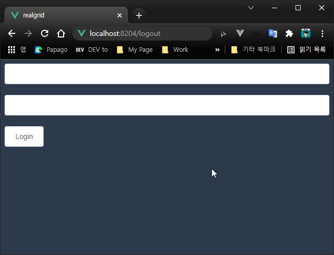

## 로그아웃 기능 추가하기


### 라우터 수정

``` js
...
import Logout from '../views/Logout.vue'

const routes = [
    ...
    {
        path: '/logout',
        component: Logout
    },
]
...
```

### Logout.vue 생성하기

src/components/Logout.vue 파일을 생성하고 아래와 같이 코드를 작성한 뒤 저장합니다.

``` html
<template>
    <div>
    </div>
</template>

<script>
import apiManagers from '@/api/manager'

export default {
    mounted() {
        apiManagers.signout();
        this.$router.push({path: "/"});
    }
}
</script>
```

### 로그아웃 테스트

브로우저 주소창의 주소 뒤에 /logout을 입력하고 엔터를 치게되면
로그아웃이 진행되어 다시 로그인 화면이 나와야 합니다.




