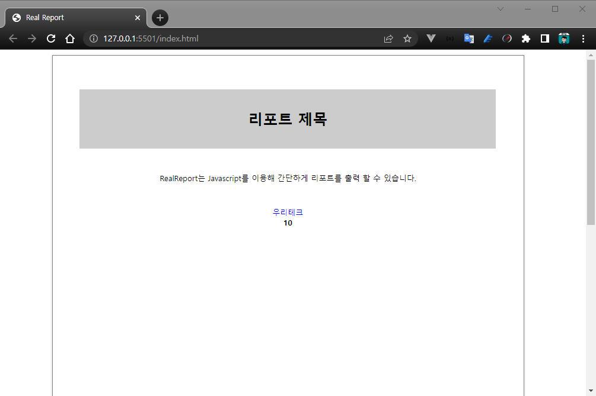

# Hello, World? I'm RealReport!

## 샘플 파일로 테스트 코드 실행하기

복잡한 과정없이 다운로드 받은 파일로 간단한 예제를 실행해볼 수 있도록 준비된 파일을 먼저 살펴보겠습니다.

### 샘플 파일 다운받기

아래의 링크를 클릭하시고 파일을 다운 받으신 다음 압축을 푸시고
VS Code의 Live Server 등을 이용해서 index.html을 실행하시면
아래와 같은 간단한 리포트 화면이 나타나게 됩니다.

[샘플 파일 다운받기](/realreport.zip)

### 실행 결과 화면



## 코드 설명

```html
<!DOCTYPE html>
<html lang="">
    <head>
        // PDF 관련 라이브러리
        <script type="text/javascript" src="/js/pdfkit.js"></script>

        // 하이차트 라이브러리
        <link href="/highcharts/highcharts.css" rel="stylesheet" />
        <script src="/highcharts/highcharts.js"></script>
        <script src="/highcharts/highcharts-more.js"></script>

        // 리얼 리포트 라이브러리
        <link href="/realreport/realreport.css" rel="stylesheet" />
        <script src="/realreport/realreport-lic.js"></script>
        <script type="text/javascript" src="/realreport/realreport.js?v=4"></script>
    </head>
    <body>
        // 리얼 리포트가 표시될 영역
        <div id="realreport"></div>
    </body>
</html>

<script>
    // 리포트 양식 데이터
    const reportForm = {
        ...
    };

    // 사용자 데이터
    const reportData = {
        ...
    };

    // ReportViewer 객체 생성
    this.viewer = new RealReport.ReportViewer("realreport", reportForm);

    // 리포트에 사용자 데이터 연결 (리포트 내용이 외부 데이터에 의해서 변경될 필요가 있을 때)
    this.viewer.dataSet = reportData;

    // 미리보기 실행
    this.viewer.preview();
</script>
```

## 라이센스 신청 및 RealReport 다운받기

[라이센스 신청 및 RealReport 다운받기](https://service.realgrid.com/)

* RealReport는 상용 라이브러리 입니다.
* 개발자를 위한 무료 라이선스를 제공하고 있습니다
* 구매를 위해 [가격 및 구매방법](https://realgrid.com/#buy)을 확인하시고 [RealGrid & Report 영업팀]에 문의해 주세요.

## 기타

### realreport

* 기술과 관련된 문의사항은 [RealReport 기술지원 포럼](https://forum.realgrid.com/categories/z6SA78vS9G6cgiYht)에 문의해 주세요.

### highcharts

* RealReport와 HighCharts는 협업 계약관계를 유지하고 있습니다.
* RealReport를 구매할 경우 HighCharts 상용 라이선스가 발급됩니다.
