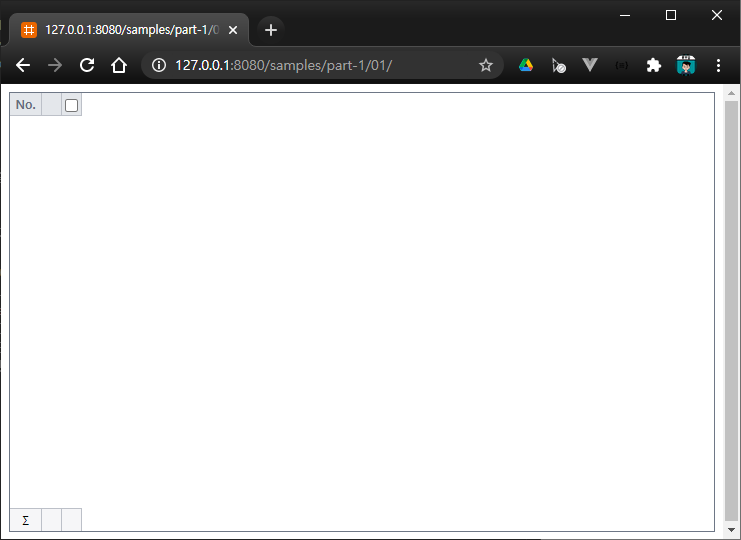
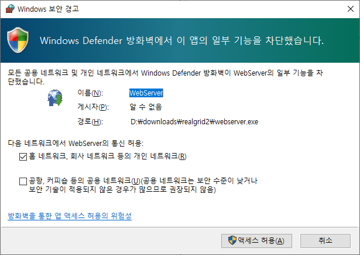
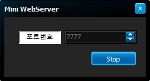
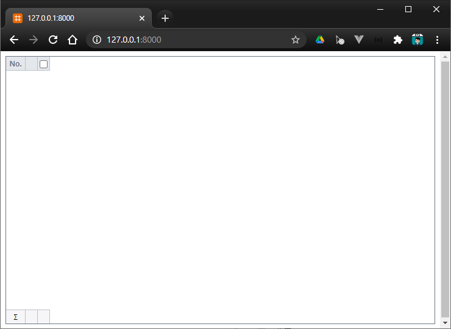

# Hello, World? I'm RealGrid!


## 리얼그리드를 사용하는 최소한의 코드

``` html
<!DOCTYPE html>
<html>
	<head>
		<link href="/lib/realgrid-style.css" rel="stylesheet" />
		<script type="text/javascript" src="/lib/realgrid-lic.js"></script>
		<script type="text/javascript" src="/lib/realgrid.2.2.2.min.js"></script>
	</head>
	<body>
		<div id="realgrid" style="width: 100%; height: 440px;">
		</div>
	</body>
</html>

<script>
	document.addEventListener('DOMContentLoaded', function () {
		const container = document.getElementById('realgrid');
		const provider = new RealGrid.LocalDataProvider(false);
		const gridView = new RealGrid.GridView(container);
		gridView.setDataSource(provider);
	});
</script>
```
* 4: 리얼그리드의 스타일이 담겨진 파일을 가져옵니다.
  * 다른 스타일을 지정하여 색상 등을 마음대로 변경하실 수 있습니다.
* 5: 리얼그리드 라이센스 키가 담긴 파일입니다. 개발이나 테스트 용도로 요청해서 받아서 사용하실 수도 있습니다.
* 6: 리얼그리드 라이브러리 파일입니다.
* 9-10: 리얼그리드가 표시될 영역을 &lt;div> 태그로 지정합니다.
  * 이곳에 리얼그리드가 표시됩니다.
  * style을 적용해서 크기를 지정하였습니다. (가로 100%, 세로 440 픽셀)
* 14-21: 페이지 로딩이 완료되면 그리드를 초기화하는 자바스크립트 코드입니다.
* 16: id가 "rerealgrid"인 엘리먼트 찾아서 "container" 변수에 담습니다.
* 17: 데이터를 관리해주는 객체를 생성합니다. 나중에 다시 설명합니다.
* 18: 리얼그리드 객체를 생성하고 "container" 안에 표시합니다.
* 19: 리얼그리드에 "provider"를 데이터 제공자로 지정합니다.
  * setDataSource() 메소드로 인해서 "provider"에서 관리되고 있는 데이터가 그리드에 표시됩니다.


## 실행 결과 화면


* [예제-01 확인하기](/samples/realgrid2/part-1/01)


## 테스트 환경 구축하기

여러분들이 이미 웹 서버 구축 등에 익숙하다면 이번 세션은 넘어가도 상관 없습니다. 아래 설명은 최대한 간편하게 테스트를 할 수 있도록 환경을 구축하는 방법에 대해서 설명합니다.

윈도우즈 환경에서 테스트 환경 구축하는 것을 기준으로 설명합니다.


### 미니 웹서버 다운받기

아래의 링크를 클릭하시고 미니웹서버를 다운 받습니다.

[미니 웹서버 다운로드 링크](/downloads/realgrid2.zip)


### 미니 웹서버 실행 및 방화벽 허용하기

압축을 풀고 WebServer.exe 파일을 실행합니다.
아래와 같이 방화벽 허용 메시지가 나타나면 "엑서스 허용" 버튼을 클릭합니다.



프로그램이 정상적으로 실행되면 아래의 이미지처럼 미니 웹서버가 화면에 보이게 됩니다.




### 웹 브로우져에서 웹 페이지 확인하기

웹 서버가 문제없이 동작하면 자동으로 웹 브로우져를 열어서 아래의 이미지처럼 그리드를 표시해줍니다.



::: tip
기본으로 7777 포트를 사용하고 있습니다. 다른 프로그램에서 사용중인 포트라면 
Stop 버턴을 클릭하시고 포트 번호를 변경한 다음 다시 Start 버튼을 클릭하세요.
:::


### 리얼그리드 코드 작성하고 테스트하기

WebServer.exe가 설치된 폴더가 웹 루트 폴더로 지정됩니다.
웹 브로우져에 샘플 페이지가 표시되는 것을 확인하셨으면, 
WebServer.exe와 같은 폴더에 있는 index.html 파일을 열어서
코드를 수정하시고 웹 브로우져에서 새로고침을 하여 확인하시면 됩니다.


## 라이센스 파일 및 리얼그리드2 다운받기

만약 리얼그리드를 여러분들의 웹 사이트에서 동작하는 것을 확인하고 싶을 실 때에는 라이센스를 신청하시고 발급받으셔야 합니다.
라이센스 신청페이지의 링크는 아래와 같습니다.

[리얼그리드2 라이센스 신청하기](https://service.realgrid.com/start)