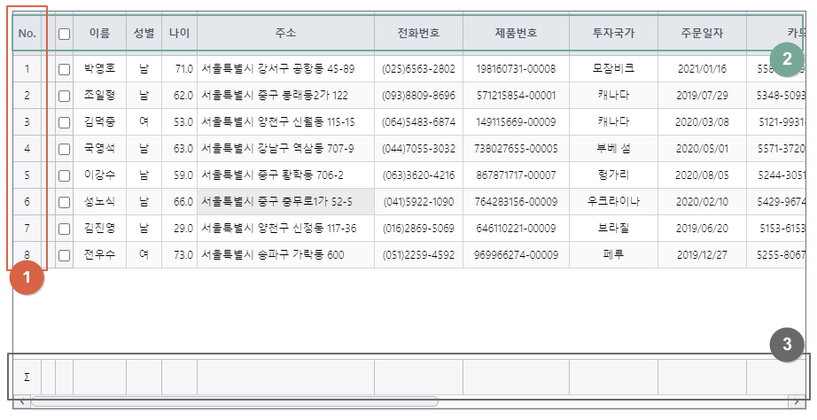
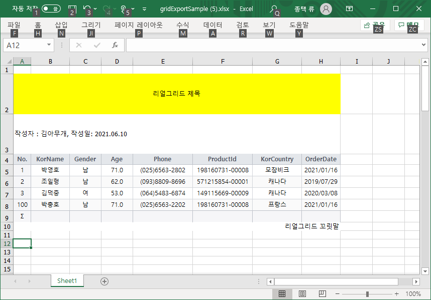

# 엑셀 파일로 내보내기


## 기본 코드

예제들의 기본이 되는 코드부터 살펴보겠습니다.
서버로부터 예제 데이터를 가져와서 표시해주기까지만 적용된 상태입니다.

기본 코드의 실행결과는 아래 링크에서 확인할 수 있습니다.
* [기본 코드의 실행 결과](http://10bun.tv/samples/realgrid2/part-1/12/step-00.html)

``` html
<!DOCTYPE html>
<html>
	<head>
        ...
	</head>
	<body>
		<div id="realgrid" style="width: 100%; height: 440px;">
		</div>
	</body>
</html>
<script>
    const provider = new RealGrid.LocalDataProvider();
    const gridView = new RealGrid.GridView("realgrid");
    gridView.setDataSource(provider);
    provider.setFields([ 필드 설정 ]);
    gridView.setColumns([ 컬럼 설정 ]);
	
    var data_url = 
		"https://raw.githubusercontent.com/realgrid/" +
    	"open-tutorial/main/datas/data-001.json";
    $.getJSON(data_url, function (data) {
        console.log(data);
        provider.fillJsonData(data, { fillMode: "set" });
    });
</script>
```


## 엑셀 내보내기 기본 예제

엑셀 내보내기는 GridView의 exportGrid() 메소드로 간단하게 구현할 수 있습니다.
아래의 코드는 데이터가 서버에서 모두 다운받아지면
바로 그리드의 내용을 엑셀 파일로 내려 받도록 하는 예제입니다.

예제 코드의 실행결과는 아래 링크에서 확인할 수 있습니다.
* [엑셀 내보내기 기본 예제 실행결과](http://10bun.tv/samples/realgrid2/part-1/12/step-01.html)

``` html
<!DOCTYPE html>
<html>
<head>
	...
	<script type="text/javascript" src="/lib/libs/jszip.min.js"></script>
</head>
	...
</html>
<script>
	...
    $.getJSON(data_url, function (data) {
        console.log(data);
        provider.fillJsonData(data, { fillMode: "set" });
		gridView.exportGrid({
			type: "excel",
			target: "local",
			fileName: "gridExportSample.xlsx", 
			progressMessage: "엑셀 Export중입니다.",
			
			showProgress: true,
			indicator: "visible",
			header: "visible",
			footer: "visible",
			
			done: function () {
				alert("done excel export")
			}
		});
    });
</script>
```
* 14-28: 엑셀 내보내기를 지원하는 exportGrid() 함수의 구현부분입니다.
* 17: 저장할 때 사용할 파일명을 지정합니다.
* 18: 저장하는 동안 표시될 메시지입니다. 데이터가 많지 않을 때에는 거의 순간적으로 지나가게 됩니다.
* 20: 메시지를 표시할 지 여부를 결정합니다.
* 21: indicator는 아래 이미지의 1번에 해당하는 영역을 엑셀로 내보낼 지 결정합니다. visible과 hidden 중에 선택합니다.
* 22: header는 아래 이미지의 2번에 해당하는 영역을 엑셀로 내보낼 지 결정합니다. visible과 hidden 중에 선택합니다.
* 23: footer는 아래 이미지의 3번에 해당하는 영역을 엑셀로 내보낼 지 결정합니다. visible과 hidden 중에 선택합니다.
* 26: 엑셀 내보내기가 끝나면 실행할 코드를 작성하는 영역입니다.




## 제목 및 꼬릿말 달기

이번에는 내보낼 엑셀 파일에 제목 및 꼬릿말 등을 삽입하는 방법에 대해서 알아보겠습니다.
우선은 아래의 이미지를 보시면 예제가 실행되었을 때 어떻게 엑셀에 적용될 지를 쉽게 이해하실 수 있을 것입니다.



예제 코드의 실행결과는 아래 링크에서 확인할 수 있습니다.
* [제목 및 꼬릿말 달기 예제 실행결과](http://10bun.tv/samples/realgrid2/part-1/12/step-02.html)

``` html
<!DOCTYPE html>
<html>
	...
</html>
<script>
	...
	$.getJSON(data_url, function (data) {
		console.log(data);
		provider.fillJsonData(data, { fillMode: "set" });
		gridView.exportGrid({
			...
			documentTitle: {
				message: "리얼그리드 제목",
				visible: true,
				spaceTop: 1,
				spaceBottom: 0,
				height: 60,
				styles: { "text-align": "center", "vertical-align": "middle", "background-color": "yellow" }
			},

			documentSubtitle: {
				message: "작성자 : 김아무개, 작성일: 2021.06.10",
				visible: true,
				height: 60,
			},

			documentTail: {
				message: "리얼그리드 꼬릿말",
				visible: true,
				styles: { "text-align": "right", "vertical-align": "middle" }
			},
			...
		});
	});
</script>
```
* 12-19: 엑셀 파일에 제목을 삽입하는 코드입니다.
* 21-25: 엑셀 파일에 부제을 삽입하는 코드입니다.
* 21-25: 엑셀 파일에 꼬릿말을 삽입하는 코드입니다.


## 여러 개의 그리드를 하나의 엑셀 파일로 보내기

이번 예제에서는 여러 개의 그리드를 하나의 엑셀 파일에 각각 다른 sheet로 저장하는 방법을 다룹니다.

예제 코드의 실행결과는 아래 링크에서 확인할 수 있습니다.
* [여러 개의 그리드를 하나의 엑셀 파일로 보내기 예제 실행결과](http://10bun.tv/samples/realgrid2/part-1/12/step-03.html)

``` html
<!DOCTYPE html>
<html>
	...
	<body>
		<div><button onclick="saveToExcel()">엑셀로 내보내기</button></div><br>
		<div id="realgrid1" style="width: 100%; height: 440px;"></div><br>
		<div id="realgrid2" style="width: 100%; height: 440px;"></div>
	</body>
</html>
<script>
    const provider1 = new RealGrid.LocalDataProvider();
    const gridView1 = new RealGrid.GridView("realgrid1");
    gridView1.setDataSource(provider1);
    provider1.setFields([ 필드 설정 ]);
    gridView1.setColumns([ 컬럼 설정 ]);

    const provider2 = new RealGrid.LocalDataProvider();
    const gridView2 = new RealGrid.GridView("realgrid2");
    gridView2.setDataSource(provider2);
    provider2.setFields([ 필드 설정 ]);
    gridView2.setColumns([ 컬럼 설정 ]);

    var data_url = 
		"https://raw.githubusercontent.com/realgrid/" +
    	"open-tutorial/main/datas/";	
    $.getJSON(data_url + "data-005.json", function (data) {
        provider1.fillJsonData(data, { fillMode: "set" });
    });
	$.getJSON(data_url + "data-006.json", function (data) {
        provider2.fillJsonData(data, { fillMode: "set" });
    });
	
	function saveToExcel() {
		RealGrid.exportGrid({
			type: "excel",
			target: "local",
			filename: "multiExport.xlsx",
			exportGrids: [
				{ grid: gridView1, sheetName: "Sheet 1" },
				{ grid: gridView2, sheetName: "Sheet 2" }
			]
		});	
	}
</script>
```
* 11-15: 첫 번 째 그리드를 생성합니다.
* 17-21: 두 번 째 그리드를 생성합니다.
* 26-28: 첫 번 째 데이터를 내려 받아서 첫 번 째 그리드에 적용합니다.
* 29-31: 두 번 째 데이터를 내려 받아서 두 번 째 그리드에 적용합니다.
* 33-42: 버튼이 클릭됐을 때 엑셀로 저장하도록 구현된 코드 입니다.
* 39: 첫 번 째 sheet에 저장될 그리드 객체와 sheet의 이름을 지정합니다.
* 40: 두 번 째 sheet에 저장될 그리드 객체와 sheet의 이름을 지정합니다.