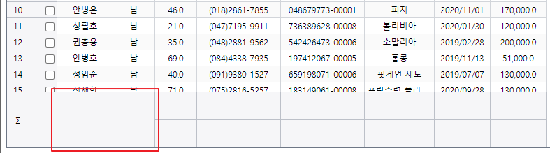
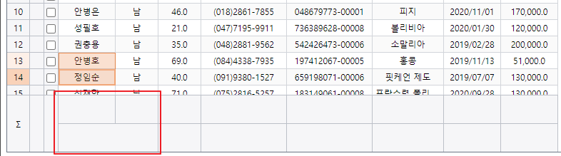

# 헤더와 푸터


## 기본 코드

예제들의 기본이 되는 코드부터 살펴보겠습니다.
서버로부터 예제 데이터를 가져와서 표시해주기까지만 적용된 상태입니다.

기본 코드의 실행결과는 아래 링크에서 확인할 수 있습니다.
* [기본 코드의 실행 결과](http://10bun.tv/samples/realgrid2/part-2/02/step-00.html)

``` html
<!DOCTYPE html>
<html>
	<head>
        ...
	</head>
	<body>
		<div id="realgrid" style="width: 100%; height: 440px;">
		</div>
	</body>
</html>
<script>
    const provider = new RealGrid.LocalDataProvider();
    const gridView = new RealGrid.GridView("realgrid");
    gridView.setDataSource(provider);
    provider.setFields([ 필드 설정 ]);
    gridView.setColumns([ 컬럼 설정 ]);
	
    var data_url = 
		"https://raw.githubusercontent.com/realgrid/" +
    	"open-tutorial/main/datas/data-001.json";
    $.getJSON(data_url, function (data) {
        console.log(data);
        provider.fillJsonData(data, { fillMode: "set" });
    });
</script>
```


## 헤더와 푸터의 높이 조절

예제 코드의 실행결과는 아래 링크에서 확인할 수 있습니다.
* [헤더와 푸터의 높이 조절 예제 실행결과](http://10bun.tv/samples/realgrid2/part-2/02/step-01.html)

``` html
<!DOCTYPE html>
<html>
    ...
	<body>
        <div>
            <button onclick="setHeight(60)">헤더/푸터 높이 변경</button>
        </div>
        <br>
        ...
	</body>
</html>
<script>
    ...
    function setHeight(value) {
        gridView.header.height = value;
        gridView.footer.height = value;
    }
</script>
```
* 14-17: 버튼 클릭시 전달받은 value 값을 header와 footer의 height에 지정합니다.
  * 이를 통해서 헤더와 푸터의 높이가 지정된 픽셀로 변경됩니다.
  * 헤더와 푸터의 높이 등의 속성은 초기화 과정에서 주로 사용하게 됩니다. 여기서는 변화를 확인하기 위해서 버튼을 사용하였습니다. 


## 그룹컬럼 헤더 높이 변경

예제 코드의 실행결과는 아래 링크에서 확인할 수 있습니다.
* [그룹컬럼 헤더 높이 변경 예제 실행결과](http://10bun.tv/samples/realgrid2/part-2/02/step-02.html)

``` html
<!DOCTYPE html>
<html>
    ...
	<body>
        <div>
            <button onclick="setHeaderHeight(30, 60)">헤더 높이 변경</button>
        </div>
        <br>
        ...
	</body>
</html>
<script>
    ...
    gridView.setColumnLayout([
        {
            name: "userInfoGroup",
            direction: "horizontal",
            items: [
                "KorName",
                "Gender",
                "Age",
                "Phone"
            ],
            header: {
                text: "User Info",
            }
        },
        ...
    ]);
    ...
    function setHeaderHeight(value1, value2) {
        gridView.header.heights = [value1, value2];
    }
</script>
```
* 14-29: 그룹컬럼 헤더를 만들기 위한 코드입니다. KorName, Gender, Age, Phone 네 개의 컬럼을 수평으로 묶어서 "User Info"라는 셀 밑에 묶어줍니다.
* 31-33: 그룹컬럼의 헤더가 두 줄로 되어 있기 때문에 변수 2개가 필요한 것에 유의하시기 바랍니다. 배열로 전달해주시면 되며 차례대로 적용됩니다.


## 헤더 체크박스

헤더에 체크박스를 추가하는 방법에 대해서 알아보겠습니다.
선택된 컬럼들에 대한 추가 작업이 필요한 경우에 유용하게 사용할 수 있습니다.

예제 코드의 실행결과는 아래 링크에서 확인할 수 있습니다.
* [헤더 체크박스 예제 실행결과](http://10bun.tv/samples/realgrid2/part-2/02/step-03.html)

``` html
<!DOCTYPE html>
<html>
    ...
	<body>
        <div>
            <button onclick="showCheckBoxState()">헤더 체크박스 확인</button>
        </div>
        <br>
        ...
	</body>
</html>
<script>
    ...
    gridView.setColumns([
        {
            name: "KorName",    fieldName: "KorName",    width:  "80",
            header: {
                checkLocation: "left"
            },
            checked: true
        },
        ...
    ]);
    ...
    function showCheckBoxState() {
        var checkColumn = gridView.columnByName("KorName");
        alert(checkColumn.checked);
    }
</script>
```
* 15-21: KorName의 컬럼 설정을 변경합니다.
  * 17-19: header의 속성을 변경합니다.
    * 18: checkLocation의 값을 "left"로 지정하고 있습니다. 예제를 실행하면 체크박스가 KorName 컬럼 표시 왼쪽에 표시되는 것을 확인할 수 있습니다. right, top, bottom 등으로 변경할 수 있습니다.
    * 20: 체크박스의 기본값을 true로 설정하고 있습니다. 체크박스가 처음부터 선택된 상태로 표시됩니다.
* 25-28: 버튼이 클릭되면 현재 체크박스의 상태를 alert 창으로 표시하여 확인합니다.


## 여러 줄로 표시하기

이번에는 해더와 푸터의에 텍스트를 여러 줄로 표시하는 방법에 대해서 알아보겠습니다.

예제 코드의 실행결과는 아래 링크에서 확인할 수 있습니다.
* [여러 줄로 표시하기 예제 실행결과](http://10bun.tv/samples/realgrid2/part-2/02/step-04.html)

``` html
...
<script>
    ...
    gridView.header.height = 60;
    gridView.footer.height = 60;
    ...
    gridView.setColumns([
        {
            name: "KorName",    fieldName: "KorName",    width:  "80",
            header: {
                text: "한글이름\nKorName",
            },
            footer: {
                text: "한글이름\nKorName",
            },
        },
        ...
    ]);
    ...
</script>
```
* 4-5: 여러 줄의 텍스가 보일 수 있는 공간을 확보하기 위해서 헤더와 푸터의 높이를 40 픽셀로 변경하고 있습니다.
* 9-16: KorName의 컬럼 설정을 변경합니다.
  * 10-12: header의 속성을 변경합니다.
    * 11: text 속성에 표시할 텍스트를 지정하고 있습니다. 중간에 보시면 "\n"문자가 보이는데요. 다음 줄로 넘어가서 뒤에 오는 텍스트를 표시하라는 의미입니다.
  * 13-15: fotter의 속성을 변경합니다. 동작 원리는 header와 같습니다.


## 컬럼 푸터의 expression 속성

이번에는 컬럼의 값을 계산해서 표시하는 방법에 대해서 알아보도록 하겠습니다.

예제 코드의 실행결과는 아래 링크에서 확인할 수 있습니다.
* [컬럼 푸터의 expression 속성 예제 실행결과](http://10bun.tv/samples/realgrid2/part-2/02/step-05.html)

``` html
...
<script>
    ...
    gridView.setColumns([
        ...
        {
            name: "OrderDate",  fieldName: "OrderDate",  width:  "80",
            footer: { text: "sum" },
        },
        {
            name: "SaveCost",   fieldName: "SaveCost",   width:  "80",
            footer: { 
                numberFormat: "#,##0",
                expression: "sum"
            },
        },
    ]);
    ...
</script>
```
* 11-16: SaveCost의 컬럼 설정을 변경합니다.
* 14: expression 속성을 "sum"으로 지정하고 있는데요. 이런 경우 해당 컬럼의 모든 값을 더한 결과가 셀에 표시됩니다.

expression에서 사용할 수 있는 계산 방법은 아래와 같습니다. 
"count", "sum" 등과 같은 경우에는 "aggregate" 모드에서만 계산이되는데요.
"aggregate"은 기본값이기 때문에 굳이 옵션을 설정하지 않으면 바로 사용이 가능합니다.

"var"와 같은 계산은 "statistical"로 설정해주어야하는데요.
"statistical" 설정하면 산술적 계산식들은 모두 사용이 가능합니다.

"statistical"은 "aggregate"을 포함한다고 생각하시면 됩니다.

``` js
gridView.setOptions({ summaryMode: "aggregate" });
```
* 산술적 계산 모드
  * count: 데이터행의 갯수.
  * sum: 컬럼에 포함된 모든 데이터셀의 값들을 더한 값.
  * max: 컬럼에 포함된 모든 데이터셀의 값들 중 가장 큰 값.
  * min: 컬럼에 포함된 모든 데이터셀의 값들 중 가장 작은 값.
  * avg: 컬럼에 포함된 모든 데이터셀의 값들의 평균.

``` js
gridView.setOptions({ summaryMode: "statistical" });
```
* 통계적 계산 모드
  * var: 컬럼에 포함된 모든 데이터셀의 값들의 분산.
  * varp: 컬럼에 포함된 모든 데이터셀의 값들의 모집단 분산.
  * stdev: 컬럼에 포함된 모든 데이터셀의 값들의 표준편차.
  * stdevp: 컬럼에 포함된 모든 데이터셀의 값들의 모집단 표준편차.

``` js
gridView.setOptions({ summaryMode: "none" });
```
* 아무것도 계산하지 않음


## 컬럼 푸터 동적 계산

이번에는 컬럼 푸터에 함수의 계산값이 표시되도록 하겠습니다.
보다 자유롭게 원하는 계산값을 표시할 수 있다는 장점이 있습니다.

예제 코드의 실행결과는 아래 링크에서 확인할 수 있습니다.
* [컬럼 푸터 동적 계산 예제 실행결과](http://10bun.tv/samples/realgrid2/part-2/02/step-06.html)

``` html
...
<script>
    ...
    gridView.setColumns([
        ...
        {
            name: "OrderDate",  fieldName: "OrderDate",  width:  "80",
            footer: { text: "Count" },
        },
        {
            name: "SaveCost",   fieldName: "SaveCost",   width:  "80",
            footer: {
                numberFormat: "#,##0",
                valueCallback: function (grid, column, index, footer, value) {
                    return grid.getSummary("SaveCost", "count");
                }
            },
        },
    ]);
    ...
</script>
```
* 14-16: 이전의 expression 대신 valueCallback 이라는 속성을 사용하고 있습니다.
람다 함수의 리턴값이 푸터에 표시됩니다. 여기서는 "SaveCost" 컬럼의 행 개수를 리턴하도록 하고 있습니다.


## 상단 요약 표시

이번에는 헤더 밑에 요약을 위한 행을 추가하고 컬럼의 값을 계산해서 표시하는 방법에 대해서 알아보도록 하겠습니다.

예제 코드의 실행결과는 아래 링크에서 확인할 수 있습니다.
* [상단 요약 표시 예제 실행결과](http://10bun.tv/samples/realgrid2/part-2/02/step-07.html)

``` html
...
<script>
    ...
    gridView.headerSummaries.visible = true;
    gridView.setColumns([
        ...
        {
            name: "SaveCost",   fieldName: "SaveCost",   width:  "80",
            headerSummary: {
                numberFormat: "#,##0",
                expression: "sum"
            },
        },
    ]);
    ...
</script>
```
* 4: 헤더 밑에 요약을 위한 행을 표시하도록 합니다. false로 지정하거나 주석처리되면 요약이 표시되지 않습니다.
* 8-13: SaveCost의 컬럼 설정을 변경합니다.
* 11: expression 속성을 "sum"으로 지정하고 있습니다. 컬럼의 모든 값을 합한 결과를 셀에 표시하게 됩니다.


## 상단 요약 동적 표시

이번에는 상단 요약 표시에 함수의 계산값이 표시되도록 하겠습니다.

예제 코드의 실행결과는 아래 링크에서 확인할 수 있습니다.
* [상단 요약 동적 표시 예제 실행결과](http://10bun.tv/samples/realgrid2/part-2/02/step-08.html)

``` html
...
<script>
    ...
    gridView.headerSummaries.visible = true;
    gridView.setColumns([
        ...
        {
            name: "SaveCost",   fieldName: "SaveCost",   width:  "80",
            headerSummary: {
                numberFormat: "#,##0",
                valueCallback: function (grid, column, index, footer, value) {
                    return grid.getSummary("SaveCost", "count");
                }
            },
        },
    ]);
    ...
</script>
```
* 14-16: valueCallback에 지정된 람다 함수의 리턴값이 요약 표시에 표시됩니다. 여기서는 "SaveCost" 컬럼의 행 개수를 리턴하도록 하고 있습니다.


## 컬럼 푸터 병합

이번에는 푸터의 셀들을 병합해서 보여주는 방법에 대해서 알아보겠습니다.

예제 코드의 실행결과는 아래 링크에서 확인할 수 있습니다.
* [컬럼 푸터 병합 예제 실행결과](http://10bun.tv/samples/realgrid2/part-2/02/step-09.html)

``` html
...
<script>
    ...
    gridView.setFooters([{ height: 40 }, { height: 40 }]);
    gridView.setColumnLayout([
        // { column: "KorName", footerUserSpans: [{}, { colspan: 2 }] },
        { column: "KorName", footerUserSpans: [{ rowspan: 2, colspan: 2 }] },
        ...
    ]);
    ...
</script>
```
* 4: 여러 줄의 푸터가 보일 수 있는 공간을 확보하기 위해서 모두 높이를 40 픽셀로 변경하고 있습니다.
* 5-9: 푸터의 컬럼을 병합하기 위해서 footerUserSpans 속성을 사용하고 있습니다.

코드의 내용은 아래와 같이 두 가지의 경우를 분리해서 이미지와 함께 설명드리겠습니다.

### 2 x 2 셀을 병합하는 코드

``` js
{ column: "KorName", footerUserSpans: [{ rowspan: 2, colspan: 2 }] },
```

위의 코드가 적용된 이미지는 아래와 같습니다.
rowspan과 colspan이 모두 2로 지정되어서 2 x 2 셀이 하나로 병합되었습니다.


###

``` js
{ column: "KorName", footerUserSpans: [{}, { colspan: 2 }] },
```

위의 코드가 적용된 이미지는 아래와 같습니다.
첫 번 째 줄에는 아무것도 지정되지 않았기 때문에 디폴트 상태로 셀마다 분리되어 표시되고 있고요.
두 번 째 줄에는 colspan이 2로 지정되어 있기 때문에 병합된 상태가 됩니다.

